# Supplier Microsite 

The Supplier Microsite in Bagisto B2B Marketplace is like a mini online store for each supplier. It lets suppliers showcase their brand, products, company details, and policies in one place.

Buyers can visit the microsite to explore products, request quotes, or place orders directly. This helps suppliers build trust, promote their business, and reach more customers easily.

 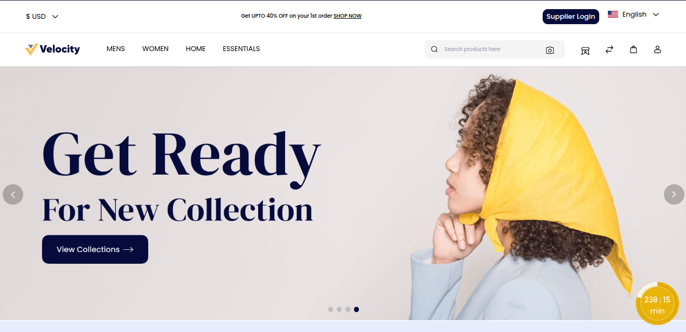

### Create a New Supplier Account

**Step 1:** Go to Supplier Login and click on Sign In.

**Step 2:** Fill in the required details:

**1) First Name -** Enter the First name

**2) Last Name -** Enter the Last Name

**3) Email Address -** Enter the Email Address

**4) Password -** Enter your Password

**5) Confirm Password -** Now confirm the password

**6) Company URL -** Add your company URL

**Step 3:** Click the Register button to create a supplier account.

 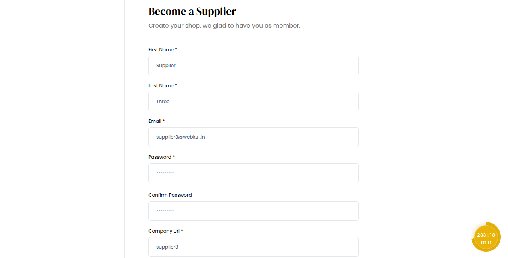

### Admin: Approve or Disapprove New Supplier

In the admin panel, the administrator has full control to approve or disapprove newly registered suppliers. 

**Step 1:** Log in to the Admin Panel.

**Step 2:** Go to B2B Marketplace >> Suppliers.

**Step 3:** Select a supplier you want to review.

**Step 5:** Check the supplier details such as company name, email, and URL.

**Step 6:** Choose from the “Select Action” menu to either

**Approve:** Supplier account becomes active in the marketplace.

**Disapprove:** Supplier request is rejected and access is denied.

 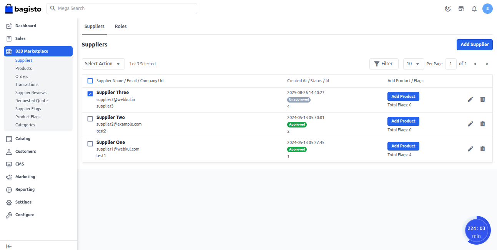

Once the supplier is approved, their account becomes active in the marketplace. 

 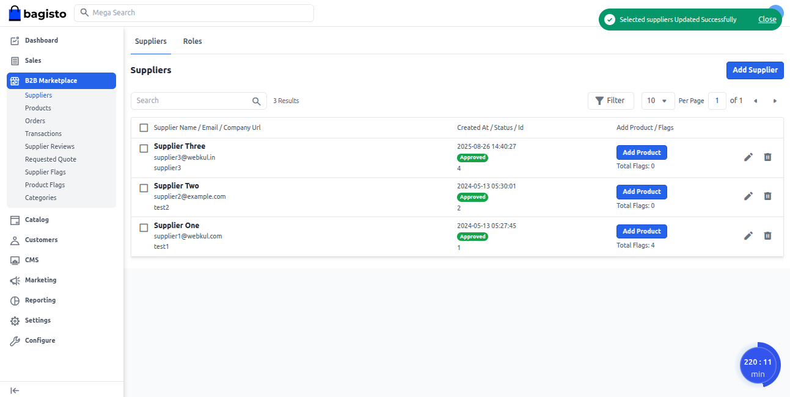

### Accessing the Supplier Dashboard

The supplier can log in using their registered email ID and password to access their dashboard.

 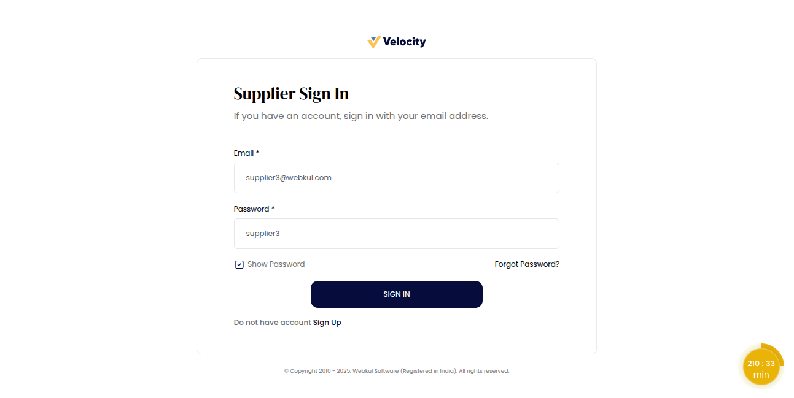

The supplier dashboard opens, giving suppliers access to manage their products, quotes, orders, and account details.

 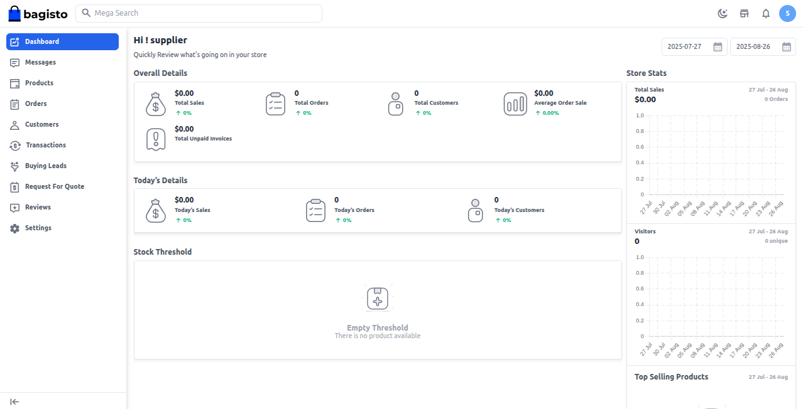

The supplier needs to set up their profile to build trust and visibility in the marketplace.

Go to **Settings >>  Profile**

To set up a new supplier profile, fill in the basic details such as:

**Banner Image:** Click to add a professional banner that highlights your brand.

**Logo:** Click to upload your company logo and represent your brand identity.

 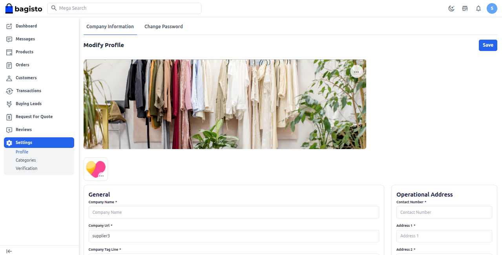

### General

This section covers the main details of the business.

**1) Company Name:** Official business name.

**2) Company URL:** Website or online presence link.

**3) Company Tag Line:** Short business tagline.

**4) Registered In:** Country of business registration.

**5) Designation:** Role of the contact person.

**6) Team Size:** Total number of employees.

**7) Certification:** Any official certifications (ISO, etc.).

**8) Response Time in Hours:** Average response time to queries.

### Operational Address

Enter the complete business address where the company operates.

**1) Contact Number:** Primary business phone number.

**2) Address 1:** Main business address line (e.g., building/office).

**3) Address 2:** Additional address details (e.g., landmark, suite).

**4) City:** City where the business is located.

**5) State:** State or region of business operation.

**6) Country:** Country of business registration.

**7) Post Code:** Postal/ZIP code of the business address.

 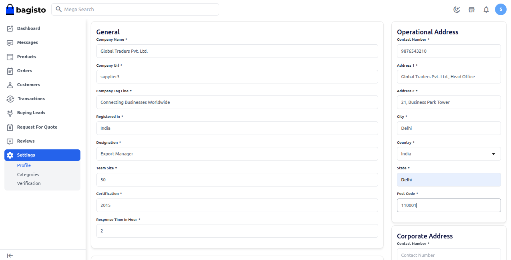

### Corporate Address

Buyers can use this information to reach out, verify the business, and ensure smooth communication for orders and inquiries.

**1) Contact Number:** Primary phone number for business communication.

**2) Address 1:** Main business address or office location.

**3) Address 2:** Additional details, such as a landmark.

**4) City:** City where the business operates.

**5) State:** State or region of the business.

**6) Country:** Country of business registration.

**7) Post Code:** Postal or ZIP code of the business address.

### About Shop

This section provides a brief overview of the supplier’s shop. It highlights the company’s brand, products, and services, helping buyers understand what the shop offers.

 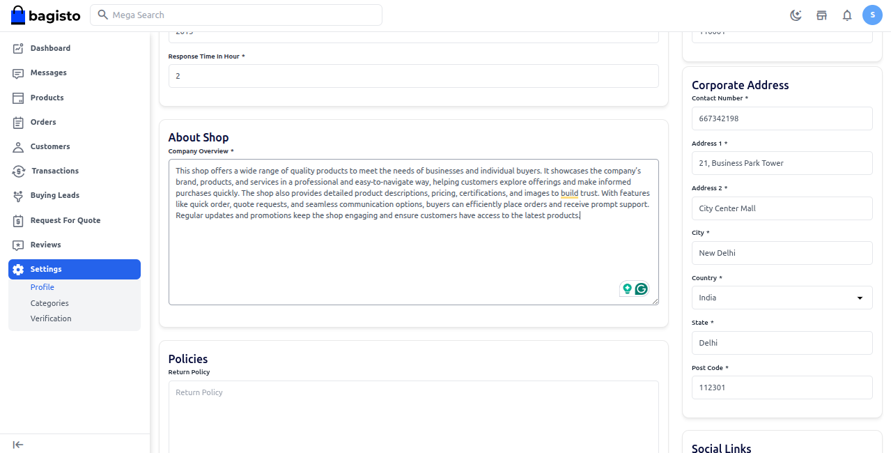

### Policies

To ensure a clear and trustworthy shopping experience, Seller can add important policies such as **Privacy Policy, Shipping Policy, and  Return** 

**Privacy Policy:** Tell users how their personal information is collected, stored, and protected.

**Shipping Policy:** Explain delivery times, shipping charges, and how orders are handled.

**Return Policy:** Let customers know how they can return or exchange products, including conditions and timeframes.

 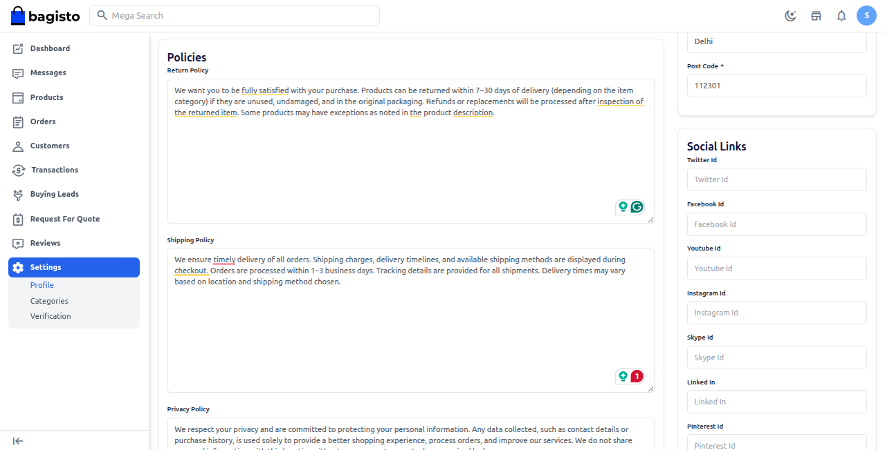

### Social Links

In this section, the seller can add links to the shop’s social media pages to enhance visibility and customer engagement.

**1) Twitter Id:** Link to the shop’s Twitter profile.

**2) Facebook Id:** Link to the shop’s Facebook page.

**3) YouTube Id:** Link to the shop’s YouTube channel.

**4) Instagram Id:** Link to the shop’s Instagram profile.

**5) Skype Id:** Skype contact for direct communication.

**6) LinkedIn:** Link to the shop’s LinkedIn profile.

**7) Pinterest Id:** Link to the shop’s Pinterest page.

 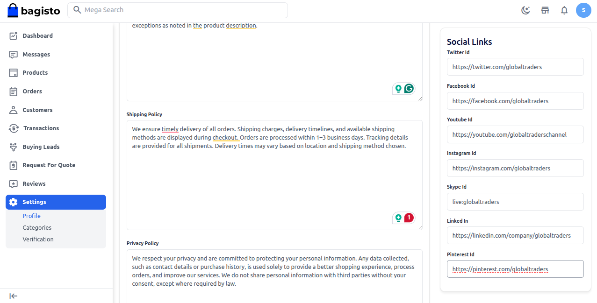

### Search Engine Optimization

To boost your shop’s visibility on search engines, you can fill out SEO fields like Meta Title, Meta Keywords, and Meta Description. 

**1) Meta Title:** The title that appears in search engine results.

**2) Meta Keywords:** Relevant keywords that describe your shop.

**3) Meta Description:** A short summary that tells what your shop offers.

 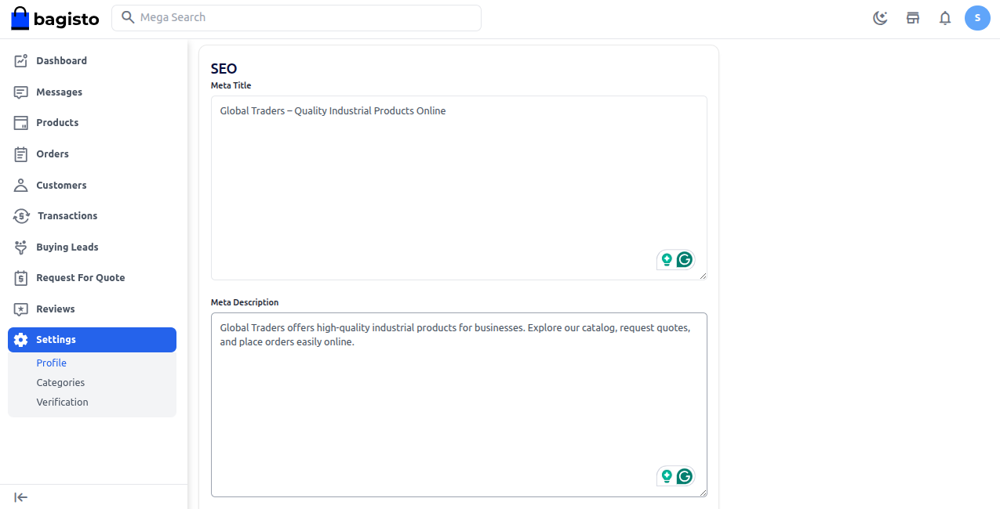

After filling in all the required details, click on the **Save** button.

### Store Frontend View

 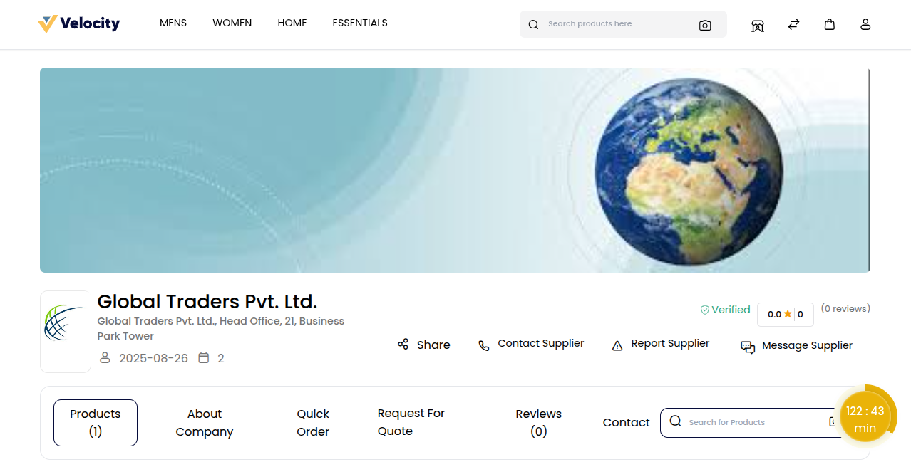
