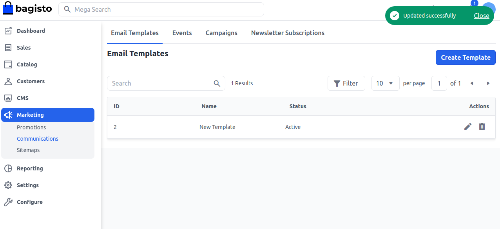
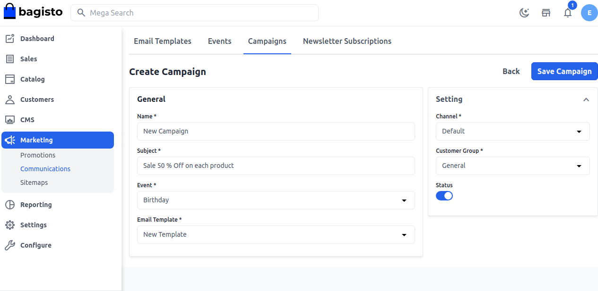

# Communications

Constant communication with the customer, especially after they have made a purchase, about their order status, delivery status, product warranty, how to use explainer videos, ongoing or upcoming offers, and discounts, and sharing personalized cross-sell product offers consequently has proven to be a good strategy.

## Email Templates
As we all know, everyone wants some customization according to their own taste that's why knowing about changing the email template is also quite helpful for some users.

### Step 1: 

**Add New Email Template**

On the Admin panel, go to **Marketing >> Communications >> Email Templates** and click on **Create Template** as shown in the below image.
 

### Step 2: 

Add **Name** and **Status** as Active, Inactive, or Draft of the Email Template as shown in the below image.

### Step 3: 

Add the content by simply copying and pasting you can also apply a link after right-clicking on the content and add the **URL, Text to display, Title, Open Link in** as shown in the below image.

Now you will able to see the new **Email Template** as shown below

So by this, you can easily create an **Email Template** and use it in emails in Bagisto.

## Events

An event parameter is an additional piece of data about a user interaction on a website and/or app, offering valuable context and details about the interaction For Example Birthdays, Anniversaries, Baby Shower, etc. 

### Step 1: 
**Add Event**

On the Admin panel, go to **Marketing >> Communications >> Events** and click on **Create Event** as shown in the below image.

### Step 2: 

Now add the **Event Name, Description, Date** as shown in the below image.

### Step 3: 

Now you will able to see the new **Event** as shown below.

By this, you can easily create a **Events** in Bagisto.

## Campaigns

E-commerce marketing campaigns are designed to drive traffic and increase sales. They can help you reach many potential customers, keep existing customers engaged, and build brand loyalty.

**Add Campaigns**

On the Admin panel, go to **Marketing >> Communications >> Campaigns** and click on **Create Campaign** as shown in the below image.

### Fill in the necessary fields.

**1.Name** Add the name of the campaign.

**2.Subject** Add the subject according to your requirements.

**3.Events** Select the event for which you want to apply the campaign you can also add your events to this also.

**4.Email Template** Select the Email template to which you want to apply to send the emails for the campaign.

**5.Channel** Select the channel.

**6.Customer Group** Select the customer group which you want to apply the campaign for.

**7.Status** Select the Status to yes/no.

 ### Step 4: 

Now you will able to see the new **Campaign** as shown below.

By this, you can easily create a **Campaigns** in Bagisto.

## Newsletter Subscriptions

Bagisto newsletter subscription is an opportunity for the store owners to let their customers receive an interesting newsletter from your Bagisto website.

Email marketing is one of the most powerful tools for your website.

This feature allows you to communicate with your customers in bulk about upcoming offers of your stores such as Black Friday sales, Christmas sales, and New Year offers.

### Admin Configuration

**Step 1)** Firstly the admin can navigate to **Configue >> Customer >> Settings**

**Step 2)** Now Enable the **Newsletter Subscription** and click on **Save Configuration** button as shown in below image.

### Newsletter subscriptions

Here the admin can see all their customers who subscribed to the newsletter subscription.

Also, the admin will navigate to **Marketing >> Communications >> Newsletter Subscriptions** as shown in the below image.

