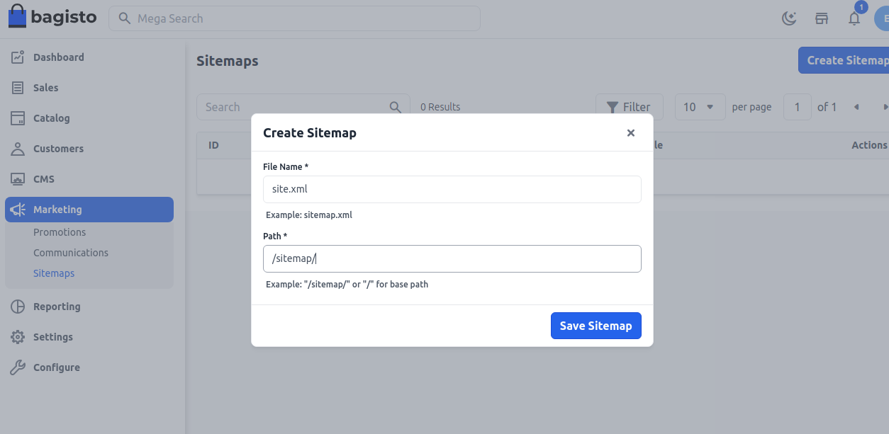
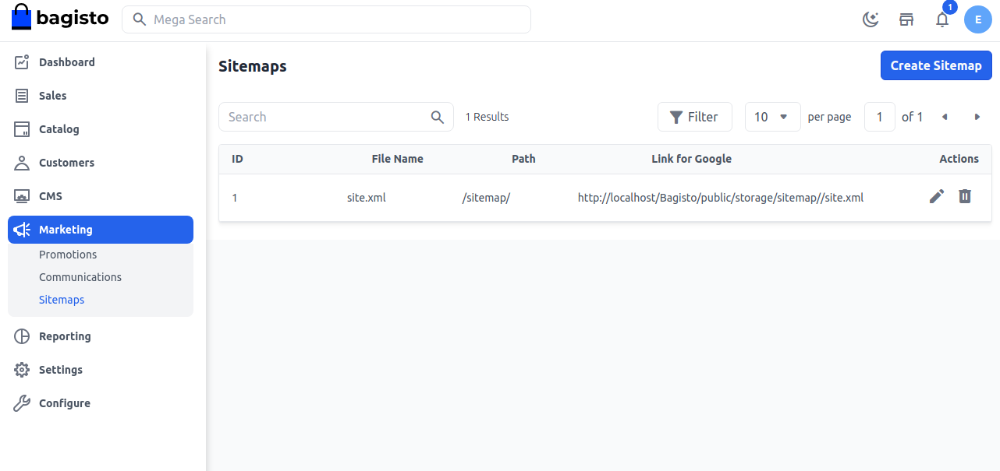

# Sitemaps

Sitemaps inform search engines which pages on a website should be crawled, and may help search engines discover and index those pages. While sitemaps can be a simple text file listing the URLs of all of the pages you'd like to have indexed, they can also be an XML document carrying more information.

### Step 1: Add New Sitemap

1. On Admin panel, go to **Marketing >> Sitemaps** click on create **Create Sitemap** as shown in below image

 

### Step 2: Add New Sitemap

Add **File Name** and **File Path** and click the **Save Sitemap** button.

Kindle make sure you created a **XML file** and mention its desired path as shown below.

 

### Step 3: 

Now you will able to see the new **Sitemap** as shown below.

 

By this, you can easily create a **Sitemap** in Bagisto.