# Vendor Management

Managing multiple vendors is important for any online marketplace. It helps the platform owner (admin) keep track of all the vendors (sellers), their products, orders, and earnings in an easy and organized manner.

In the Laravel Multi Vendor Marketplace Module, this system is made to be user friendly for vendors and very effective for admins.

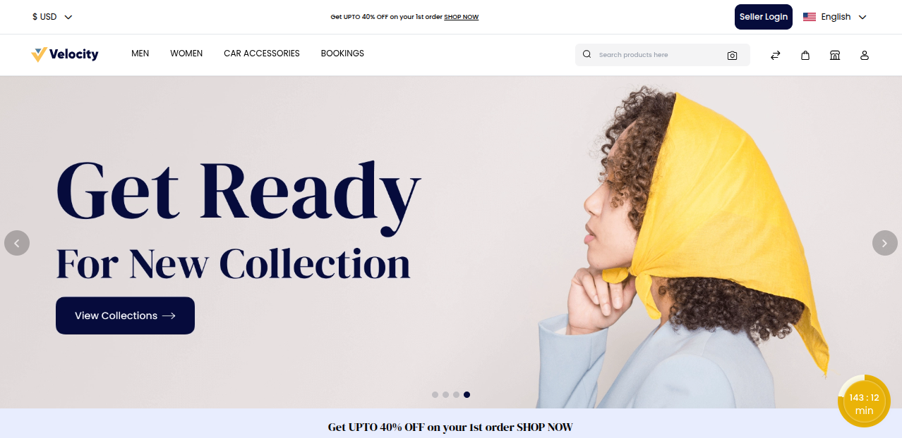

### Seller Login Button

To access the seller dashboard, a vendor first needs to click the **"Seller Login"** button on the top right of the marketplace home page.

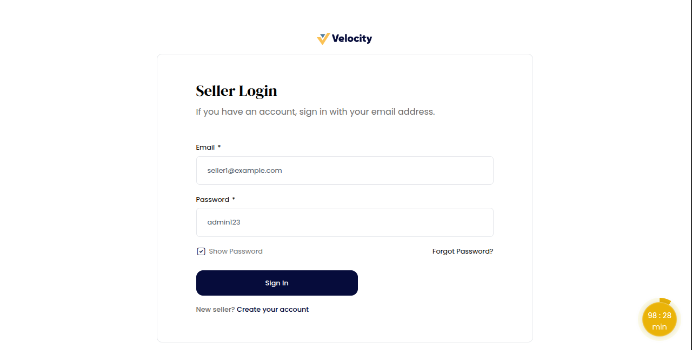

Once you log in using your approved seller account, you’ll get access to your seller dashboard where you can easily manage products, view orders, track sales, and update store details.

### Seller Dashboard Overview

Once signed in, sellers land on the Dashboard tab, which gives a clear and quick overview of how their store is performing in real time.

**Key Highlights:**

**1) Overall Details:** View total sales and keep an eye on revenue growth with simple charts and figures.

**2) Top Selling Products:** Instantly see which products are selling the most to plan stock or promotions.

**3) Total Sales:** Know your exact earnings from all completed customer purchases, including trends over time.

This dashboard helps sellers stay updated, make informed decisions, and grow their business more efficiently.

### Manage Profile

The Manage Profile section is the first step in creating your store’s identity. Here, vendors can add basic details like **Store Name, Logo, and Contact Info**.

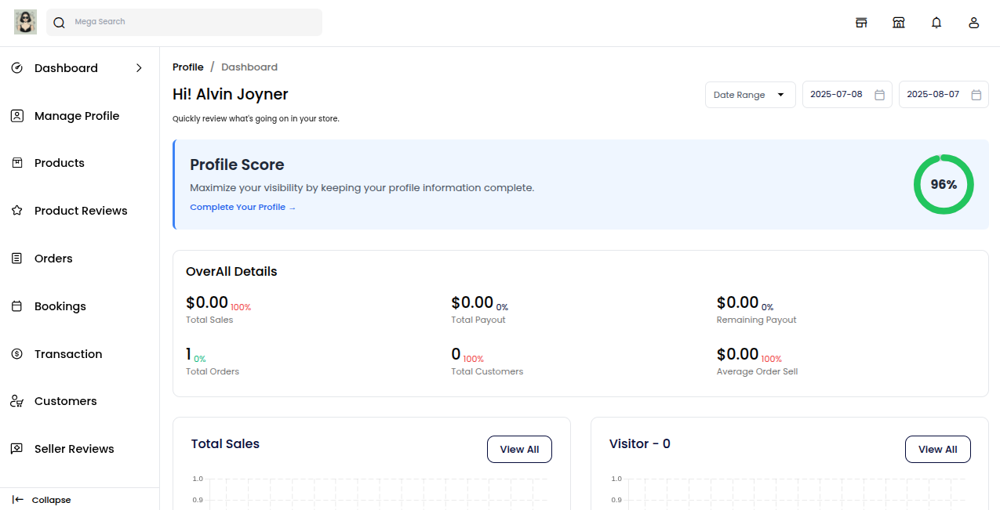

A complete profile builds trust with customers and makes your shop look professional. 
Go to **Manage Profile >> Edit Profile** button and see the seller’s details.

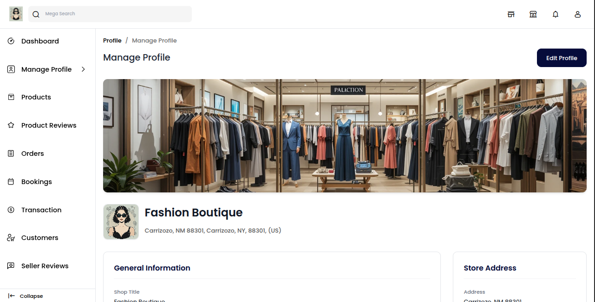

This section is very useful for shop branding, as it provides customers with important information about your store. 

Below are the fields you’ll find in the Profile section:

**1)** Upload a banner image to display on your storefront

**2)** Add your store logo to create brand identity

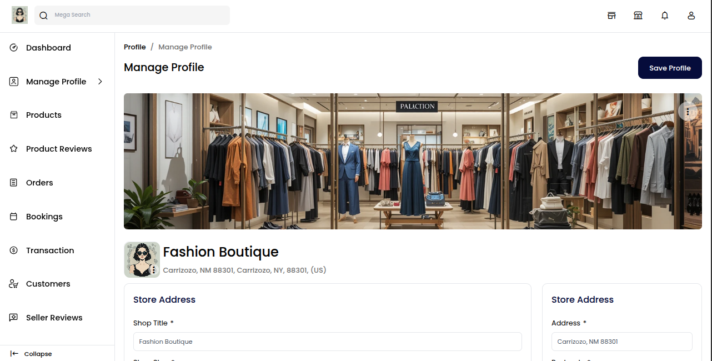

These visual elements help attract customers and make your store stand out on the platform.

### Store Details

Enter your store details to complete your profile. These details help customers recognize and contact your shop easily.

Here’s what you need to fill in:

**1) Shop Title:** The name of your store shown to customers.

**2) Shop Slug:** A unique URL link for your shop (e.g., yourstore-name).

**3) Name:** The store owner's full name.

**4) Email:** Contact email for customer queries or support.

**5) Phone Number:** A valid number for direct communication

### Store Address Details

Enter your store address details to show your shop’s physical location. This adds credibility and helps with shipping and customer trust.

Here’s what to fill in:

**1) Address:** Full street address of your store.

**2) Postcode:** Area ZIP or postal code.

**3) City:** The city where your store is located.

**4) State:** The state or region of your shop.

**5) Country:** The country where your business operates.

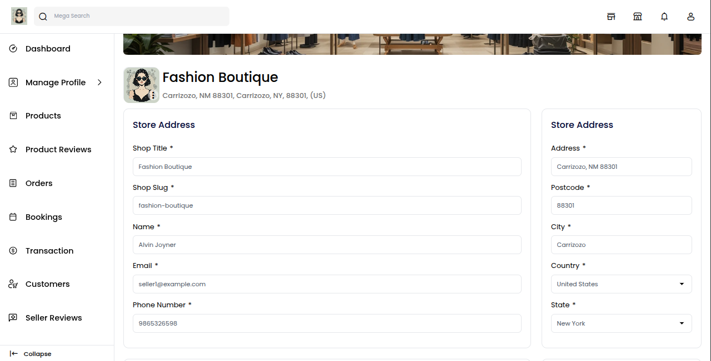

Make sure the details are correct, as they may be used for shipping, invoices, or customer communication.

### About Store

In this section, you can write a short description about your shop. Tell customers what your store is about, what types of products you sell, and any special features or services you offer.

### Social Links

In this section, you can add links to your shop’s social media pages such as Facebook, Twitter, Pinterest, and LinkedIn.

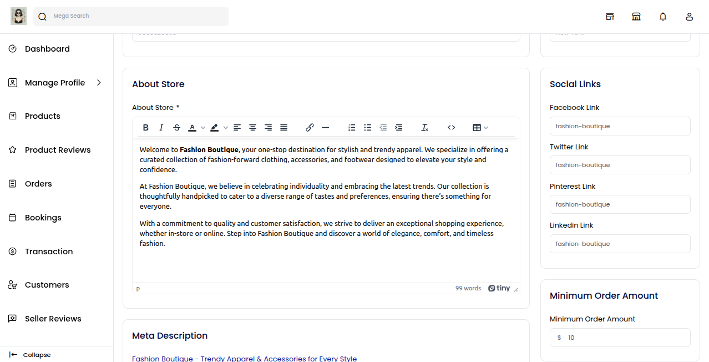

Sharing your social links helps customers follow your brand, stay updated on new products or offers, and build stronger connections with your store.

### Minimum Order Amount

This setting lets you define the minimum purchase value a customer must meet before placing an order from your store.

Simply set the amount that best fits your business needs.

**It’s useful for:**

**1)** Avoiding very small, unprofitable orders.

**2)** Encouraging customers to buy more.

**3)** Managing logistics and shipping more efficiently.

### Google Analytics

This field lets you connect your store with Google Analytics by adding your unique tracking ID (e.g., UA-XXXXXXXXX-X or G-XXXXXXXXXX).

Just paste your Google Analytics ID to start collecting insights.

**It helps you:**

**1)** Track how many people visit your store.

**2)** Understand customer behavior and popular pages.

**3)** Make better multi-vendor-marketplace and sales decisions.

### Meta Description

To boost your shop’s visibility on search engines, you can fill out SEO fields like Meta Title, 
Meta Keywords, and Meta Description. These fields play a key role in how your store appears in Google and other search results.

**1) Meta Title:** The title that appears in search engine results.

**2) Meta Keywords:** Relevant keywords that describe your shop.

**3) Meta Description:** A short summary that tells what your shop offers.

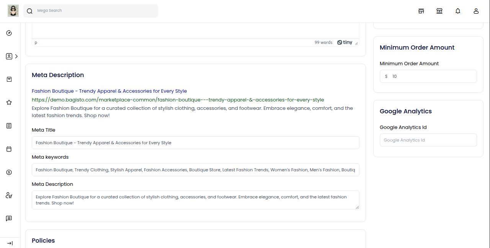

Adding strong SEO content helps more customers discover your shop and increases your chances of getting organic traffic.

### Policies

To ensure a clear and trustworthy shopping experience, you can add important policies such as Privacy Policy, Shipping Policy, and  Return Policy.

**1) Privacy Policy:** Tell users how their personal information is collected, stored, and protected.

**2) Shipping Policy:** Explain delivery times, shipping charges, and how orders are handled.

**3) Return Policy:** Let customers know how they can return or exchange products, including conditions and timeframes.

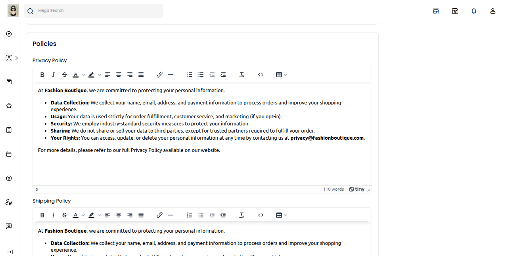

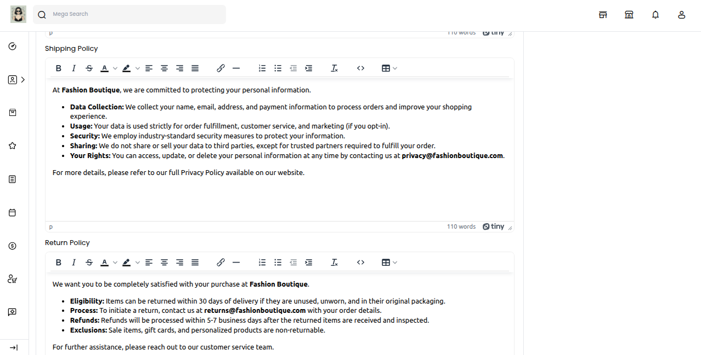

Adding these policies builds trust with customers, reduces disputes, and shows that your store is reliable and transparent.

### Save Profile

After filling in all the required details, simply click on the **“Save Profile”** button. This will update your store information and make it visible on the frontend.

After saving your profile, look for the **“Visit Shop”** icon in the top right corner and click on it.

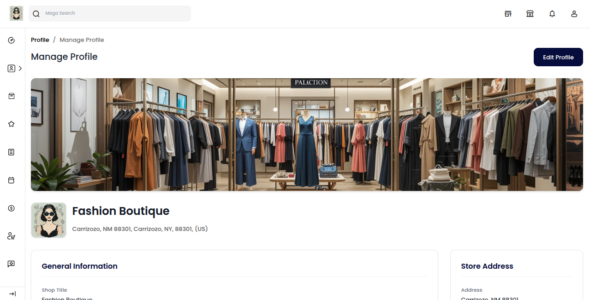

This will take you to your live storefront, where you can see how your shop looks to customers.

### Store Frontend View

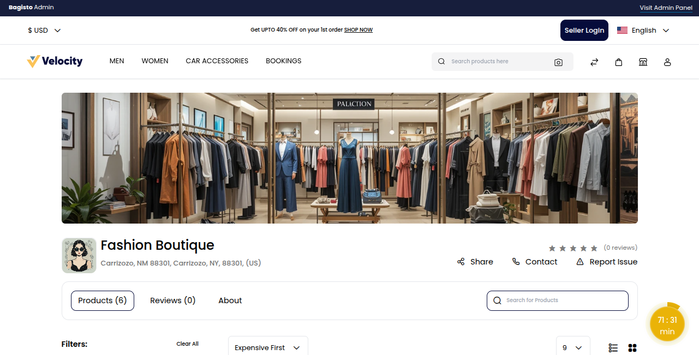

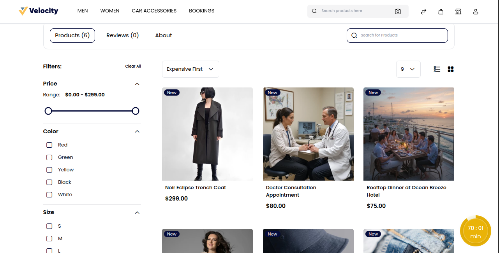