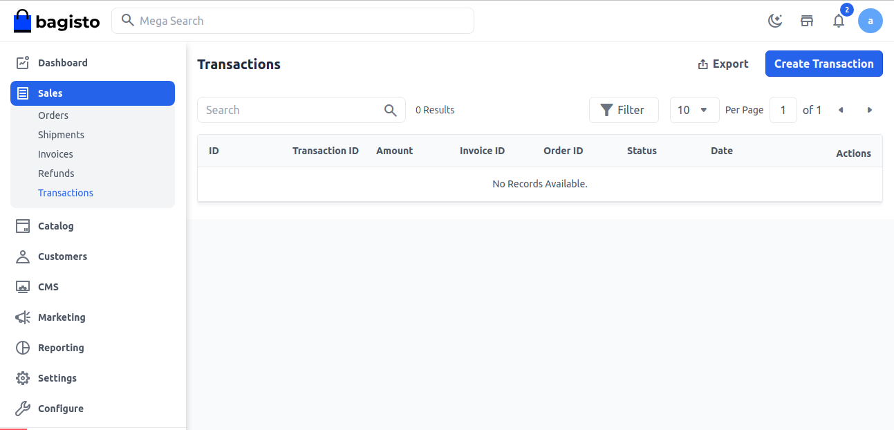
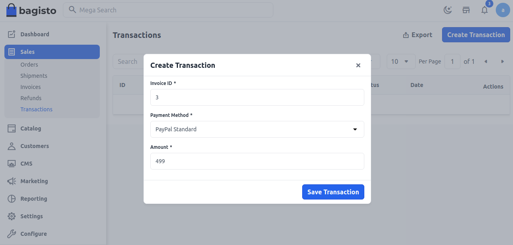
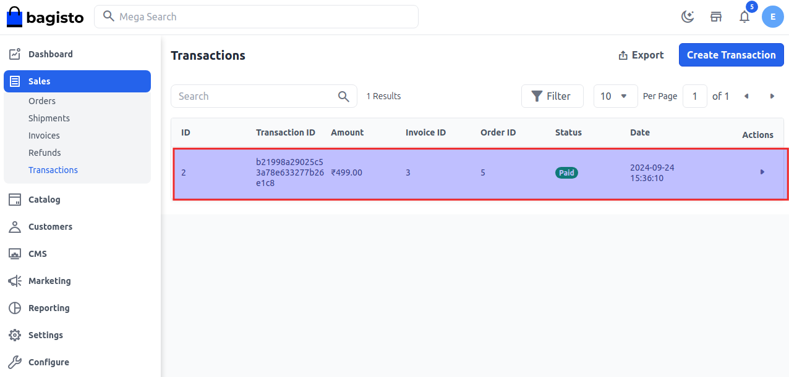
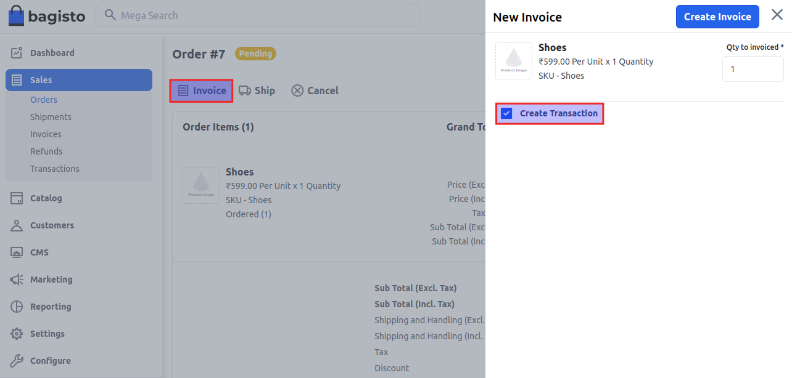
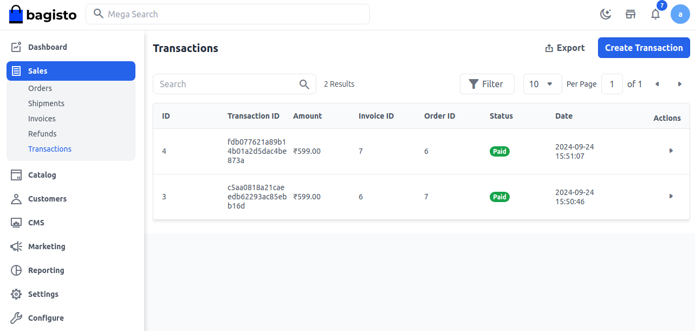

# Transactions

Transaction is a digital financial exchange that occurs when you buy goods and services through online platforms. 

E-commerce transaction means the transfer of funds electronically in exchange for products or services, conducted via e-commerce websites or mobile applications.

### Steps to Create Transactions in Bagisto 2.0

**Step-1** Click on **Orders >> Transactions >> Create Transaction** as shown in the below image.

 

**Step-2** Add the below details.

**A) Invoice ID-** Enter the Invoice ID for which you are creating a transaction.

**B) Payment Methods-** By default, 3 online payment gateways are presented.

**- Paypal Smart Button**

**- Money Transfer**

**- Paypal Standard**

Kindly select your payment gateway from the dropdown.

**C) Amount-** Enter the amount of your transaction.

At last, click on the **Save Transaction** button.

 

**Step-3** Transaction is created successfully as shown in the image below.

 

**Note - Additionally, you can also create transactions while creating an Invoice**

**1)** Click on **Sales >> Order >> Select Order** and then click on **Invoice button** after that click on the **Create Transaction** checkbox.

At last, click on the **Create Invoice** button as shown in the below image.

 

**2)** Now go to **Sales >> Orders >> Transactions** and a new transaction is created successfully as shown in the image below.

 

