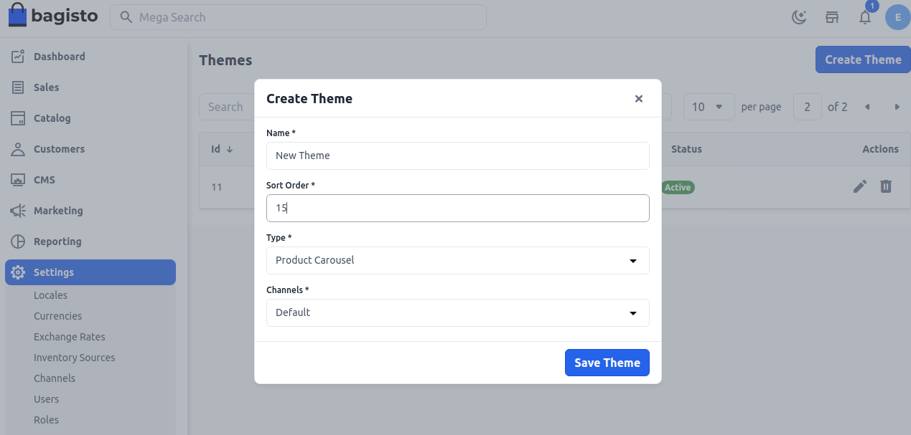
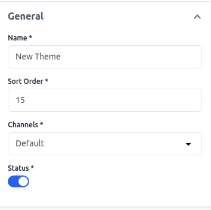
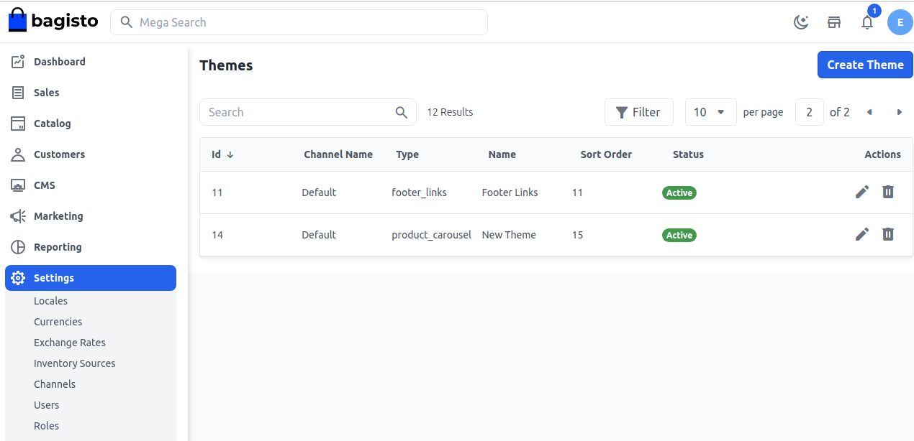

# Themes 

The theme of the website is the overall look of it and that is why it plays a major role in creating the first impression on the viewer's mind.

The theme contains different options like slider section with different slider options, Product section, Footer option, right-sidebar, Logo resizer option, Button settings, Blog Settings, Site preloader option, Related option, Icon changer option, full-width-template, color options, widgets, sidebar layouts, header.

### Create Themes

**Step 1:** It can be set on the admin panel by going to **Setting >> Themes**. Here you can create new role by clicking on the button **Create Theme** as shown in below image.

**Step 2:** Add the below fields.

**1.Name:-** Enter the Theme name

**2.Sort Order:-** Enter the sort order.

**3.Type:-** Select the Type from the dropdown according to your requirement.We have selected a product carousel in this

**4.Channels:-** Select the Channel.

Now click on **Save Theme** button and you will get redirected to type which you just selected.

### Product Carousel 

**Step 3:** Add the below fields.

**1.Title:-** Add the title of the product carousel.

**2.Sort Order:-** Add the sort order.

**3.Limit:-** Add the limit of the product carousel.

### General

**1.Name:-** Add the Name.

**2.Sort Order:-** Add the sort order.

**3.Channels:-** Select the Channel.

**4.Status** Enable the Status.

### Filters

**1.Key:-** Add the Key.

**2.Value:-** Add the Value 

Now click on **Save** button.

**Step 4:** Now you will able to see the new **Field** added in product_carousel by the name of **New Theme** as shown below.

So by this you can add a Theme Content in  Bagisto.