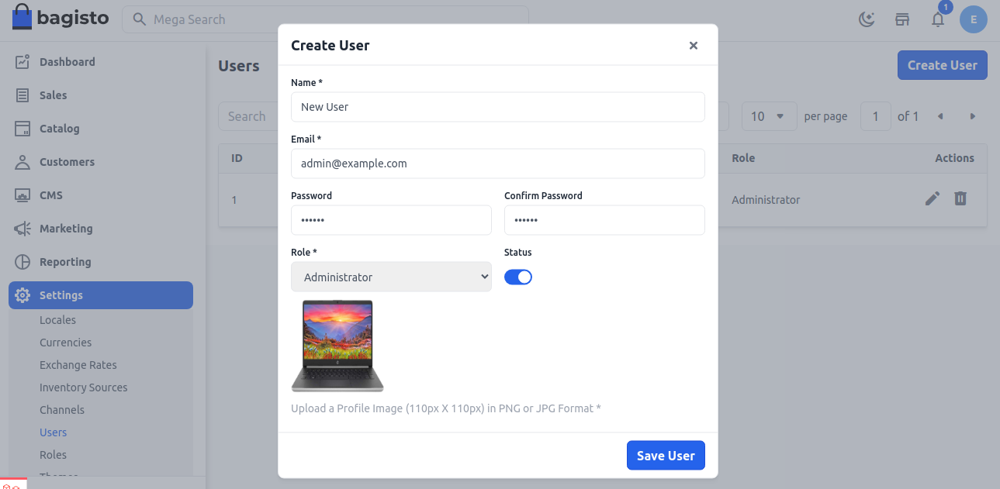

# Users

Access Control List Rules in bagisto allow the store owner to create the user and provide roles for every user. Here will discuss how to create admin ACL in bagisto.

### Create User

**Step 1:** It can be set on the admin panel by going to **Setting >> Users**. Here you can create new users by clicking on the button **Create User** as shown in below image.

**Step 2:** Add the below fields.

**1.Name:-** Enter the user name

**2.Email:-** Enter the email id of the user

**3.Password:-** You have to enter the password and confirm password.

**4.Role:-** Select a Role.

**5.Image:-** Add image for the User.

Now click on **Save User** button.

**Step 3:** Now you will able to see the new **User** by the name of **New User** is created successfully as shown below.

So by this you can create a **User** in Bagisto.

