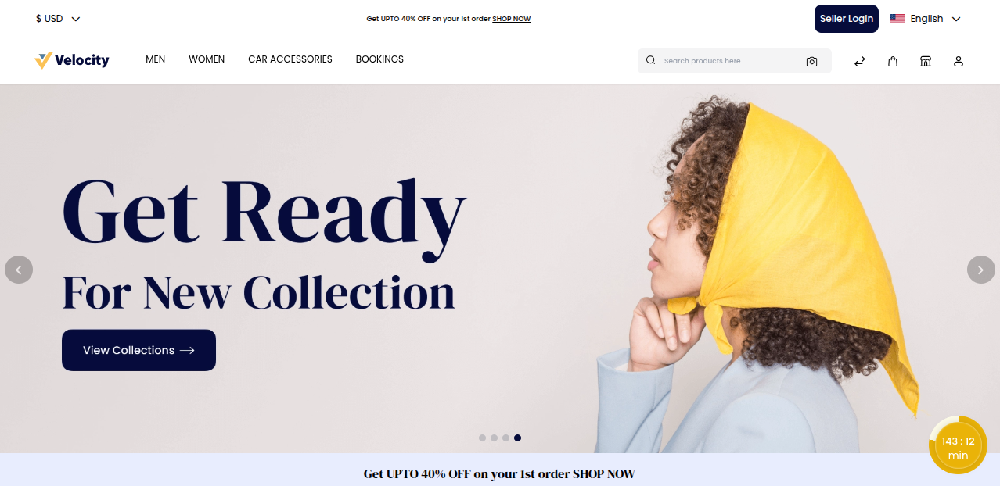
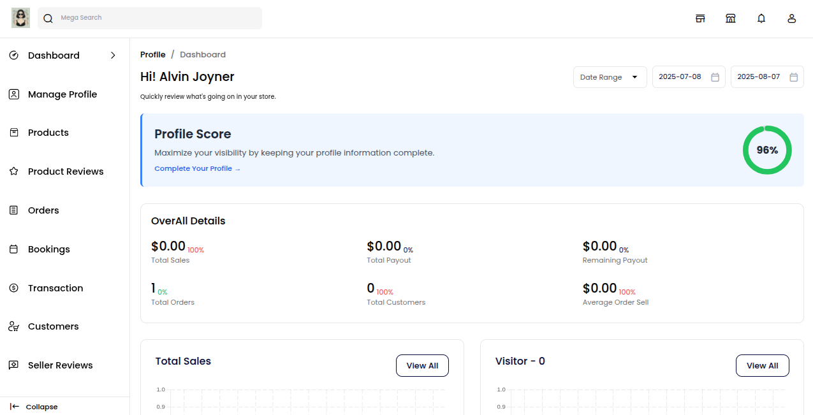

# Order Management

Order management in a Laravel Multi Vendor Marketplace helps sellers and admins track, manage, and fulfill customer orders with ease. 
From the moment a buyer places an order to shipping and delivery, everything is handled in one place. 

It ensures smooth processing, timely updates, and better coordination between vendors and buyers for a hassle free shopping experience.

### Orders

Go to the **"Orders"** menu and click on it. 

The order management page will open, where you can see all customer orders in one place. You can also filter orders by date or status, track progress, and update delivery status. 

This helps you manage orders quickly and keep your customers happy.

Clicking the arrow icon, you will find more information on the order, along with the invoice and shipment details.

After clicking on the arrow icon next to an order, the order view page will open. 

Here, you can view order details like product name, price, status, billing & shipping info, payment method, and total amount.

Initially, the order item will be in the “Pending” state. This means the order has been received but not yet processed or shipped. 

### Invoice

The seller can create an invoice. 

Click on the **"Invoice"** button in the top right corner.

A popup will appear showing invoice details like product name, quantity, price, and total amount. 

On clicking the "Create Invoice" button, the invoice is generated automatically.

A success message will appear on the screen, and the order status will change from Pending state to Processing state, indicating that the order is now being prepared for shipment.

Once the invoice is created, you can view it under the "Invoice" tab.

### Shipment

The seller can create a shipment. 

Click on the **"Ship"** button in the top right corner.

A popup will appear showing shipment details like product name, quantity, Ordered Quantity, Shipped Quantity.

To create the shipment, follow these steps:

1) Enter the Carrier Title (e.g., FedEx, DHL, etc.)

2) Enter the Tracking ID provided by the shipping service

3) Select the Product Ordered Source from the dropdown

4) Click on the **"Create Shipment"** button to proceed

On clicking the **"Create Shipment"** button, the shipment is generated automatically. 

A success message will appear on the screen, and the order status will change from **Processing** to **Completed**, indicating that the order has been successfully shipped and fulfilled.

Once the Shipment is created, you can view it under the "Shipment" tab.

### Cancelled

The seller can cancel the order. 

**Note:** The seller can cancel the order only before creating the invoice or shipment. 

Once the invoice or shipment is generated, the order can no longer be cancelled.

Click on the **"Cancel"** button in the top right corner

A popup will appear asking, "Are you sure?"

You will be given two options: 

**1)** Agree to confirm the cancellation

**2)** Disagree to keep the order active. 

Choose accordingly to proceed. 

A success message will appear on the screen, and the order status will change from **"Pending"** to **"Cancelled"**, indicating that the order has been successfully cancelled and will not proceed further.

