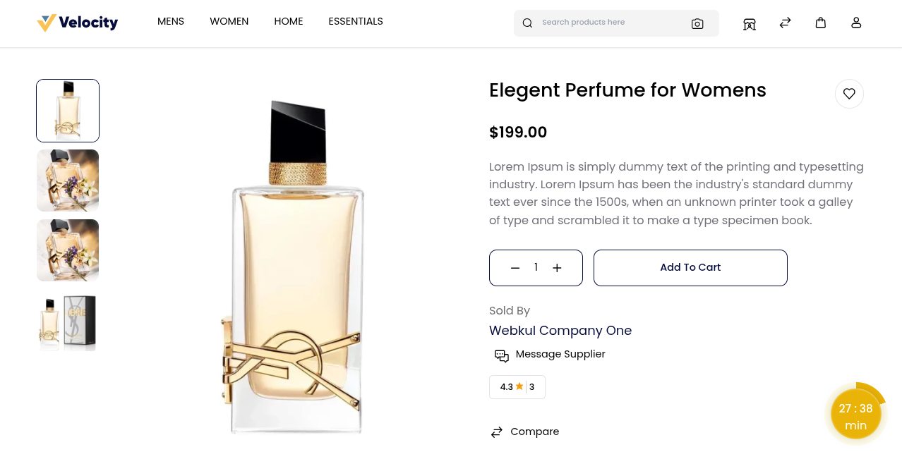
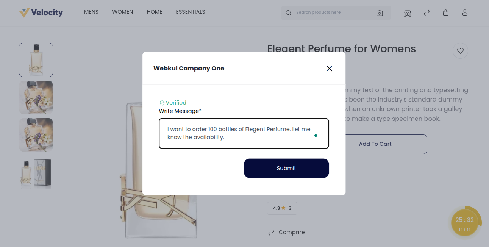
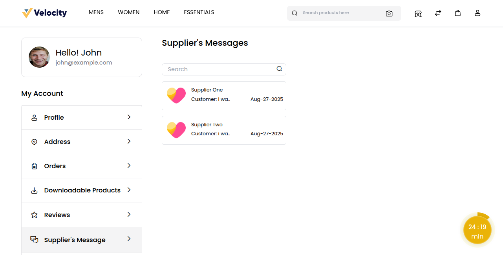
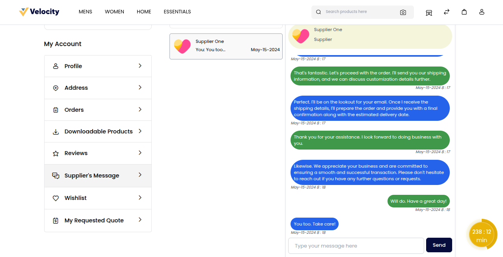
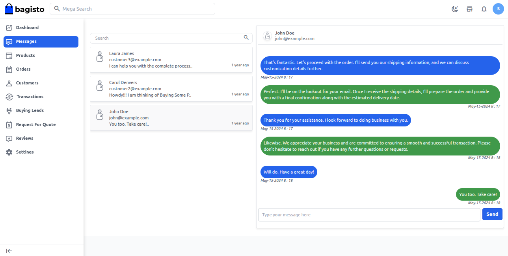

# Buyer Seller Communication

Buyer and Seller communication in a B2B Marketplace ensures smooth and transparent interactions. Buyers can send messages, negotiate prices, and discuss product details, while sellers respond with offers, updates, and order information. 

It builds strong relationships while keeping both parties clear and coordinated before closing.

### Customer to Supplier Communication

In B2B Marketplace, customers have two simple ways to contact suppliers:

**1) From the Product Page:**

Customers can send a direct message to the supplier right from the product page. This is useful for asking about price, stock, or product details instantly.

 

### How to Send a Message from the Product Page

**Step 1:** Open the product you are interested in.

**Step 2:** Click on the “Message Supplier” button.

**Step 3:** Type your message clearly in the message box.

**Step 4:** Click on the Submit button to send your message directly to the supplier.

 

**From the Supplier Response Page**

Customers can navigate to the supplier response page, where they can view replies, continue discussions, and manage communication more effectively.

 

### How to Send a Message from the Supplier Response Page

**Step 1:** Log in to your buyer account.

**Step 2:** Go to Profile >> My Account >> Supplier Response.

**Step 3:** Open the relevant conversation.

**Step 4:** Write your message clearly in the text box.

**Step 5:** Click Send to deliver the message to the supplier.

 

### Supplier to Customer Communication

In the Bagisto B2B Marketplace, suppliers can easily communicate with customers to provide updates or respond to queries.

### How to send Messages to the Customer

**Step 1:** Log in to the supplier account.

**Step 2:** Go to Messages.

**Step 3:** Open the conversation you want to reply to.

**Step 4:** Type your response clearly in the message box.

**Step 5:** Click Send to deliver your reply to the customer.

 
