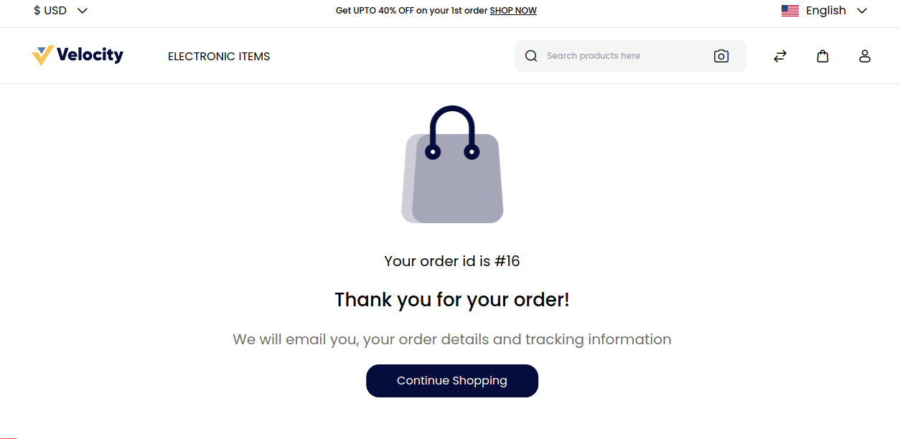

# Back Orders

A backorder is an order for a good or service that cannot be filled immediately because of a lack of available supply. Backorders give insight into a company's inventory management.

A manageable backorder with a short turnaround is a net positive, but a large backorder with longer wait times can be problematic.

You can easily manage **Backorders** by going to the Admin Panel and clicking on **Configure >> Inventory**.

There is an option present to **Enable or Disable** a Backorder and then click on **Save Configuration** as shown below.

**Note:- If the product is Out of Stock then also the customer is able to Place an Order after Enabling the Backorder Option**

In the above image these products are **Out of Stock** but you can still able to Add the product to the Cart and **Place an Order**.

