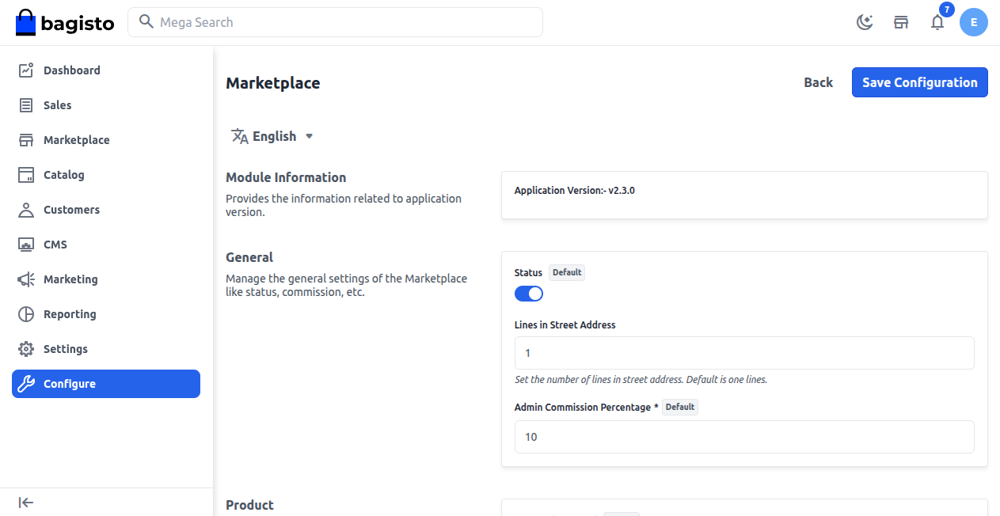
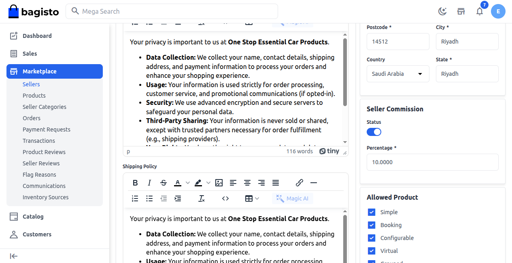
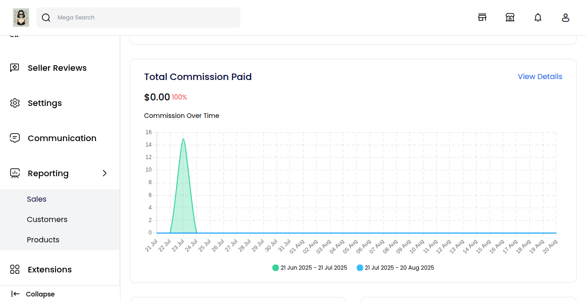

# Commission Management

The Marketplace Commission Management system in Bagisto lets platform owners (admins) set and manage commission rates for sellers in a flexible and clear way.

This system helps the marketplace earn steady income, and it also gives admins the ability to give special commission rates to sellers as rewards or incentives when necessary.

There are three main parts to commission handling:

**1) Admin Commission Percentage (Global Rate)**

**2) Seller Commission (Custom Rate)**

**3) Sales Reporting for Transparency**

### Admin Commission Percentage (Global Rate)

A global commission rate is a standard percentage that automatically applies to all sellers.

This is the easiest and most reliable way to make money from sales since every seller on the platform pays the same rate.

**Why it’s important:**

1) Makes sure that all sellers are treated fairly and equally.
2) Simple to handle — there's no need to set up separate commissions unless it's necessary.
3) Supports keeping a steady income for the marketplace.

**Steps to set the global commission**

1) In the Admin Panel, go to **Configure → Marketplace → General**.

2) Locate the **Admin Commission Percentage** field.

3) Enter the percentage rate you want to apply globally.

4) Click **Save Configuration** — the rate will now be applied automatically to all sellers.

**Example:**

If the global rate is 10%, and a seller sells something for $1,000, the admin will automatically get $100 as their commission, while the seller keeps $900.

### Seller Commission (Custom Rate)

At times, you might want to establish a unique commission rate for specific sellers.

This is called a custom commission rate and it can be either higher or lower than the overall rate, based on the agreement.

**When to use a custom commission:**

1) To motivate new sellers by offering them lower commission rates.
2) As a bonus for sellers who perform really well.
3) For unique partnership deals.
4) For short-term promotions or boosts during seasonal sales.

**Key feature:**

1) Status Toggle can enable or disable a custom commission anytime.

2) When it's on, the custom commission takes the place of the global commission for that specific seller.

3) When disabled, the seller returns to the global rate.

**How to set a custom commission for a seller:**

1) In the Admin Panel, go to: **Marketplace → Sellers**.

2) Find the seller you want to edit and click the **Edit** icon.

3) Locate the **Seller Commission** section.

4) Enter the desired rate and use the **Status Toggle** to turn it ON.

5) Save the settings — the custom rate will now apply only to that seller.

**Example:**

If the global rate is 10%, but Seller A is given a custom rate of 5%, only 5% will be deducted from Seller A’s sales, while others continue to be charged 10%.

### Sales Reporting for Transparency

Bagisto has a built-in sales reporting tool that allows sellers to easily track how much commission they have paid over time.

This openness helps create trust between the marketplace and sellers by making sure there are no secret fees.

**Benefits of sales reporting:**

1) Sellers can track their total commission paid to the admin.
2) Provides insights into how commissions impact overall profits.
3) Encourages healthy business relationships through openness.

**Where sellers can find this report:**

1) From the **Seller Dashboard**, navigate to: **Reporting → Total Commission Paid**.

**Example:**

A seller selling $50,000 worth of goods at a 10% commission rate will see $5,000 listed in the “Total Commission Paid” section.

