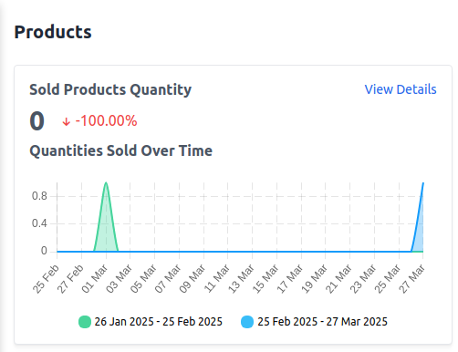
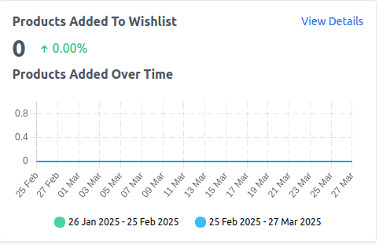
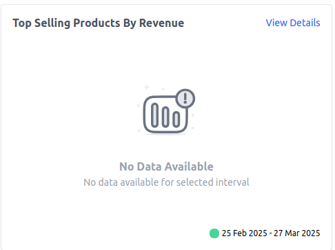
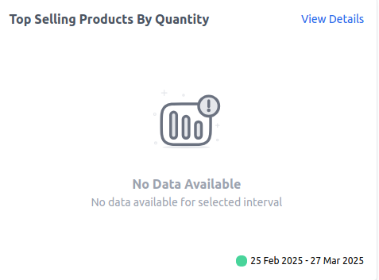
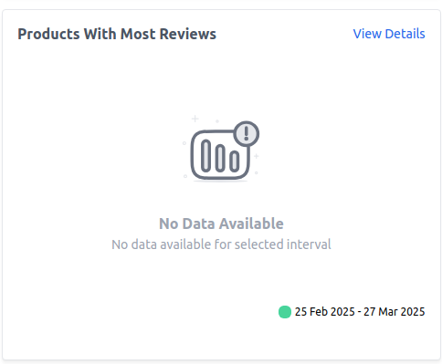
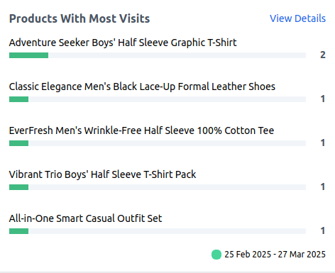
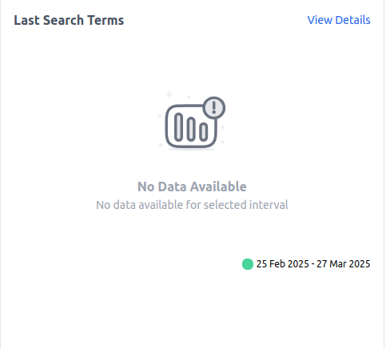
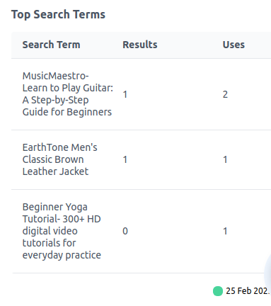

# Products Reporting

Bagisto provides detailed insights into product performance through various reports. These reports help store owners track product sales, customer engagement, and search trends. Below is a breakdown of the available product-related reports.

### A) Sold Products Quantity

This report displays the total number of products sold within the selected date range.

**Key Metrics:**

**1) Total Sold Products:** The total quantity of products sold during the specified period.

**2) Percentage Change:** A comparison with the previous period to track growth or decline.

**3) View Details:** Click to see detailed sales data.

### B) Quantities Sold Over Time

Provides a timeline-based view of product sales to help identify sales trends.

**How to Use:**

1) Compare sales performance across different date ranges.

2) Identify peak sales periods.

3) Adjust inventory and marketing strategies based on demand.

 

### C) Products Added to Wishlist

Shows how many products have been added to customers' wishlists over the selected period.

**Key Metrics:**

**1) Total Wishlist Additions:** The number of times products were added to wishlists.

**2) Percentage Change:** A comparison with the previous period.

**3) View Details:** Click to see a list of the most wished-for products.

 

### D) Top Selling Products by Revenue

Lists the products that have generated the most revenue within the selected period.

**Key Metrics:**

**1) Product Name:** The name of the top-selling product.

**2) Total Revenue:** The total revenue generated by the product.

**3) View Details:** Click to see a detailed revenue breakdown.

 

### E) Top Selling Products by Quantity

Displays products that have been sold the most in terms of quantity.

**Key Metrics:**

**1) Product Name:** The most frequently purchased product.

**2) Total Units Sold:** The total number of units sold.

**3) View Details:** Click to see a breakdown of sales by product.

 

### F) Products with Most Reviews

Shows which products have received the highest number of customer reviews.

**Key Metrics:**

**1) Product Name:** The product with the most reviews.

**2) Total Reviews:** The number of reviews received.

**3) View Details:** Click to view customer feedback and ratings.

 

### G) Products with Most Visits

Tracks which products have received the highest number of visits from customers.

**Key Metrics:**

**1) Product Name:** The most viewed product.

**2) Total Visits:** The total number of times the product page has been viewed.

**3) View Details:** Click to analyze traffic sources.

 

### H) Last Search Terms

Tracks the most recent search terms used by customers on the store.

**Key Metrics:**

**1) Search Term:** The keyword or phrase searched by users.

**2) Total Searches:** The number of times the term has been searched.

**3) View Details:** Click to analyze customer search behavior.

 

### I) Top Search Terms

Displays the most frequently searched terms in the store within the selected date range.

**Key Metrics:**

**1) Search Term:** The most commonly searched keyword or phrase.

**2) Total Searches:** The number of times the term has been used.

 
