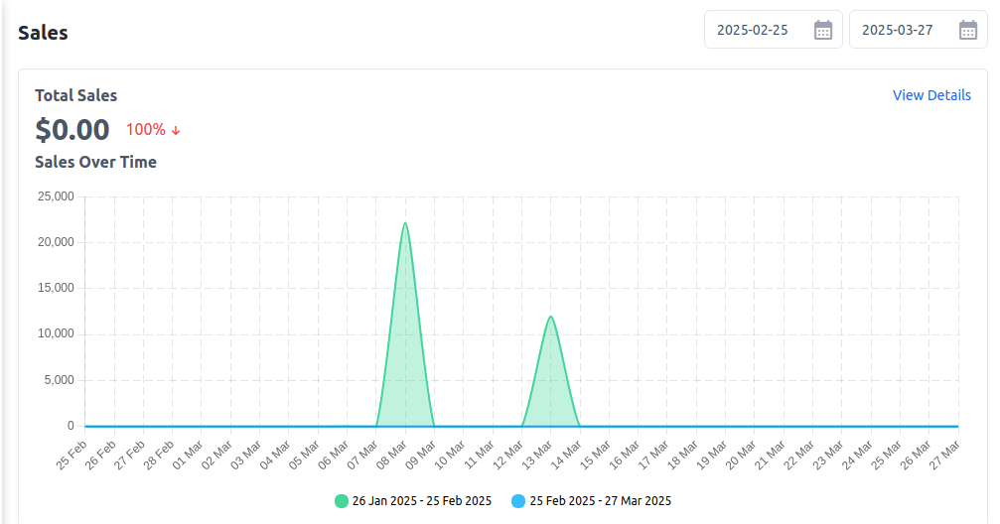
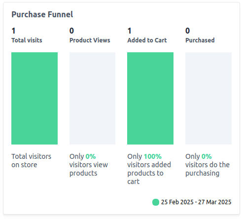
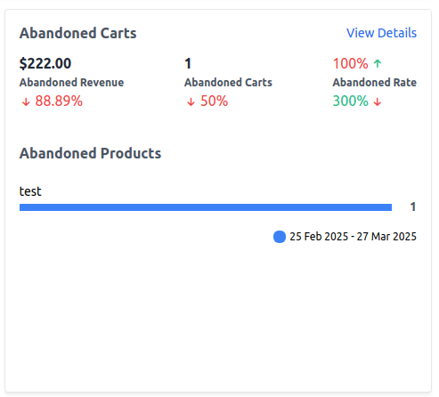
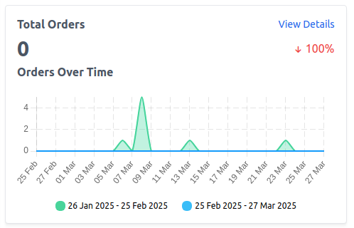
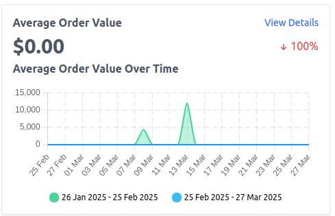
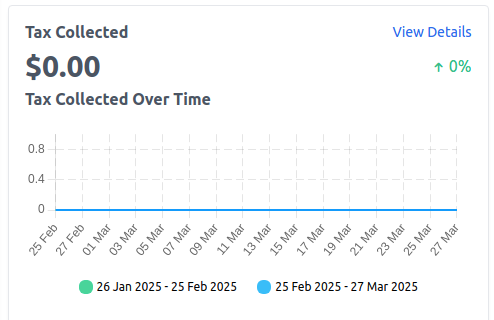
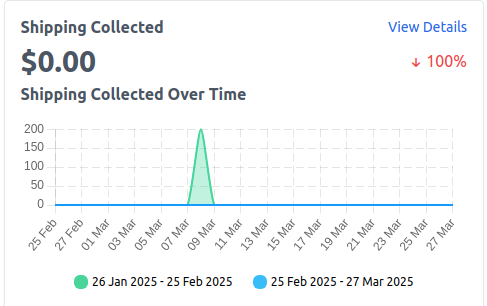
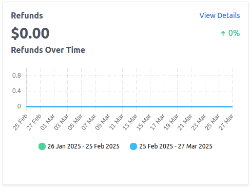
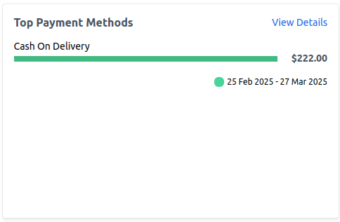

# Sales Reporting

Bagisto provides various reports to help store owners track sales, customer behavior, and financial performance. Below is a breakdown of the Sales reporting.

### 1) Total Sales 

This report displays the total revenue generated from all orders within the selected date range.

**Key Metrics:**

**1) Total Sales:** The total amount earned from completed orders.

**2) Percentage Change:** Comparison with the previous period.

**3) View Details:** Click to see a breakdown of individual transactions.

### 2) Sales Over Time

This section provides a graphical view of sales trends over different time periods. It helps store owners analyze sales patterns and seasonal trends.

**Key Metrics:**

1) Compare sales between different date ranges.

2) Identify peak sales periods.

3) Adjust marketing strategies based on trends.

 

### 3) Purchase Funnel

The purchase funnel tracks customer behavior from visiting the store to completing a purchase. It helps identify where customers drop off in the buying process.

**Key Stages:**

**1) Total Visits –** Number of visitors on the store.

**2) Product Views –** Percentage of visitors who viewed a product.

**3) Added to Cart –** Percentage of visitors who added a product to the cart.

**4) Purchased –** Percentage of visitors who completed a purchase.

 

### 4) Abandoned Carts

This report tracks the revenue lost due to customers adding products to the cart but not completing the purchase.

**Key Metrics:**

**1) Abandoned Revenue:** Estimated lost revenue from abandoned carts.

**2) Abandoned Carts:** Number of abandoned shopping carts.

**3) Abandonment Rate:** Percentage of abandoned carts compared to initiated checkouts.

**4) Abandoned Products:** Specific products left in abandoned carts.

 

### 5) Total Orders

Displays the total number of orders placed during the selected period.

**Key Insights:**

Helps track order trends over time.

A decrease in orders may indicate the need for promotional activities.

 

### 6) Average Order Value (AOV)

AOV calculates the average amount spent per order. It helps measure customer spending habits.

**Why It Matters**

1) Higher AOV indicates customers are buying more per transaction.

2) Strategies to increase AOV include product bundling and upselling.

 

### 7) Tax Collected

Shows the total tax amount collected from orders based on tax rules set in the store.

**Key Metrics:**

**1) Tax Collected:** Total tax amount from all sales.

**2) Top Tax Categories:** Categories contributing the most to tax collection.

 

### 8) Shipping Collected

Displays the total amount collected for shipping fees during the selected period.

**Key Metrics:**

**1) Shipping Revenue:** Total shipping fees collected.

**2) Top Shipping Methods:** Most frequently used shipping methods.

 

### 9) Refunds

This report tracks the amount refunded to customers for returned or canceled orders.

**Key Metrics:**

**1) Total Refunds:** The total amount refunded.

**2) Refund Trend:** Helps track frequent refund reasons.

 

### 10) Top Payment Methods

Shows which payment methods customers use the most.

**Key Insights:**

If a payment method has low usage, consider offering alternatives.

Helps optimize checkout for preferred payment options.

 
