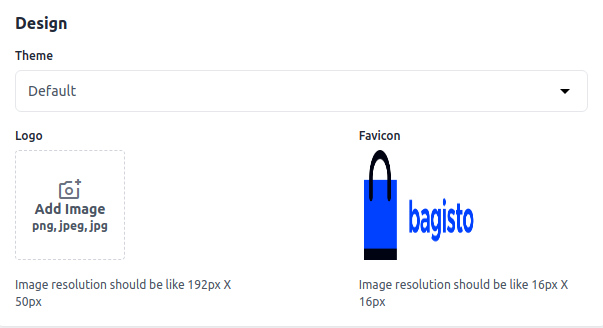
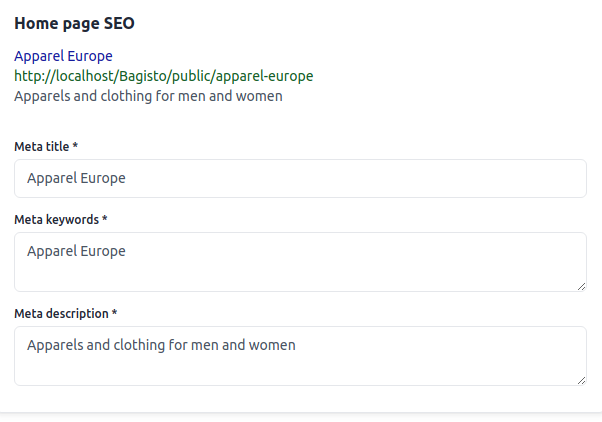

# Channels 

Bagisto allows you to set up and manage multiple instances of domains or stores in a single Bagisto backend. This guide will walk you through how to create multiple websites with different domains in Bagisto.

### Creating Channels in Bagisto.

**Step 1:** The bagisto’s channel functionality allows creating multiple websites in bagisto. Here you need to proceed towards **Settings >> Channels >> Create Channel** as shown in below image.

  

### General

Below are the fields that fall under the General section.

**1.Code:** Provide a code for your channel

**2.Name:** Provide an identifying name for your Channel

**3.Description:** Provide more description about your channels regarding its uses, products that would be selling etc.

**4.Inventory Sources:** Here you select or multi-select inventories that you would be using for this particular channel.

**5.Root Category:** One root category can be selected from the drop-down for your channel.

**6.Hostname:** Here you can provide the URL of your website which you want to connect with your main bagisto’s instance.

  

### Currencies and Locales
Here the settings needed to be done for the currency and locale

**1.Locales:** Here you can select or multi-select locales that you would be using for the particular channel.

**2.Default Locale:** Here amongst the locales that you have created, you can select the locale which should be there as default for your channel.

**3.Currencies:** Here you select or multi-select currencies that you would be using for the particular channel.

  

### Design

Within the design section, you can choose a theme from the drop-down option if multiple themes have been created.

 

### Logo 

For creating a frontend **Logo** kindly click on this logo add image option and select the logo from your system and then click on **Save Channel** Button.

 

### Logo on Frontend

Now check the output on your frontend logo is updated successfully.

 

### Favicon 

For creating a frontend **Favicon** kindly click on this favicon add image option and select the logo from your system and then click on **Save Channel** Button.

 
 
### Favicon on Frontend 

Now check the output on your frontend logo is updated successfully.

 

### Home Page SEO

**1.Meta Title** So Provide the main title of the product by which your product will be known.

**2.Meta Keyword** The meta keyword for the product needs to be provided to improve its searchability on the search engine for specific keywords.

**3.Meta Description** Enter the description so that products can easily appear in search engine listings.

 

### Maintenance Mode

In Bagisto, **maintenance mode** refers to a feature that allows you to put your online store into a temporary offline state. This mode is typically used when you need to perform updates, maintenance tasks, or make significant changes to your store's backend or frontend without disrupting the customer experience.

**1) Message-** Enter the message that will visible to the customers when they visit your store under maintenance mode.

**2) Allowed IPs-** Enter the IP address that will run under maintenance mode

**3) Status-** Enable/Disable the status for the maintenance mode.

 

Now click on **Save Channel** and you will able to see the new **Channel** as shown below.

 

So by this you can easily create a new **Channels** in Bagisto.