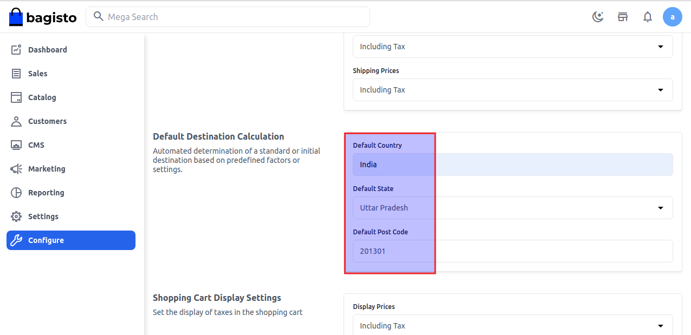
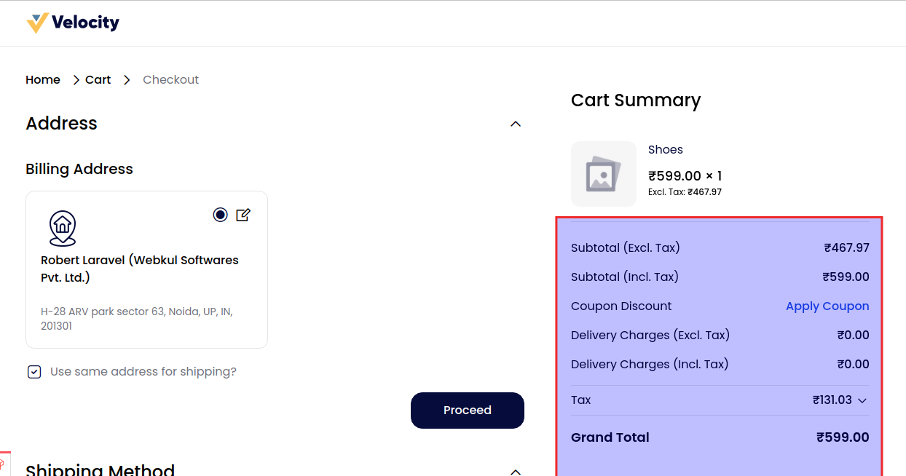
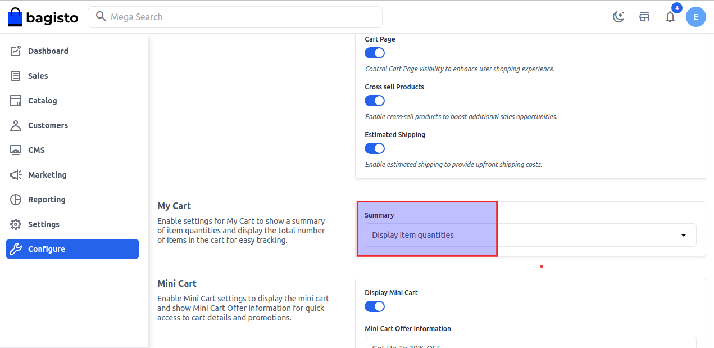
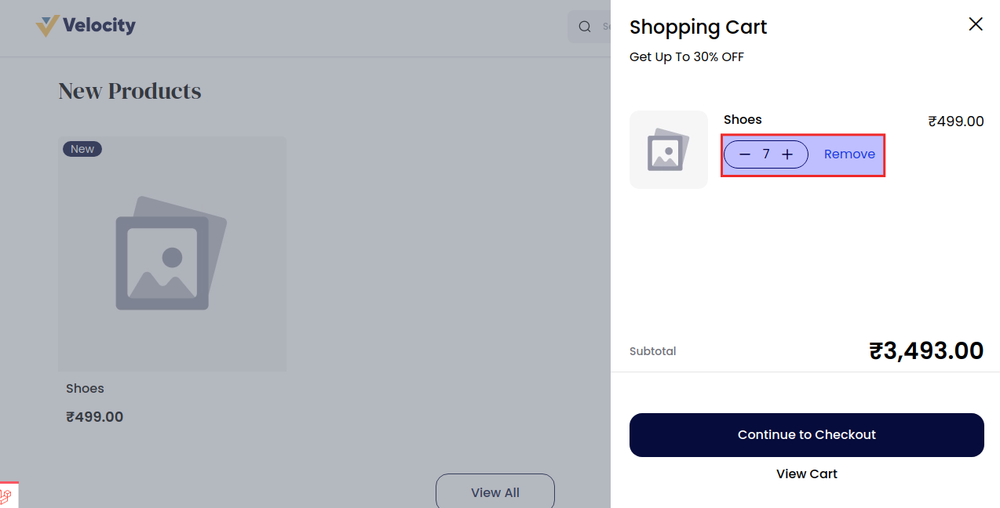
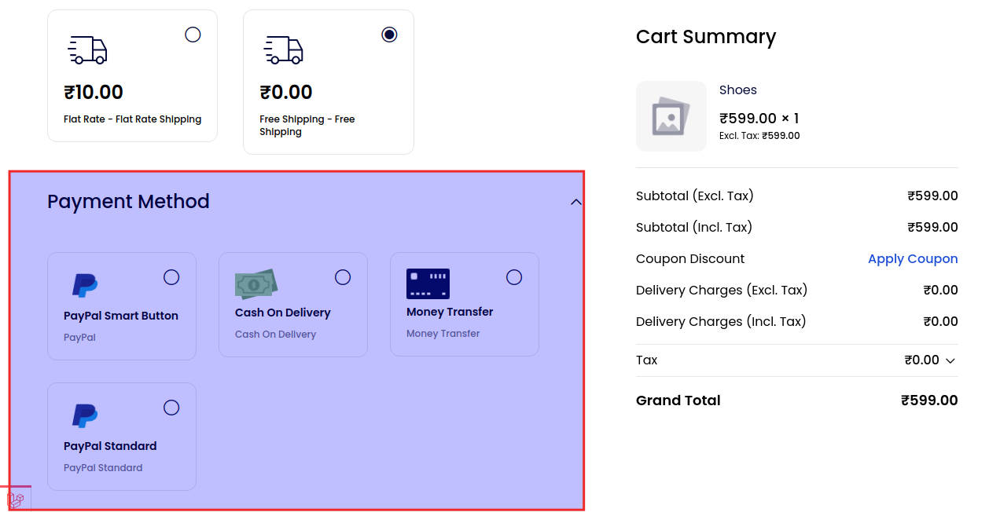

# Configure

Generally, a configuration is the arrangement - or the process of making the arrangement - of the parts that make up a whole.

How the parts of something, or a group of things, are arranged.

## Magic AI

To add Magic AI go to Admin Panel and go to **Configure >> General >> Magic AI** as shown in the below image.

1. If you want to enable it for the **Content Generation** kindly allow it from here.

2. Kindly Enable it for the **Image Generation** from here.

3. For **Review Translation** add your model and Enable it as shown in the below image.

4. For the **Personalized Checkout Message** Enable it and add the model.

## Weight Unit

**1)** To add Weight Unit go to the Admin panel and go to **Configure >> General**.Next, select the **Weight Unit** from dropdown **lbs or kgs** according to your requirement and click on the **Save Configuration** button as shown in the image below

## Configurable Choices.

Settings refer to configurable choices that control how a system, application, or device behaves, tailored to user preferences and requirements.

**1)** Now to add Weight Unit go to the Admin panel and go to **Configure >> Content**.Next, you will able to see the below options.

**Compare Options** - By this, you can easily compare your products.

**Wishlist Option** - This helps to add the functionality of Wishlist.

**Image Search Option** - This option helps to search your image.

After clicking on the **Save Configuration** button.

## Custom Scripts

Custom scripts are personalized pieces of code created to add specific functions or features to the software, enhancing its capabilities uniquely.

Here, in this specified section CSS and JS Admin can write the code. And in last, it will automatically append the code to the master file.

**1)** Now to add **Custom Scripts** go to the Admin panel go to **Configure >> Content**.Next you will able to see the below options.

### Custom CSS

We have used a background color by **Light Blue** and saved the Configurations.

Now the storefront background color has changed as shown below image.

### Custom JS

You can apply javascript also according to your requirement and click on the **Save Configuration** button.

After then click on the **Save Configuration** button.

## Design

Admin logo is the distinctive image or emblem representing the administration interface of a system or website, often customizable.

To add **Designs** like **Admin logo, Favicon** go to the Admin Panel and click on **Configure >> Design** and you can easily update a new logo image and favicon from here. Click on the **Choose Files** option to select an image last click on the **Save Configuration** button.

The new **Admin Logo** and **Favicon** images are updated.

## Back Orders

A backorder is an order for a good or service that cannot be filled immediately because of a lack of available supply. Backorders give insight into a company's inventory management.

A manageable backorder with a short turnaround is a net positive, but a large backorder with longer wait times can be problematic.

You can easily manage **Backorders** by going to the Admin Panel and clicking on **Configure >> Inventory**.

There is an option present to **Enable or Disable** a Backorder and then click on **Save Configuration** as shown below.

**Note:- If the product is Out of Stock then also the customer is able to Place an Order after Enabling the Backorder Option**

In the above image these products are **Out of Stock** but you can still able to Add the product to the Cart and **Place an Order**.

## Guest Checkout

Guest checkout allows customers to buy products without creating an account, streamlining the purchase process for convenience and faster transactions.

To manage Guest checkout go to Admin Panel and click on **Configure >> Products**.You can see an option of **Enable or Disable** of Guest Checkout and then click the **Save Configuration** button.

## Product View Page

A Product View Page is a dedicated web page or interface within an online store or catalog where detailed information about a specific product is displayed.

This page provides customers with comprehensive insights and details to help them make purchasing decisions.

To add go to Admin Panel and click on **Configure >> Products**

Here you can able to manage a number of Related Products & Up Sell Products will be visible on the front end.

After clicking on the **Save Configuration** button.

## Cart View Page

Cart view page configuration involves arranging items, details, and options on the shopping cart page, improving user interaction and purchase flow.

To add go to Admin Panel and click on **Configure >> Products**

Here you can able to manage several cross-selling products that will be visible on the front end.

After then click on the **Save Configuration** button.

## Frontend

The storefront serves as the customer-facing component of an online store, featuring product displays, category listings, and intuitive navigation to ensure a smooth and enjoyable shopping experience.

To add go to Admin Panel and click on **Configure >> Products >> Storefront**

**1.Search Mode:** Select the search mode by **Database or Elasticsearch** as per your requirements.

**A) Elastic Search-** When you have a large number of products on your website it is quite difficult to search the product. Elastic Search mode helps for fast search mode of products.

**B) Database-** It is recommended when you have a small number of products on your website choose the database option for search mode.

**2.Default List Mode:** You manage in which format your products will be visible on the storefront select from the dropdown **Grid or List**.

### List Mode

### Grid Mode

**3.Products Per Page:** You can enter the quantity that how many products that will be visible per page on the Storefront.

**4. Sort By** Select a sort-by option from the dropdown according to your requirements.

**5. Buy Now Products** Select from the **Enable/Disable** option as per requirement. After enabling it will be visible on the product detail page as shown in the below image.

After then click on the **Save Configuration** button.

## Image Size

Storefront is the customer-facing interface of an online shop, showcasing products, categories, and navigation for a seamless shopping experience.

To add go to Admin Panel and click on **Configure >> Products**

### Small Image

Select **Height and Width** for the small images.

### Medium Image

Select **Height and Width** for the medium images.

### Large Image

Select **Height and Width** for the Large images.

After then click on the **Save Configuration** button.

## Review

Here are the configurations where you can manage the review for Guest Users.

To add go to Admin Panel and click on **Configure >> Products >> Review**

By enabling, this option Guest Users are also able to write a review for the product.

After then click on the **Save Configuration** button.

## Attribute

In this option, you can easily add the size of an **Image and File** upload size (in KB) from here to improve the behavior, appearance, or function.

To add go to Admin Panel and click on **Configure >> Products >> Attribute**

After then click on the **Save Configuration** button.

## Social Share

Sharing things from a website with friends on social media platforms like Facebook, Twitter, or Instagram.

To add go to Admin Panel and click on **Configure >> Products >> Social Share**

After then click on the **Save Configuration** button.

### Frontend:-

All the icons that you just enabled from the Admin Panel are created as shown in the below image.

## Rich Snippets

Rich Snippets (also known as “Rich Results”) are normal Google search results with additional data displayed. This extra data is usually pulled from Structured Data found in a page's HTML.

Set products and category configurations. To add to the Admin Panel click on **Configure >> Rich Snippets**

### Products

Items available for purchase or use, offered by a business or seller. Select the option of **Enable/Disable** and click on **Save Configuration** Button.

### Categories

"Categories" refer to groups or classifications that help organize and group similar products or items for easier browsing and navigation.

Select the option of **Enable/Disable** and click on **Save Configuration** Button.

## Address

To add an address on the Admin Panel go to **Configure >> Address** and manage your **Requirements & Information** and then click on **Save Configuration** button.

## Captcha

"Sitemap: Website layout map for search engines. Secret key: Secure code for data encryption, authentication, or API access protection."

On the Admin Panel go to **Configure >> Captcha** add the **Site Key & Secret Key** and enable/disable the **Status** according to your requirement.

After then click on the **Save Configuration** button.

## Settings

Set newsletter subscriptions, email verifications, and social login.
To add go to the Admin Panel and click on **Configure >> Settings**

### Newsletter Subscription

"Newsletter information" contains updates, offers, or content shared regularly through emails to subscribers, keeping them informed and engaged.

### Email Verification

"Email verification" confirms the authenticity of an email address, often by sending a confirmation link, enhancing account security and communication reliability.

### Social Login

"Social login" enables users to access websites using their social media accounts, streamlining registration and login processes for convenience.

After clicking on the **Save Configuration** button.

## E-mail Settings

Set email sender name, shop email address, admin name, and admin email address.

To add go to the Admin Panel and click on **Configure >> Email Settings**

After clicking on the **Save Configuration** button.

## Taxes

**A) Tax Categories -** Tax categories are classifications for different types of taxes, such as sales tax, value-added tax, or excise tax, used to categorize and apply tax rates to products or services that will be visible over here.

**B) Calculation Settings -** Information about how much things cost, including the starting price, any discounts, taxes, and extra fees.

**1) Calculation Based On-** By default, there are 3 options for calculations i.e. Shipping Address, Billing Address, Shipping Origin.

**A) Shipping Address-** A shipping address is the location where goods or products are sent for delivery. It includes details like the recipient’s name, street address, city, state or province, postal or ZIP code, and sometimes additional information like a company name or suite number.

**B) Billing Address-** A billing address is the address associated with a payment method, such as a credit or debit card. It’s used to verify the identity of the cardholder and to process transactions.

**C) Shipping Origin-** Shipping origin refers to the location from which goods or products are dispatched or sent out. It is the starting point of the shipment journey before it is transported to the destination address.
The shipping origin typically includes details such as the address of the warehouse, store, or supplier where the shipment begins.
This information is important for tracking the shipment, calculating shipping costs, and estimating delivery times.

**2) Product Pricing-** There are two options available. Include Tax and Exclude Tax

**A) Excluding Tax-** It simply means that no taxes have been included in the product pricing. For example in the below image product price is 599 and the tax amount is 167.72 and it is separately calculated.

**B) Including Tax-** It means tax are already factored into the price you have received for a good or service. For example in the below image product price is 599 and the tax amount is 167.72 and the calculation is showing all the amount altogether.

**C) Default Destination Calculation -** Select **Country, State & Pin Code** it typically refers to the automatic determination of a shipping or delivery address based on preset criteria or system.

**D) Shopping Cart Display Settings -** Set the display of taxes in the shopping cart by Display Prices, Display Subtotal, and Display Shipping Amount.

By default, we provide Three options:

**A) Excluding Tax-** It simply means that no taxes have been included in the product pricing. For example in the below image product price is 599 and the tax amount is 167.72 and it is separately calculated.

**B) Including Tax-** It means tax are already factored into the price you have received for a good or service. For example in the below image product price is 599 and the tax amount is 167.72 and the calculation shows the amount is altogether.

**C) Excluding and Including Both-** Excluding tax simply means that no taxes have been included in the product pricing and Include Tax are already factored into the price you have received for a good or service.

## Checkout

Checkout configurations are listed below.

### Shopping Cart

Enable guest checkout, cart page, cross-sell products, and estimated shipping to enhance user convenience and streamline the shopping process for increased sales.

### My Cart

Enable settings for My Cart to show a summary of item quantities and display the total number of items in the cart for easy tracking.

In this, we provide two options:

**A) Display numbers of items in cart** - Select **Display number of items in cart** option and then click on **Save Configuration** button.

After clicking the Add to Cart button this option shows you the total number of quantities. For example, we add 5 products inside the cart. 5 products will be visible on the front end as shown in the image below.

**B) Display Items Quantities** - Select Display items quantities option and then click on **Save Configuration** button.

After clicking the Add to Cart button for eg. 7 products you have added inside the cart only 1 quantity will be visible on frontend

To check the total number of items then you have to go inside the mini-cart.

### Mini Cart

Mini Cart is the option where you can able to see the information after adding the product to the cart.

To enable mini cart settings go to **Configure >> Checkout >> Mini Cart** you can also add a mini cart offer information message as shown in the image below.

The mini cart is able to open with an offer message as shown in the image below.

Now, if we disable this Mini-Cart user is not able to open the mini-cart, and the user directly gets redirected to the checkout page.

## Notifications

A notification is a message or alert that provides information or prompts an action to users, usually within software applications, websites, or devices.

To add go to the Admin Panel and click on **Configure >> Notifications**

After then click on the **Save Configuration** button.

## Shipping

Shipping Origin refers to the location from which goods or products are dispatched or shipped. It is the starting point of the shipping process before the items are transported to their destination.

To add go to the Admin Panel and click on **Configure >> Shipping**

## Shipping Methods

To deliver the products there are two types of shipping methods.

To add go to the Admin Panel and click on **Configure >> Shipping Methods**

**1) Free Shipping** "Free shipping" refers to a shipping method where the cost of shipping is waived, and the seller covers the shipping expenses for delivering goods to the buyer.

**2)Flat Rate Shipping** Flat rate shipping is a shipping method where a fixed fee is charged for shipping, regardless of the weight, size, or distance of the package. This simplifies shipping costs and can be advantageous for both buyers and sellers.

After then click on the **Save Configuration** button.

### Shipping Mentod Frontend

## Payment Methods

A payment method refers to the various options available for customers to make payments when purchasing a product or service. Whether in a physical or online store, payment methods cover a range of choices. Commonly accepted payment methods include cash, credit cards, debit cards, gift cards, and mobile payments.

To add go to the Admin Panel and click on **Configure >> Payment Method**

### Paypal

PayPal Smart Button: Simplifies online payments with customizable buttons for secure, multi-method transactions on websites and apps.

### Cash On Delivery

Payment method where customers pay in cash upon receiving goods or services at their doorstep.

### Money Transfer

Transfer of funds from one person or account to another, often electronically, for various purposes such as transactions or remittances.

### PayPal Standard

PayPal Standard is a basic PayPal payment option for online businesses, enabling customers to pay using their PayPal accounts or credit/debit cards.

After clicking on the **Save Configuration** button.

### Payment Methods Forntend

## Order Settings

To add go to the Admin Panel and click on **Configure >> Order Settings**

**Order Number Settings:-** Order Number Settings refer to the configuration parameters that determine how order numbers are generated, formatted, and managed within a system.
These settings are crucial for organizing and tracking orders efficiently.

**Minimum Order Settings:-** Configured criteria specifying the lowest required quantity or value for an order to be processed or qualify for benefits.

In the Order section add a new configuration setting so that the order has Included Discount Amount, Include Tax to Amount, and the Description in the cart page.

**Allow Reorder:-** Enable or disable the reordering feature for admin users.

After then click on the **Save Configuration** button.
**Admin Reorder**

To check Admin Reorder go to **Sales >> Orders** and go inside the order which is showing the pending status. Here you will able to see the option of Reorder on the admin side.

**Frontend Reorder**

After completing your order go inside **My Accounts >> Orders** here you will able to see the Reorder button at the top right corner as shown in the below image.

## Invoice Settings

To add go to the Admin Panel and click on **Configure >> Invoice Settings**

**1.Invoice Number Settings** Configuration of rules or parameters for generating and assigning unique identification numbers to invoices for organizational and tracking purposes.

**2. Payment Terms** Agreed-upon conditions dictating when and how payment for goods or services should be made by the buyer to the seller.

**3.Invoice Slip Design** Visual layout and formatting of an invoice slip, including company branding, itemization, pricing, and payment details for professional presentation.

**4.Invoice Reminders** Automated notifications or communications sent to customers to remind them of upcoming or overdue invoice payments.

After then click on the **Save Configuration** button.

## Pricing

Details about the cost of goods or services, including base price, discounts, taxes, and additional charges information.

To add go to the Admin Panel and click on **Configure >> Pricing**

After clicking on the **Save Configuration** button.
