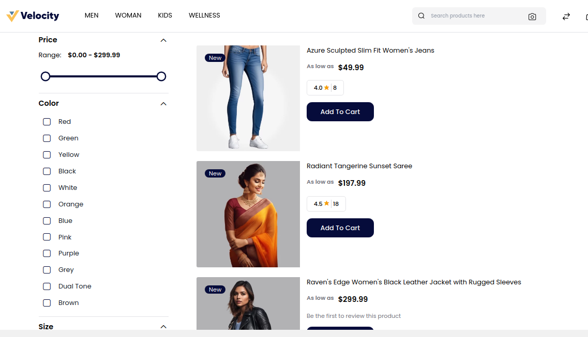
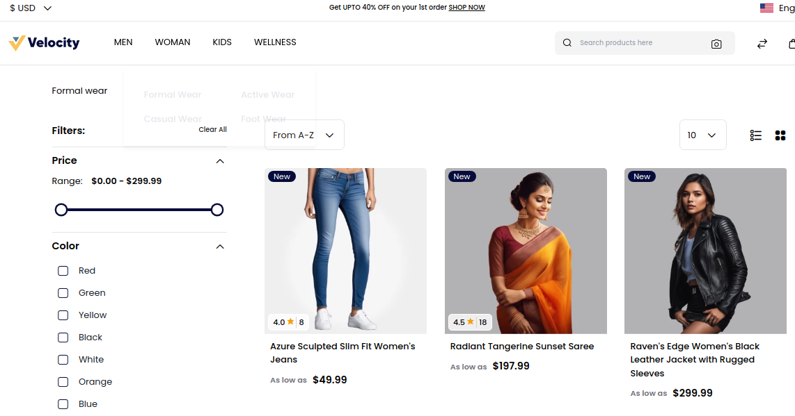

# Frontend

The storefront serves as the customer-facing component of an online store, featuring product displays, category listings, and intuitive navigation to ensure a smooth and enjoyable shopping experience.

To add go to Admin Panel and click on **Configure >> Products >> Storefront**

**1.Search Mode:** Select the search mode by **Database or Elasticsearch** as per your requirements.

**A) Elastic Search-** When you have a large number of products on your website it is quite difficult to search the product. Elastic Search mode helps for fast search mode of products.

**B) Database-** It is recommended when you have a small number of products on your website choose the database option for search mode.

**2.Default List Mode:** You manage in which format your products will be visible on the storefront select from the dropdown **Grid or List**.

### List Mode

### Grid Mode

**3.Products Per Page:** You can enter the quantity that how many products that will be visible per page on the Storefront.

**4. Sort By** Select a sort-by option from the dropdown according to your requirements.

**5. Buy Now Products** Select from the **Enable/Disable** option as per requirement. After enabling it will be visible on the product detail page as shown in the below image.

After then click on the **Save Configuration** button.
