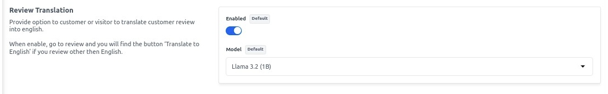

# Magic AI

To add Magic AI go to Admin Panel and go to **Configure >> General >> Magic AI** as shown in the below image.

1. If you want to enable it for the **Content Generation** kindly allow it from here.

2. Kindly Enable it for the **Image Generation** from here.

3. For **Review Translation** add your model and Enable it as shown in the below image.

4. For the **Personalized Checkout Message** Enable it and add the model.

