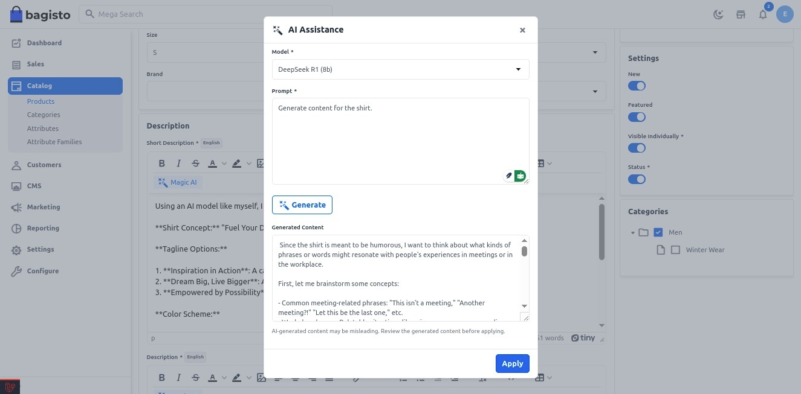

# Magic AI

Magical AI is the ultimate tool for professionals in diverse fields looking to enhance their efficiency. Some of its use cases are: Speeding up data entry tasks for sales and customer support teams.

Bagisto 2.2.0 integrates Magic AI, using artificial intelligence to simplify e-commerce management.

## Content Generation

With Magic AI, store owners can effortlessly generate engaging **Products, Categories, and CMS** content. 

### In Bagisto 2.2.0 it provides Native Support to various LLMs.

**A) For Content** – GPT-4o, OpenAI GPT-4o Mini, Gemini, Llama 3.3 (70B), Mistral, Phi 4, Llama 3.2 (1B and 3B), Llama 3.1 (8B, 70B, and 405B), Qwen 2.5, LLaVA, Llama 3.2 Vision (90B, 11B), Grok (xAI), Deepseek.

Say goodbye to time-consuming manual content creation as Magic AI crafts compelling and unique descriptions, saving you valuable time and effort.

## Image Generation

Empower your store’s visual appeal with Magic AI’s image-generation capabilities. 

**B) For Images** – Dall.E 2 , Dall.E 3

Admins can now generate stunning product images, ensuring a visually appealing and consistent presentation across the entire product catalogue.

 

## Review Translation

In Bagisto 2.2.0, we recognise the importance of catering to a global audience. 

The new release includes a Review Translation feature, allowing store owners and their customers to translate reviews into multiple languages automatically. 

 

Bridge language barriers and connect with a diverse customer base seamlessly.

## Personalized Checkout Messages

Create a more personalised and engaging shopping experience with Bagisto 2.2.0’s personalised checkout messages.

 

