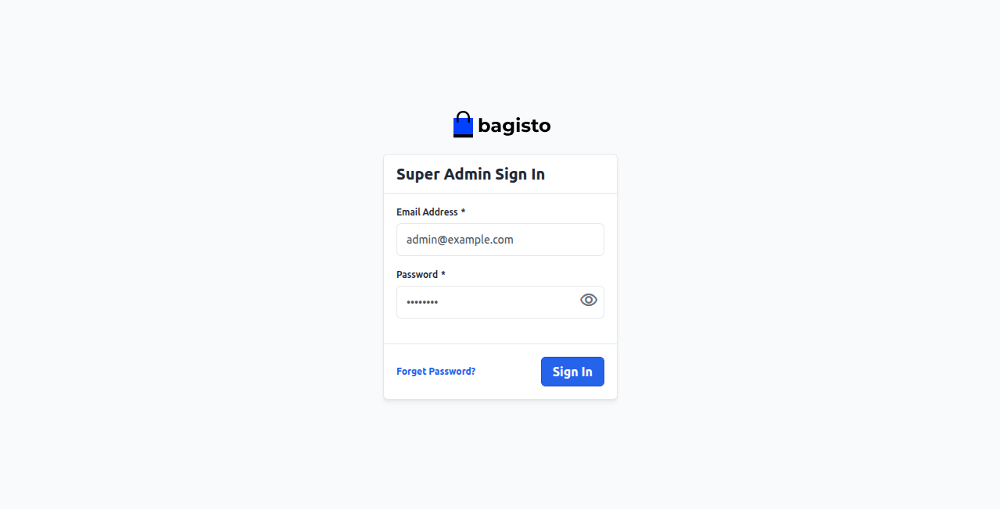
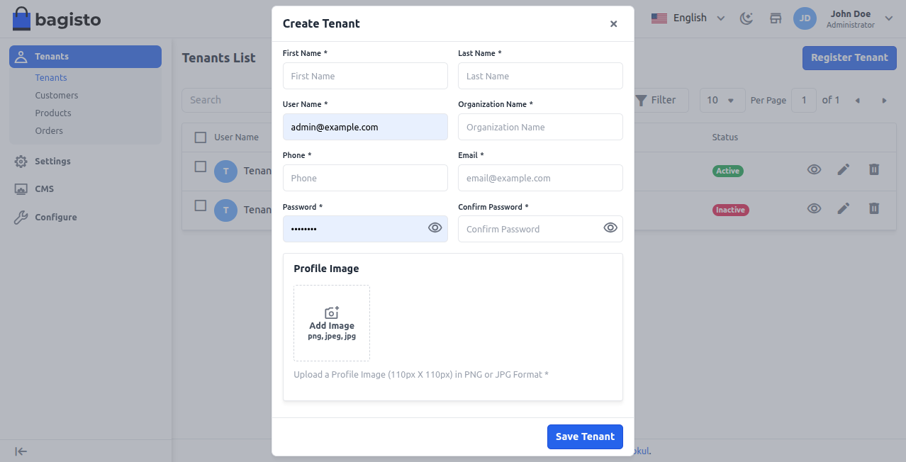
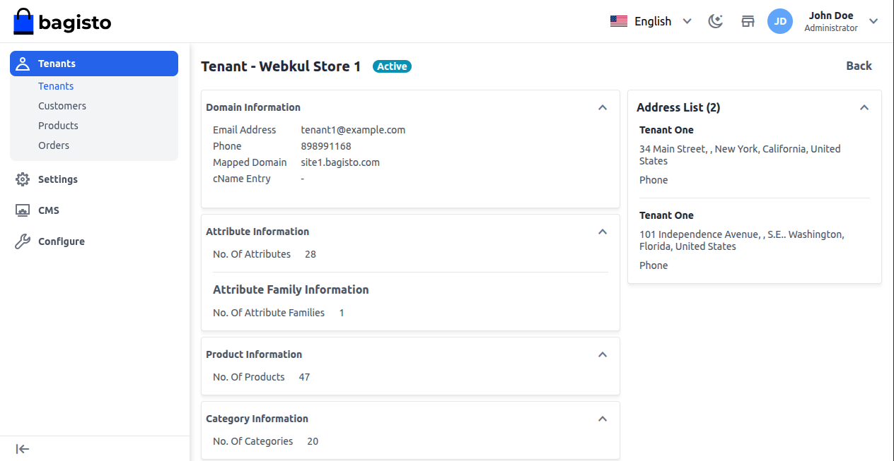
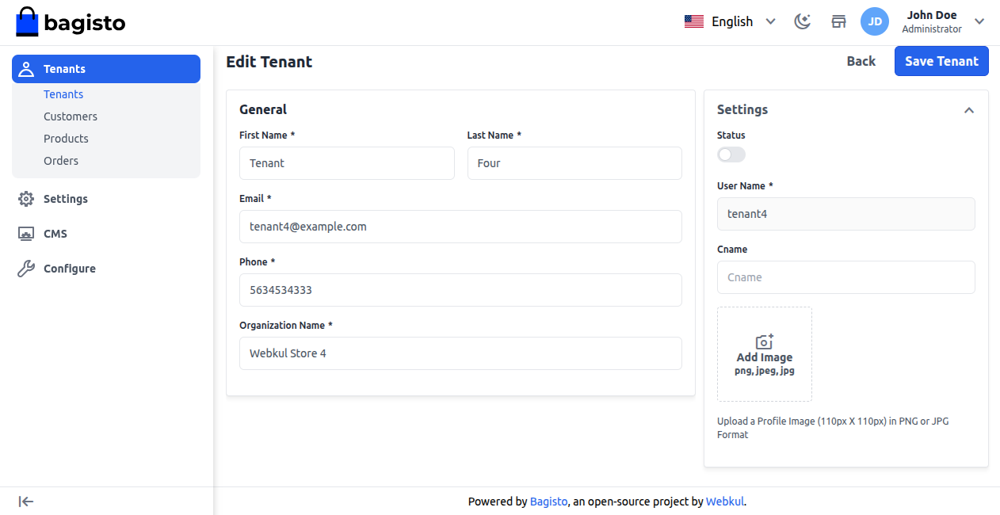
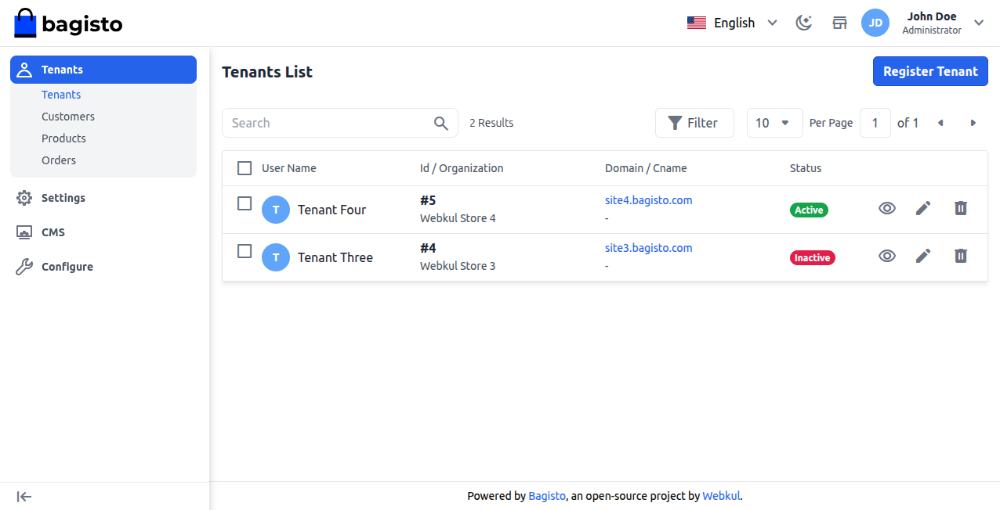
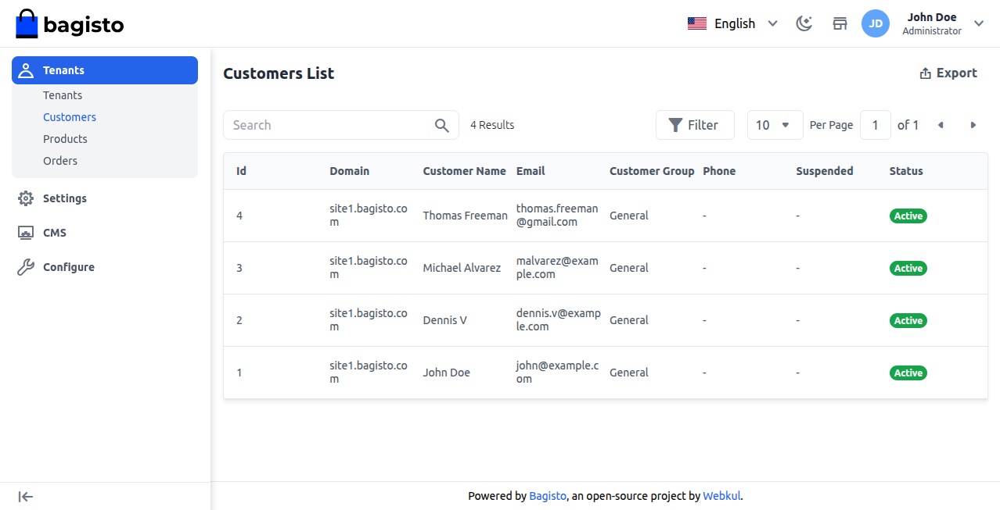
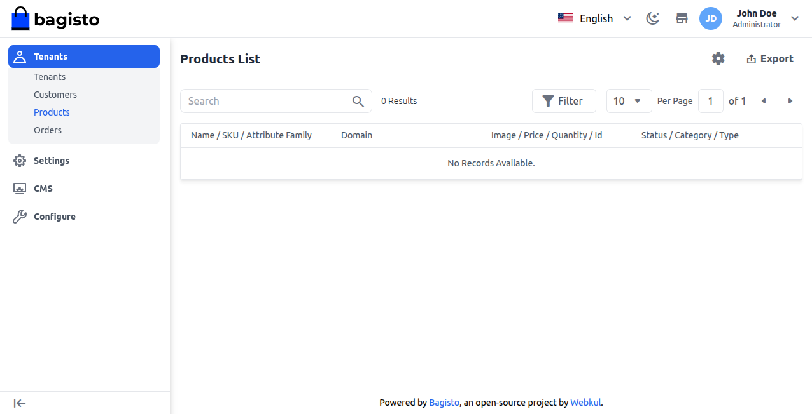
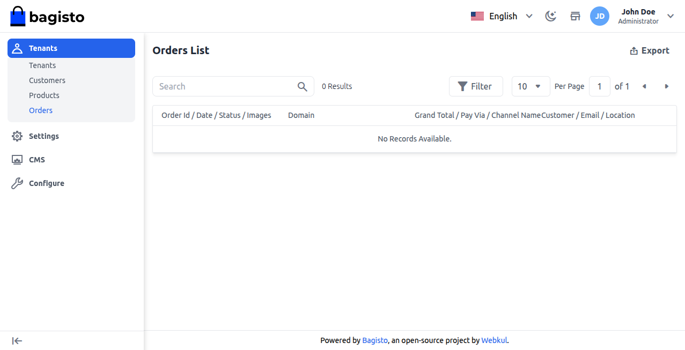

# Super Admin Management 

The Super Admin position is the top authority in the SaaS mall, in charge of overseeing tenants, staff, and the entire platform's operations.

This role includes managing merchants (tenants), giving roles to staff (agents), and making sure everything works well together in the system.

Super Admins set up what products are visible, manage channels, and design themes to keep a consistent look and branding for all tenant stores.

They also take care of CMS pages, send out email broadcasts, and manage global settings to ensure clear communication and proper governance of the platform.

### Access the Super Admin Panel

**Steps to Sign In:**

Visit the registration page and hit the **Super Admin Login** button located in the top right corner.

Type in your registered **Email Address and Password**, then press Sign In to get into the panel.

After successfully signing in, the super admin dashboard will open as shown below. Super-admin can view all the Tenants which is registered on their SaaS Panel.

Here, you can look through the list of tenants and use options to **search, filter, and paginate** for easy access.

In addition to this, the **super admin** can also register the tenant from the super admin panel itself by tapping the **Register Tenant** button on the top right-hand corner.

### Enter the below super admin details 

**1) First Name:** Enter the first name.

**2) Last Name:** Enter the last name.

**3) Phone:** Provide the phone number.

**4) User Name:** Enter the user name.

**5) Organization Name:** Mention the organization name.

**6) Email Address:** Provide the email.

**7) Password:** Provide the password.

**8) Confirm Password:** Confirm the password.

**9) Profile Image:** Add the profile image.

Lastly, tap the **Save Tenant** button to save the new tenant.

### Tenant Insights

To see all the details about a tenant, go to **Tenants → Tenants** and click on the **View icon**.

Under the tenant’s insights super admin can see all the information about their tenant store, as shown in the image below:

### Tenant Insights Information

**1) Domain Information:-** Details of the tenant.

**2) Attribute Information:-** No of attributes of the tenant.

**3) Attribute Family Information:-** Number of attribute families of the company.

**4) Product Information:-** Number of products available from that company.

**5) Category Information:-** Number of categories available to that company

**6) Customer Information:-** Number of customers available

**7) Customer Group Information:-** Number of customer groups of the tenant

**Note: The super admin can only view tenant insights and cannot delete, update, or edit any of the information shown here.**

### Edit Tenant Detail

The Super Admin can edit tenant details like name, contact info, or organization, as shown below.

However, the Super Admin has the ability to **delete** a tenant if needed by pressing the **Delete** button for that tenant.

### Tenant’s Customer

By navigating to **Tenants→Customers** super admin can see all the customer lists of their tenants, as shown in the image below.

**Note: The super admin can only view the customer list and cannot delete, update, or edit any customer details.**

### Tenant’s Products

By navigating to **Tenants → Products** super admin can also see all the product lists of their tenants, as shown in the image below:

**Note: The super admin can only view the product list and cannot delete, update, or edit any product details.**

### Tenant’s Order

By navigating to **Tenants → Orders** super admin can see all the orders of their tenants, as shown in the image below:

**Note: The super admin can only view the orders list and cannot delete, update, or edit any order details**

