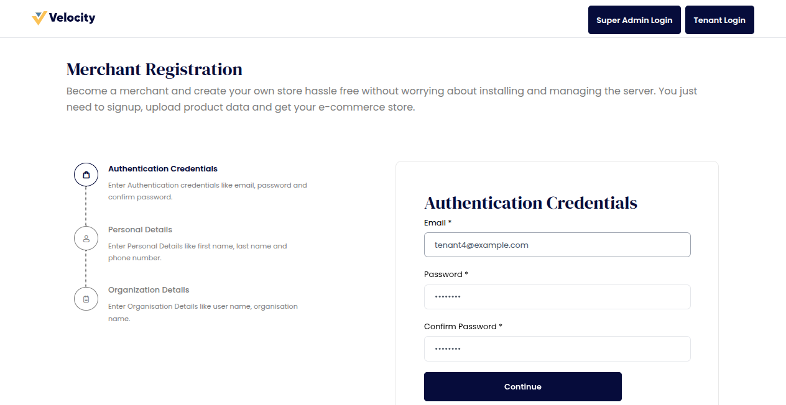
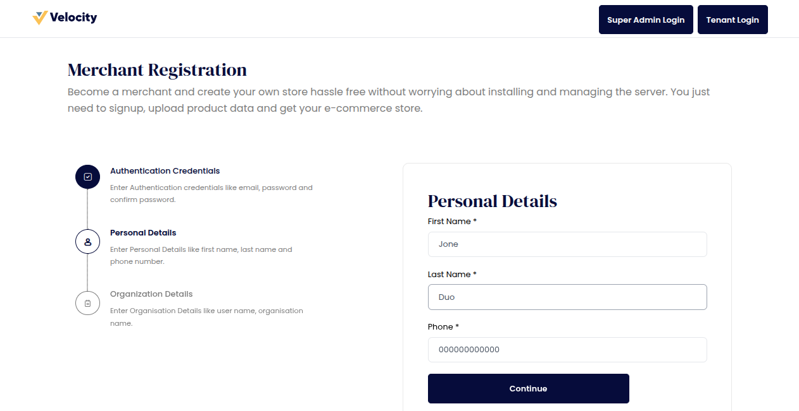
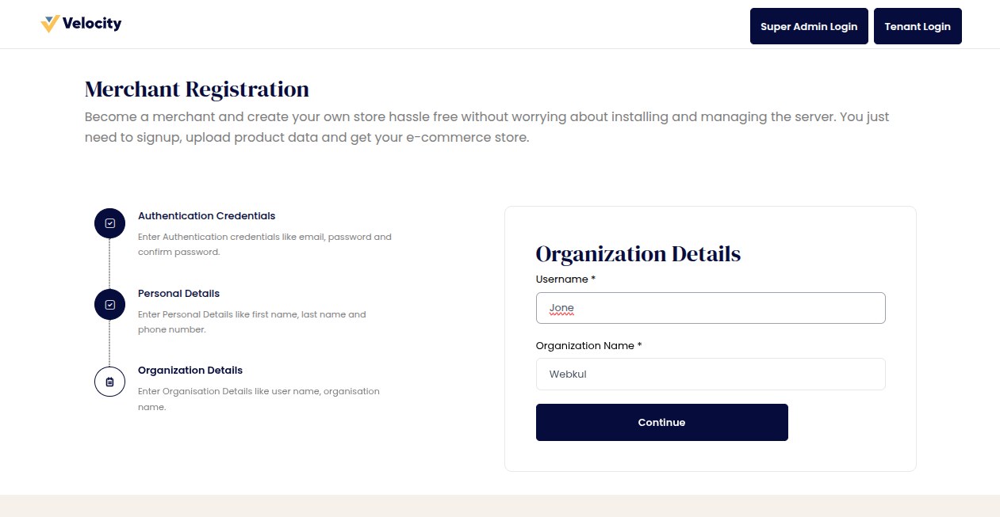
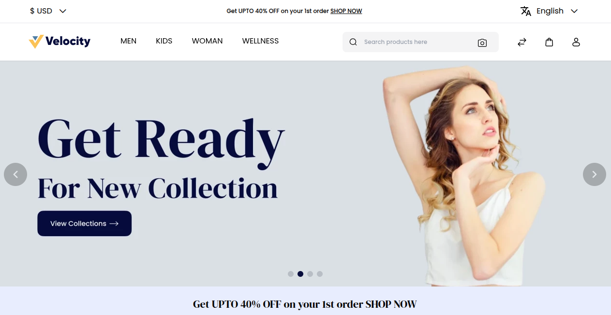
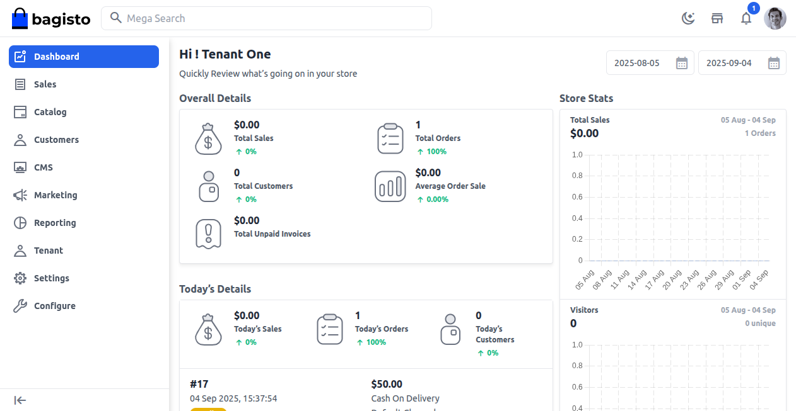
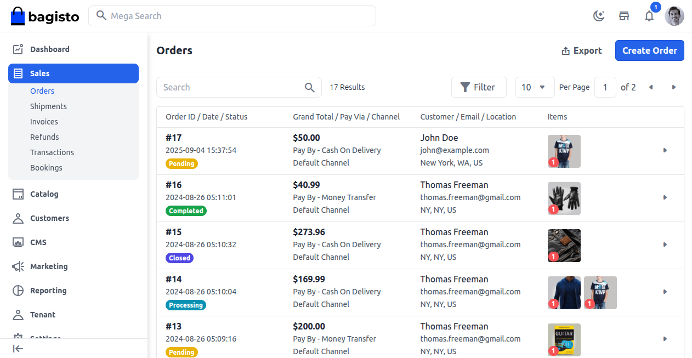
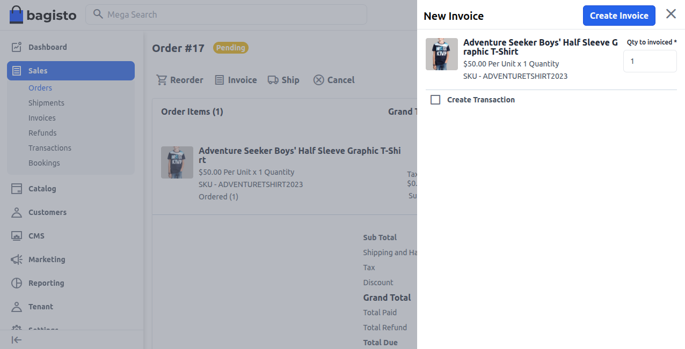
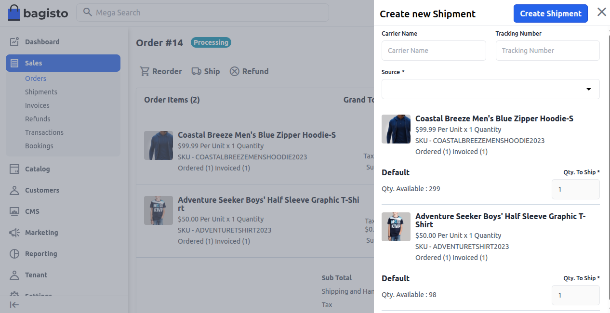
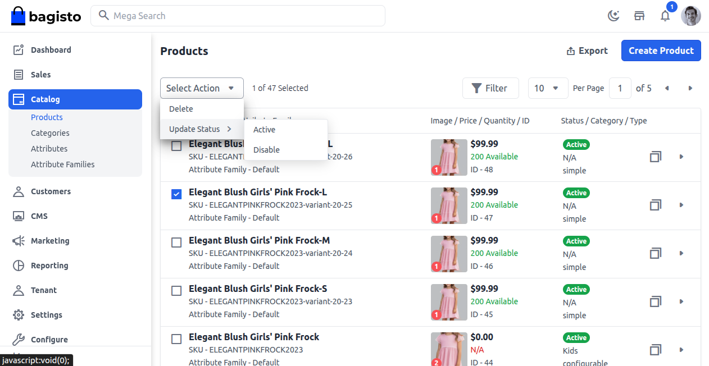
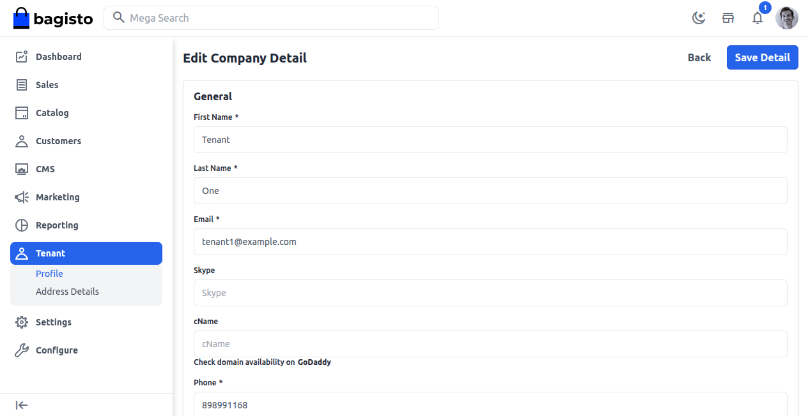

# Tenant Management

Tenant Management in the SaaS module makes it easy for tenants to sign up and quickly create their online store by filling in their login, personal, and organization information.

After they register, the tenant’s storefront is set up automatically, so they can begin selling immediately without any technical difficulties.

Using the Tenant Admin Panel, tenants can manage products, categories, attributes, customers, and more through a user-friendly interface similar to Bagisto.

Tenants can also manage orders by making invoices, setting up shipments, and using other menu options to run their store efficiently.

### Tenant Registration

There are three steps to register on the SaaS module.

**Step 1:** The Tenant has to enter the Authentication Credentials, like **email, password, and confirm password**, then click on **Continue** button.

**Step 2:** The Tenant has to enter their Personal details like **First Name, Last Name, and Phone number**, then click on **Continue**.

**Step 3:** The Tenant has to enter the Organization details, like **User name and Organization name.**

### Tenant Storefront

After the registration is done, the tenant's online store is set up automatically.

As you can see in the picture below, this store is the place where customers can look around and buy products.

### Tenant Admin Panel

After registration, tenants can access their admin panel through a unique URL (e.g., **site1.bagisto.com/saas-common/admin/dashboard**). 

As shown in the image below, the panel provides a Bagisto-like backend where tenants can manage their store operations.

### Order Management

Tenants can easily handle their orders from the admin panel, as seen in the picture below. 

This allows them to check order details, follow status, and carry out actions related to their orders.

### Invoice Management

Tenants can generate invoices for their orders by selecting the **Invoice** and clicking the **Create Invoice** button, as shown below.

### Manage Shipments

Tenants can also create shipments for their orders by selecting the **Ship** option and proceeding with the **Create Shipment** button, as shown below.

### Manage Products and Catalog

Tenants can **create, edit, and delete** products for their store as per their requirements. 

They can also update the status as **Active or Disable** whenever needed.

Apart from **products**, tenants can also create and manage **categories, attributes, and attribute families** to organize their store efficiently.

### Manage Profile Details

Under the Tenant side menu, tenants have the ability to manage and change their profile details. They can modify information like:

**1) First Name and Last Name**

**2) Email address**

**3) Skype ID**

**4) cName**

**5) Phone number**

Once the details are updated, tenants can click **Save Detail** or choose Back to return to the previous screen.

In addition, tenants can explore other menu options available to manage their store more effectively.
