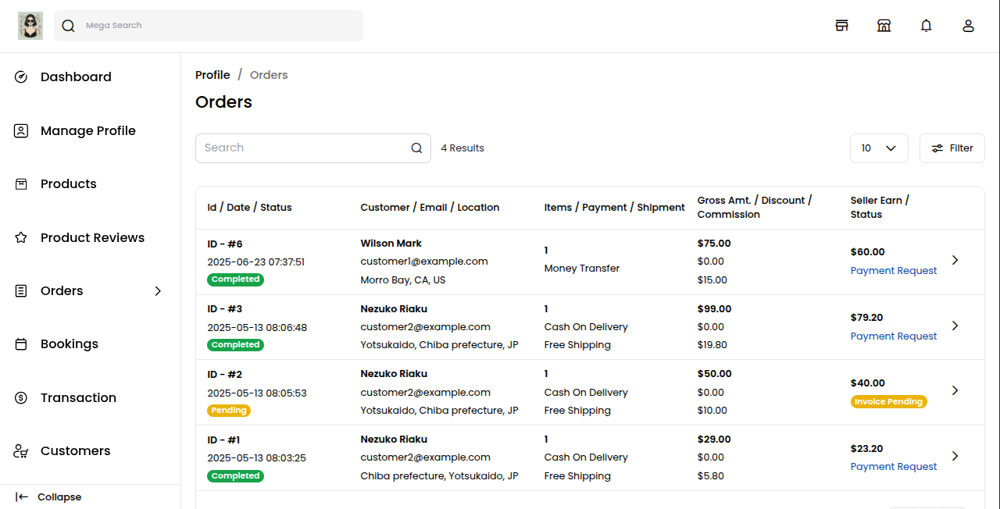
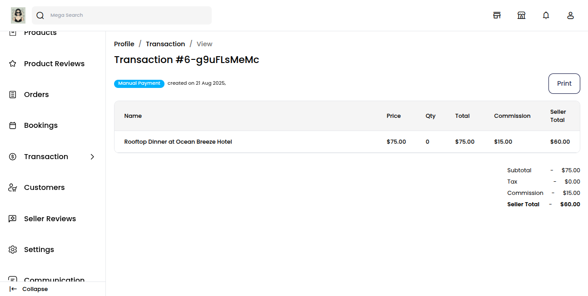
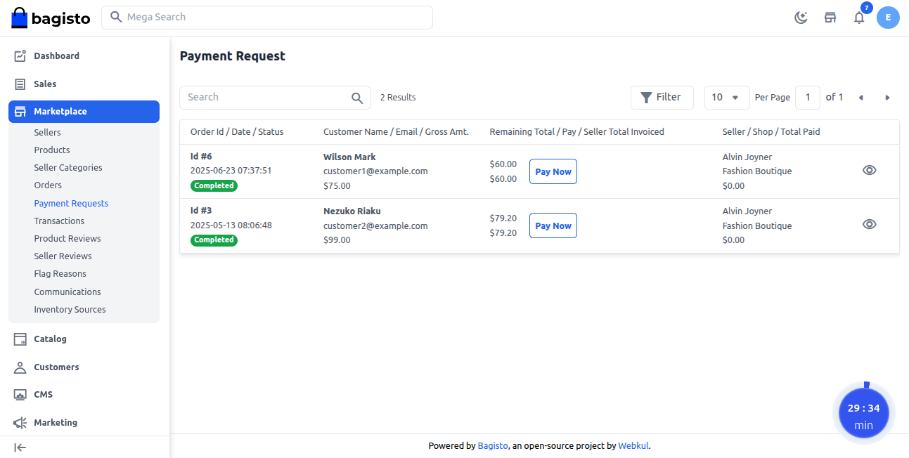
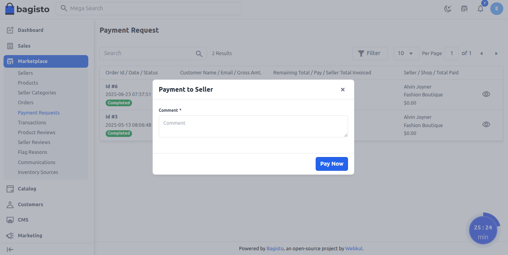
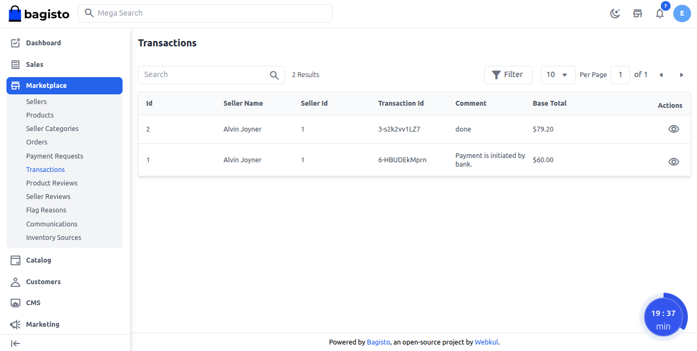

# Payment Management 

Payment management in a Multi-Vendor Marketplace helps both sellers and admins handle finances with ease and clarity. Sellers can quickly check their earnings, see payment details for orders, and request payouts without hassle. 

Admins can easily track all payments, manage commissions, and make sure settlements are secure and on time.

### Seller Side – Requesting Payment

Sellers can request their earnings once orders are completed. 

Follow the steps below to request a payment.

1) Go to **Order >> Payment Request**.

2) Click **"Payment Request"** to send a payout request to the admin.

The request is submitted and will be visible to the admin for review.

Once the admin releases the payment, it appears in the **Seller’s Transaction** section.

**Note:-** Payment requests start as Pending. After admin review, they move to Processing, and once paid out, the status updates to Paid.

### Admin Side – Managing Payments

Admins can manage seller payout requests directly from the marketplace dashboard. 

Go to the **Marketplace >> Payment Request**.

On the Payment Request page, admins can see complete product and order details. They review the request and verify that the order was delivered successfully before processing the payment.

After verification, the admin clicks on the **Pay Now** button to release the payment to the seller.

A popup will appear. The admin can enter a comment or note in the box and then click on Pay Now again to release the payment to the seller.

After payment completion, the details are stored in the **Transaction.** 

Admins can access these by going to **Marketplace >> Transactions**.

