# Rating Management

Ratings and reviews build trust in an online marketplace, guide customer purchases, and help sellers improve their service.

In a Laravel Multi Vendor Marketplace, Rating Management allows buyers to leave star ratings and detailed feedback on both products and sellers after completing a purchase.

Good ratings boost credibility, while honest feedback (even if negative) guides sellers to improve.

### Product Rating

1) Customers can give a star rating and write feedback about the product they bought.

2) This helps other buyers understand whether the product is of good quality and worth purchasing.

3) Products with higher ratings usually attract more customers, as they signal trust and satisfaction.

### Seller Rating

1) After receiving an order, customers can rate and review the seller.

2) This shows whether the seller is reliable, responsive, and delivers on time.

3) Positive ratings help sellers build a strong reputation, while constructive feedback allows them to improve their service.

**Note:** The Ratings and Reviews feature can only be used by signed in customers. Guest users are not allowed to give ratings or reviews. 

### How Customers Can Leave a Product Review

Leaving a product review is a simple way for customers to share their shopping experience and help other buyers make better decisions.

On the top right corner, click the Profile Icon. To log in or sign up as a customer, click the **Sign In** button.

Enter customer email and password in the login form, then click on the **Sign In** button to access your customer account.

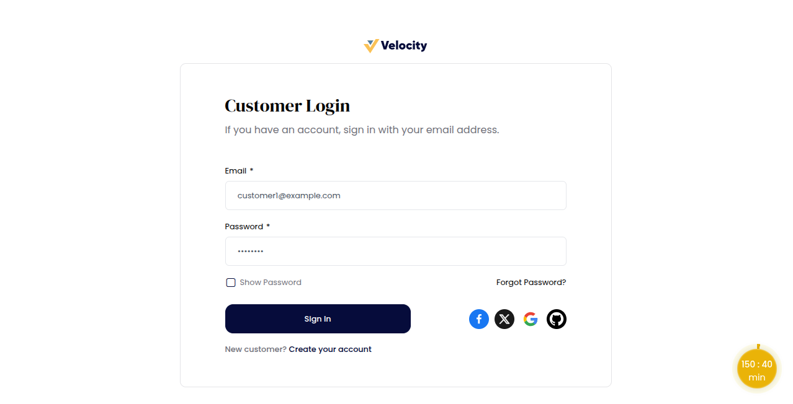

Once a customer logs in, they can browse and order the product of their choice. After completing an order, customers can easily rate the product and provide feedback through their account.

Customers can visit the product page, scroll down, and click on the **Write a Review** button.

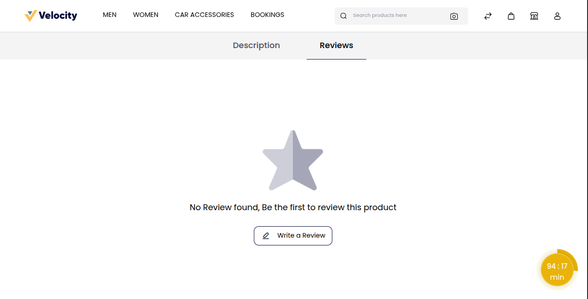

From here, customer can share detailed feedback about their purchase.

**Customers can:**

1) Select a star rating

2) Add a review title

3) Write their comments

4) Upload a photo or video

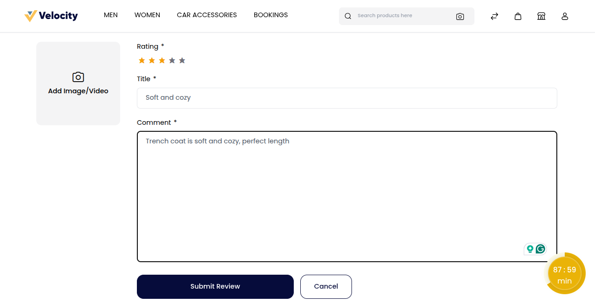

Finally, clicking the Submit Review button will publish the review and share their experience with other shoppers.

**Note:-** The review will not appear on the product page until it is approved by the seller or admin.

### Seller Dashboard: Managing Product Reviews

Sellers can view all customer reviews from their dashboard, gaining valuable insights into product performance and buyer feedback.

Go to the **Product Reviews**.

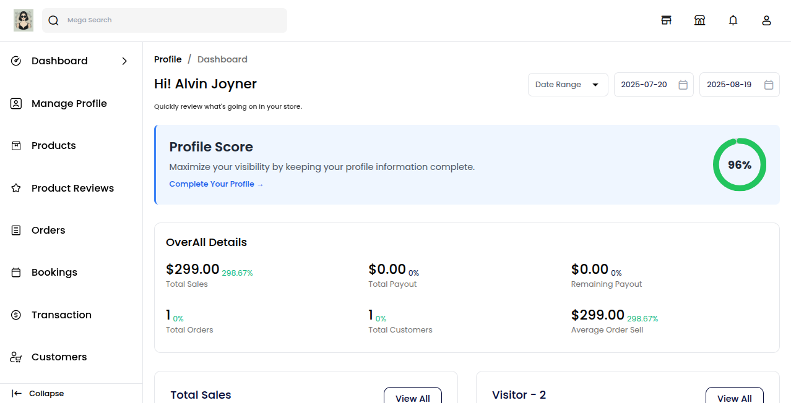

The product reviews page will open, where the seller can see all customer ratings and feedback in one place.

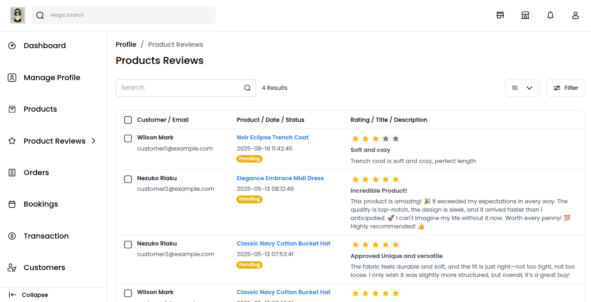

To approve or disapprove a review, select the review by clicking on the checkbox and then go to the **Select Action** dropdown.

From here, the seller has the option to **Approve or Disapprove** a review. 

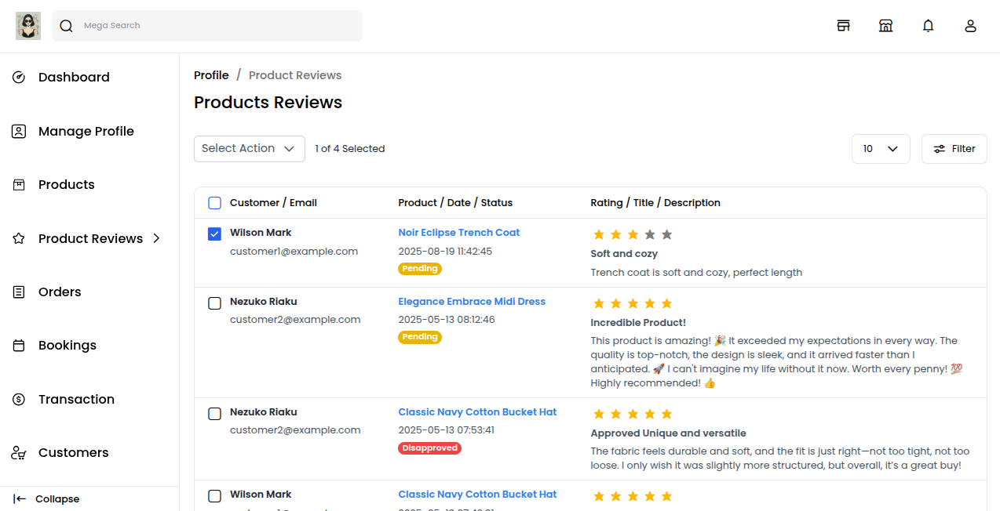

Approved reviews are instantly published on both the product page and the seller’s review page.

### Seller’s Product Review Page

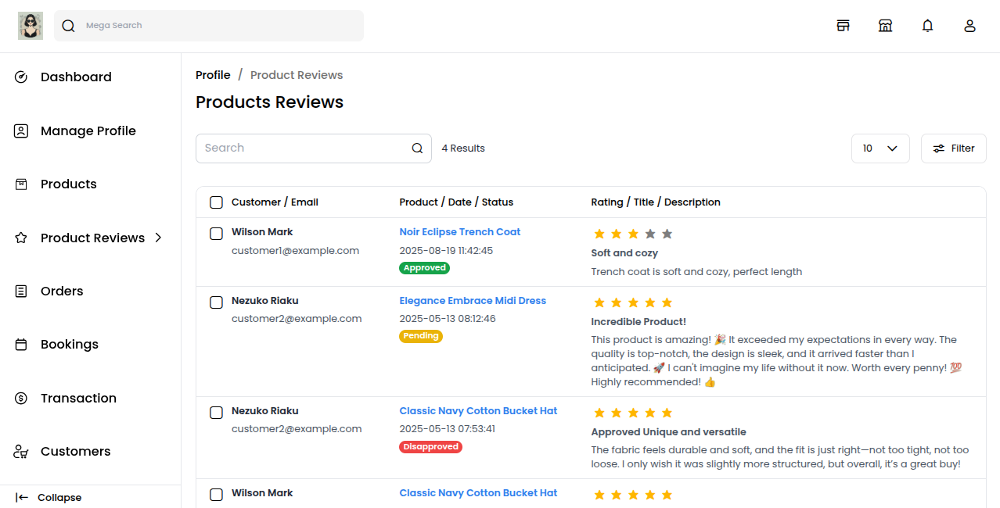

### Customer reviews (Product)

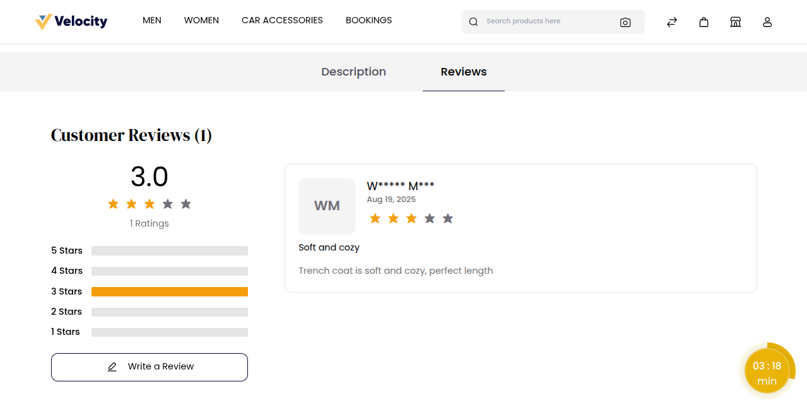

### Admin Dashboard: Managing Product Reviews

Admins oversee all customer feedback, approving or rejecting reviews to keep them genuine. Reviews can be accessed and managed via the admin dashboard.

Go to the **Marketplace >> Product Reviews**.

The product reviews page shows all customer ratings and feedback, along with the corresponding seller details for each review.

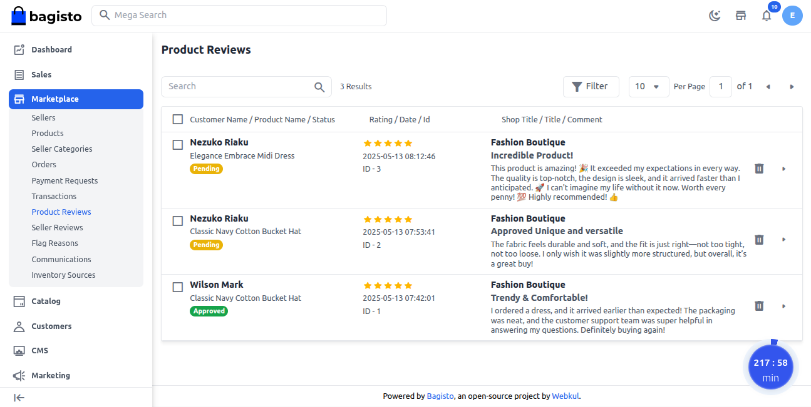

To approve or disapprove a review, the admin selects it using the checkbox and chooses the desired action from the **Select Action** dropdown.

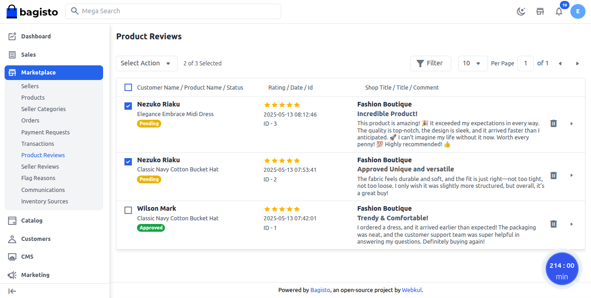

From here, the admin has the option to approve or disapprove a review.

### Admin Product Reviews Page

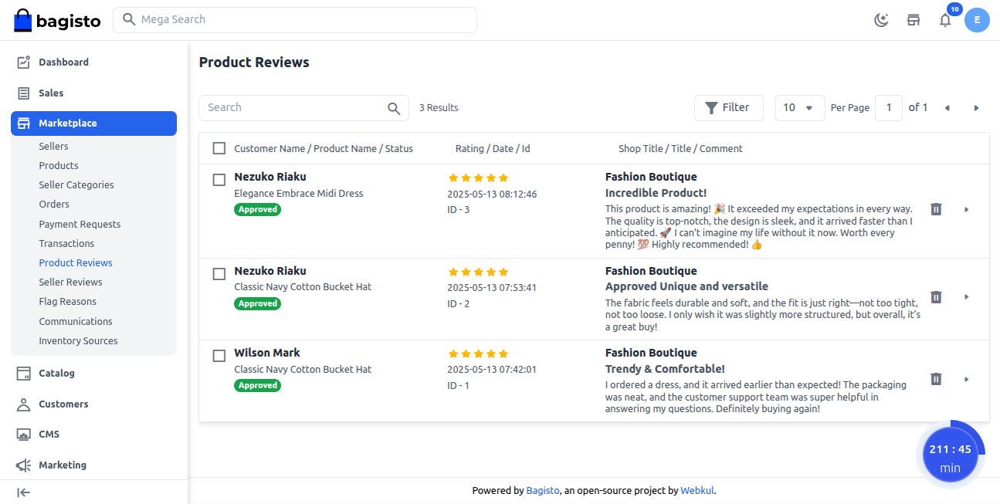

### Customer Reviews

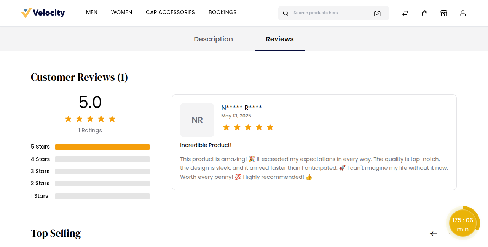

### How Customers Can Leave a Seller Review 

Leaving a seller review is an easy way for customers to share their experience with the seller. Customers can leave a seller review by visiting the seller’s profile.

Go to **Reviews** and click on the **Write a Review** button.

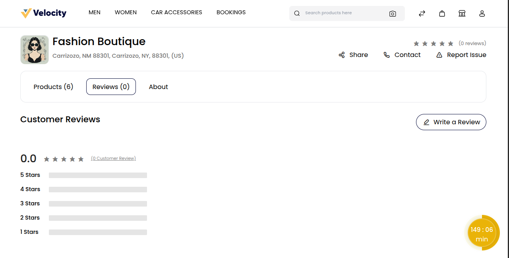

From here, customers can share detailed feedback about their experience with the seller. They can:

1) Select a star rating

2) Add a review title

3) Write their comments

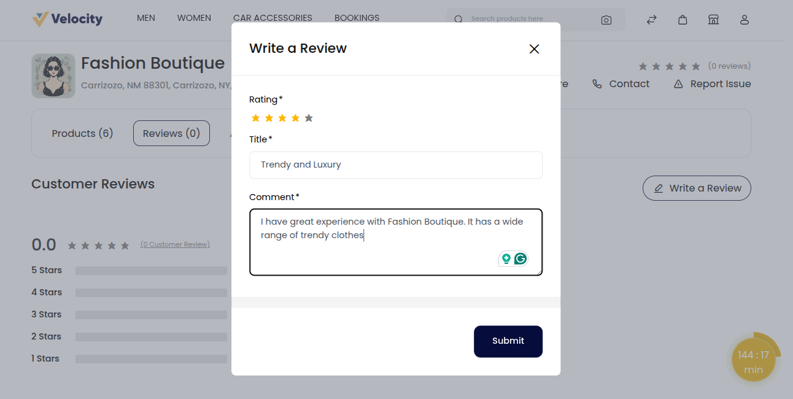

Clicking the **Submit** button will publish the seller review and share the customer’s experience with other buyers.

**Note:-** The review will not appear on the product page until it is approved by the admin.

### Admin Dashboard: Managing Seller Reviews

To maintain trust and support sellers, admins ensure all customer reviews are genuine. Reviews can be viewed directly from the admin dashboard.

Go to the **Marketplace >> Seller Reviews**.

The seller review page will open, where the admin can see all customer ratings and feedback in one place.

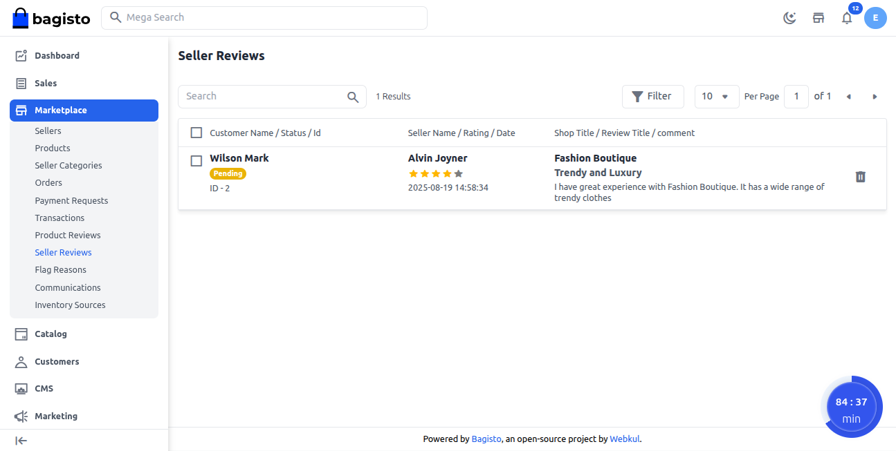

To approve or disapprove a review, the admin selects it using the checkbox and chooses the desired action from the **Select Action** dropdown.

From here, the admin has the option to approve or disapprove a review.

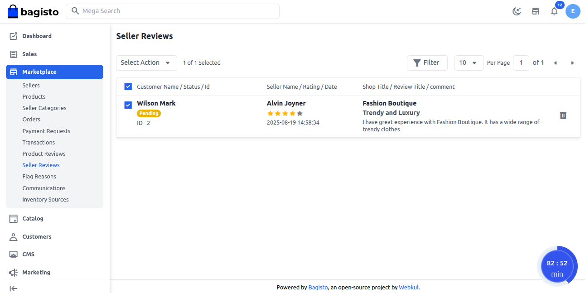

### Admin Seller Reviews Page 

After this Seller Review gets Updated successfully. 

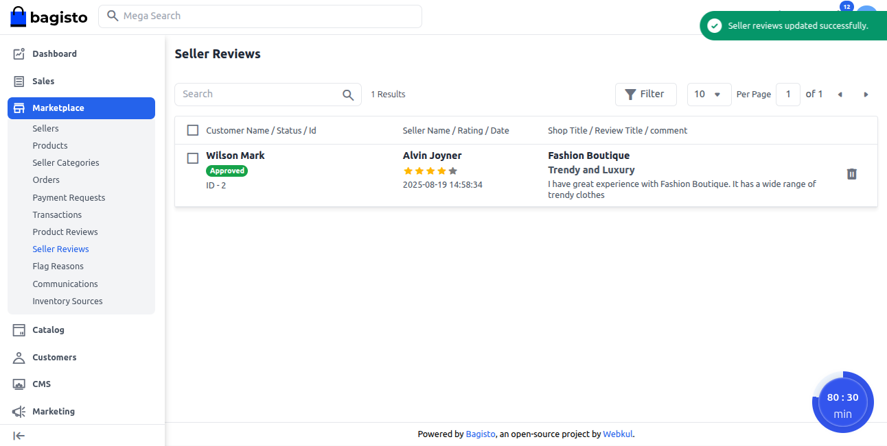

### Seller profile page

Additionally Review gets visible on Seller Profile page.

