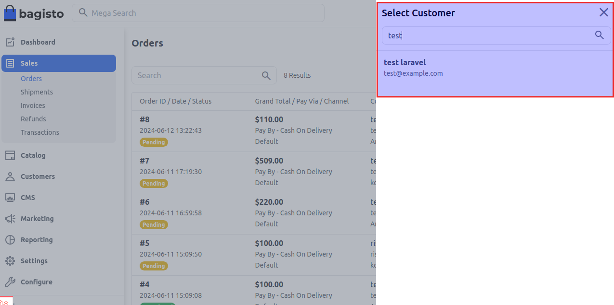
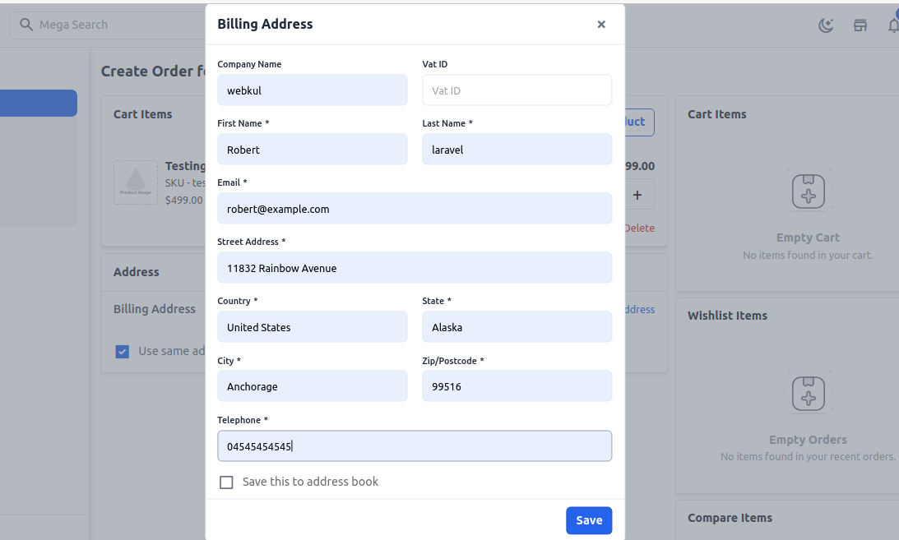

# Admin Order

Sometimes customers not able to place order in that case he/she calls the shop owner to place a order.So Admin can able to place orders on behalf of customers.

### How to Manage Admin Order in Bagisto2.2.0

**Step-1** Go to admin panel of bagisto and click on **Sales >> Orders >> Create Order** now search and select the customer as shown in the below image.

 

**Step-2** Now click on **Add Products** and search your desired product and enter the quantity and then click on **Add To Cart** as shown in the below image.

 

**Step-3** You can also increase the quantity of the product. Now click on add address as shon in below image.

 

**Step-4** Now add all the informtions in billing address form and then click on **Save button** as shown in the below image. 

 

**Step-5** Now add the shipping and payment methods and click on **Place Order** as shown in the below image.

 

**Step-6** Admin Order is successfully updated in the order datagrid as shown in the below image. 

 