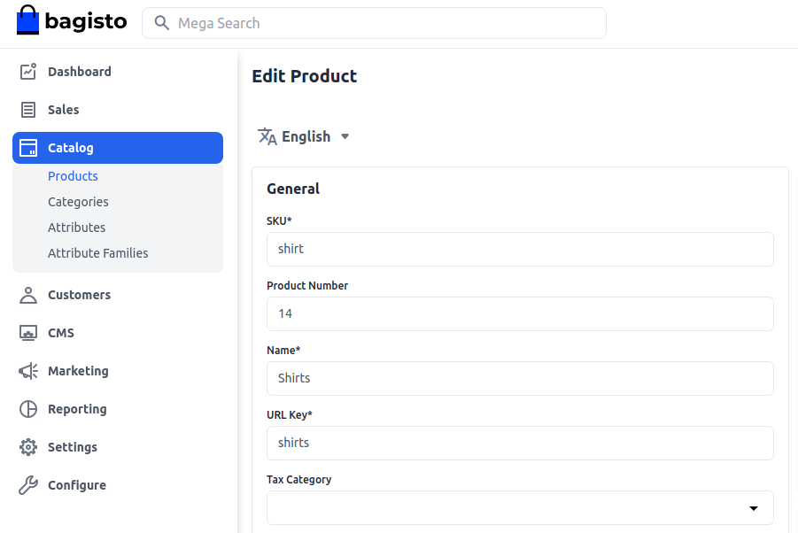

# Configurable Product

Configurable products are items or services that offer customers the flexibility to personalize certain attributes according to their preferences. Whether in manufacturing, e-commerce, or software, these products enable users to choose from predefined options, such as features, specifications, colors, or sizes.

This customization allows for a diverse range of variations without the need for creating unique products. Configurable products are designed to meet individual needs, enhancing customer satisfaction and providing a tailored experience in [Bagisto](https://bagisto.com/en/).

### How to Create a Configurable Product in Bagisto 2.2.0
1. **Add Product:** Click on **Catalog >>** select **Configurable** as Product Type >> select **Family** >> enter **SKU** and then **Save the Product** as shown in the below image.

 

   After you Save the Product, you get an option to select the **Color & Size**. In case you want some other attribute in your configurable product, you need to create an attribute first and then save the product as shown in the below image.

   

### General Attributes
Below is the list of fields you need to fill under General Attributes.

- **SKU:** Provide SKU (Stock Keeping Unit) of the product which is unique to every product.
- **URL Key:** This will be the end of the URL, for example, http://bagisto.test.com/products/philips-speaker (Speaker is a URL key)
- **Tax Category:** You can select the Tax Category from the drop-down list that you want to be applied to the product.

   

Also, make sure to enable the Settings.

- **New:** Enable the toggle button if you want to feature the product as a new product. The resulting product will be shown under the New Products section.
- **Visible Individually:** Enable the toggle button so that the product will be visible on the front end.
- **Featured:** Enable the toggle button if you want to show the product under the Featured Products section.
- **Status:** Enable the toggle button to make the product enabled on your eCommerce store.
- **Guest Checkout:** Enable the toggle button to allow the product to be ordered by the guest customer.

   

### Description
Below is the list of the fields you need to fill regarding the product under the description.

- **Short Description:** Enter a short description of the feature of the product.
- **Description:** Here you can mention your product in detail.

   

### Meta Description
Below is the list of fields that you need to provide under the meta description to make your product easily searchable on search engines.

- **Meta Title:** Provide the main title of the product by which your product will be known.
- **Meta Keyword:** The meta keyword for the product needs to be provided to improve its searchability on the search engine for specific keywords.
- **Meta Description:** Enter the description so that the product can easily appear in search engine listing.

   

### Images
Add the product images, click on **Add Images**. You can add multiple images for your product.

   

### Channels

Select the channels in which you want to save this product.

### Variations

Now you will be able to see the **Variations** right below the video section as shown below. You can simply Edit each product as we have created according to the Color and Size.

   

After all Variations are created, finally, **Save the Product**.

### Front End
The product will be visible as given below on the front end.

   
