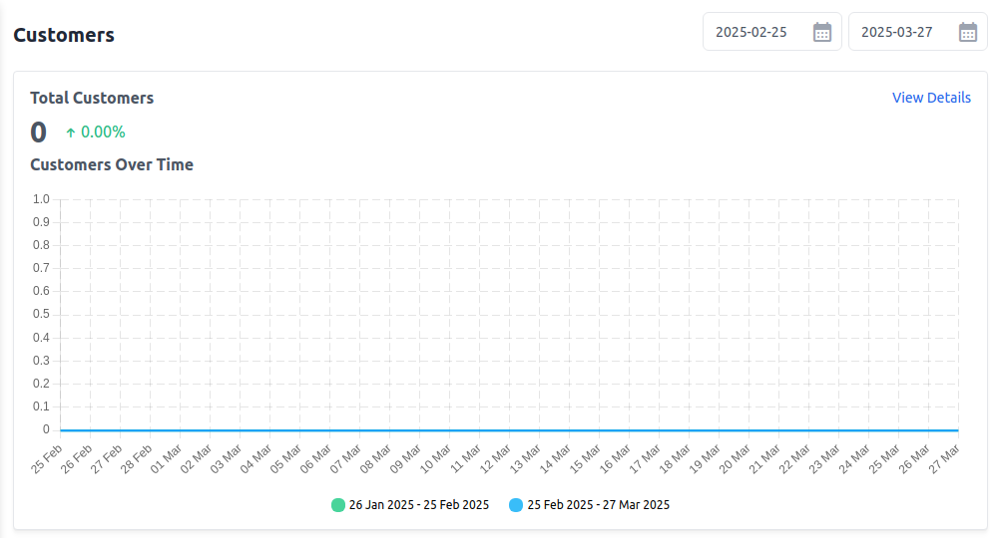
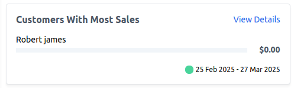
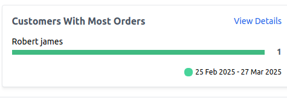
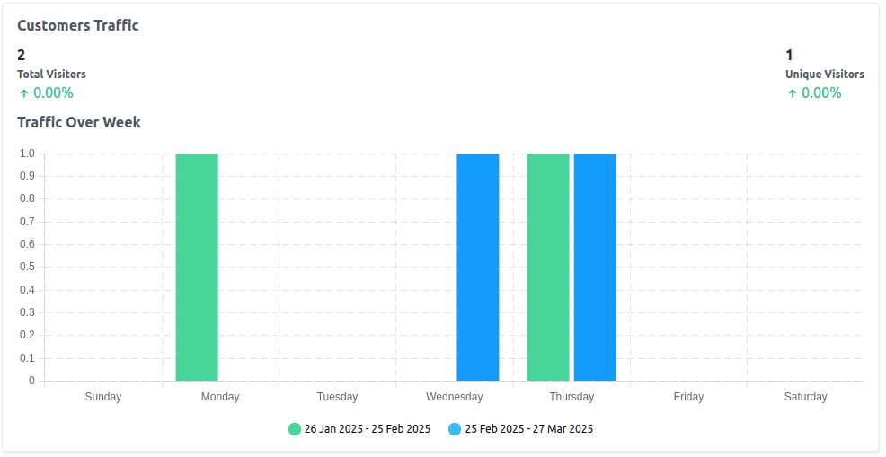
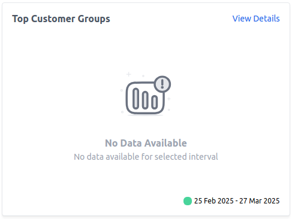
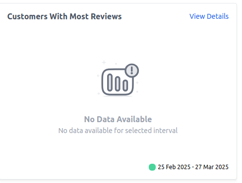

# Customers Reporting

Bagisto provides detailed customer analytics to help store owners understand their customer base, purchasing habits, and engagement levels. Below is an explanation of the customer-related reports.

### A) Total Customers 

This report shows the total number of customers registered in the store within the selected date range.

**Key Metrics:**

**1) Total Customers:** The number of new customers who signed up.

**2) Percentage Change:** Comparison with the previous period.

**3) View Details:** Click to see a list of new customers.

### B) Customers Over Time

This section provides a timeline of new customer registrations over a specific period.

**How to Use:**

1) Compare customer growth over different date ranges.

2) Identify periods of high or low customer sign-ups.

3) Adjust marketing strategies to boost customer registrations.

 

### C) Customers With Most Sales

Lists customers who have made the highest total purchases in terms of revenue.

**Key Metrics:**

**1) Customer Name:** The customer who generated the most revenue.

**2) Total Sales Amount:** The total value of their purchases.

 

### D) Customers With Most Orders

Shows which customers have placed the highest number of orders.

**Key Metrics:**

**1) Customer Name:** The customer who placed the most orders.

**2) Total Orders:** The number of orders they completed.

 

### E) Customer Traffic

Tracks the number of visitors who browsed the store within the selected period.

**Key Metrics:**

**1) Total Visitors:** The total number of visitors to the store.

**2) Unique Visitors:** The number of distinct visitors (not counting repeat visits).

**3) Percentage Change:** Comparison with the previous period.

### 6) Traffic Over Time

Provides a trend analysis of visitor traffic over different time periods.

**How to Use:**

1) Compare store traffic between different time frames.

2) Identify peak traffic times and align marketing campaigns accordingly.

 

### 7) Top Customer Groups

Lists the most active customer groups (e.g., wholesale, retail, VIP).

**Why It Matters?**

1) Helps segment customers based on buying behavior.

2) No data may indicate that customer groups need to be configured.

 

### 8) Customers With Most Reviews

Lists customers who have left the most product reviews.

**Why It Matters?**

1) Helps identify engaged customers.

2) Encouraging reviews can improve product credibility and boost conversions.

 
