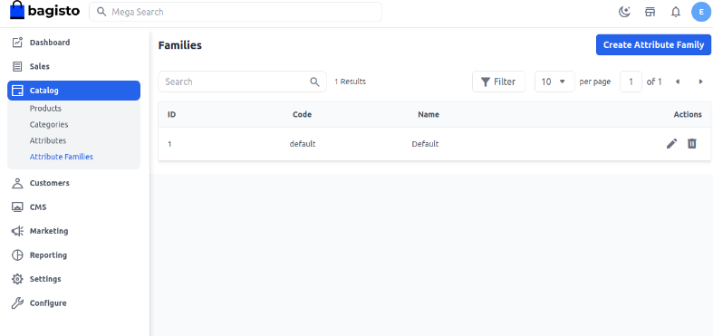
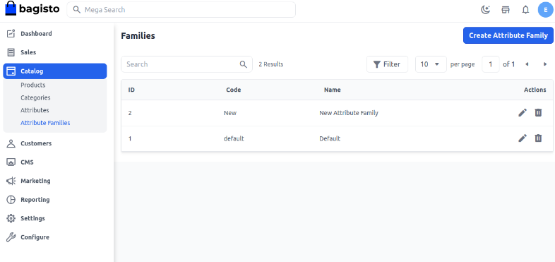
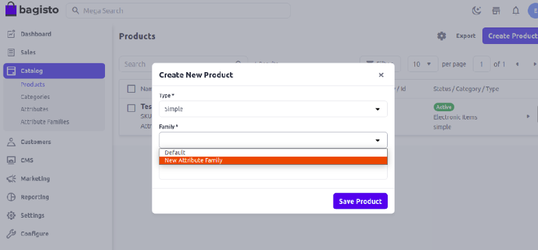

# Create Attribute Family

By using Attribute Families, you can import all the required information about the product in a single step. It can be specified as a list of attributes that are related to a unique product. Here we have listed out the tutorial on product attribute families in Bagisto.

### Create Attribute Family in Bagisto 2.3.0

**Step 1**:- On the Admin Dashboard, click **Catalog** >> **Attribute Families** >> **Create Attribute Family**

 

**Step 1**:-  Enter the **Attribute Family Code** and **Name** as shown in the below image.

 

 So now after creating a family Save Attribute Family and a New Attribute Family have been created as shown in the below image.

  

 Now that the new attribute family has been created, you can edit it through the **Action**. Add the desired **Attributes** to this family based on your specific requirements. Afterward, to verify the output during the product creation process, you will be able to see the new Attribute family. Now all Attribute will be visible on the product page that belongs to these Attribute Families.

   

By following the above steps, you can easily create an Attribute Families in Bagisto2.3.0.