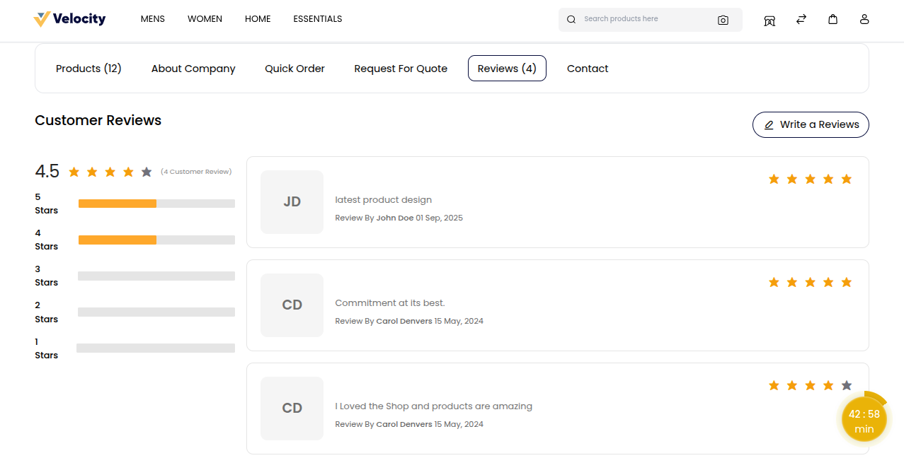
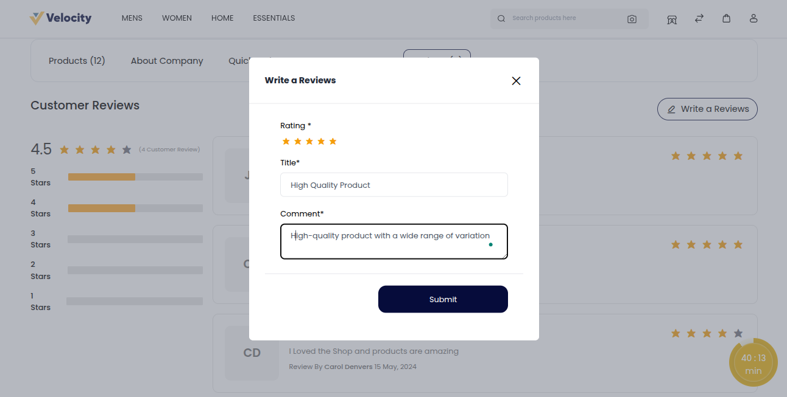
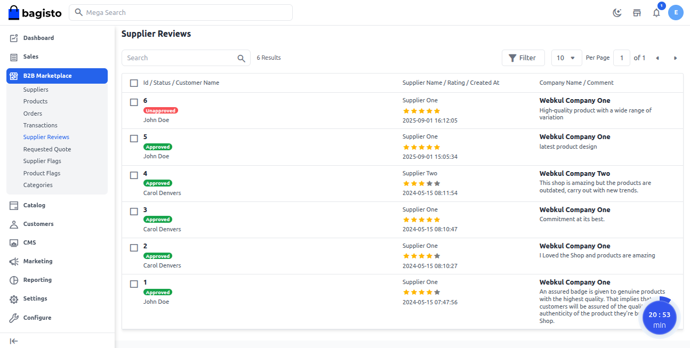
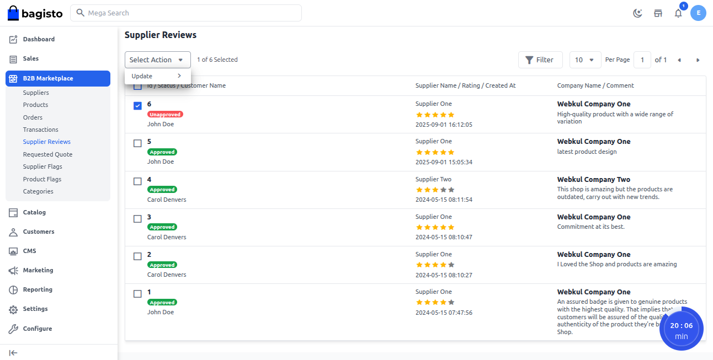
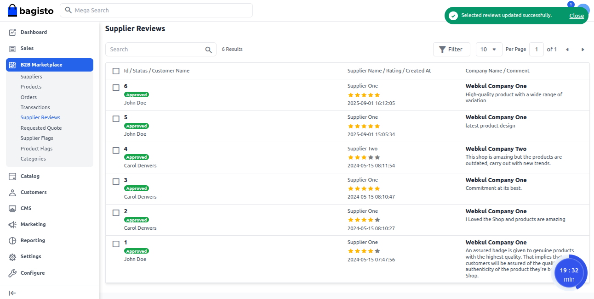
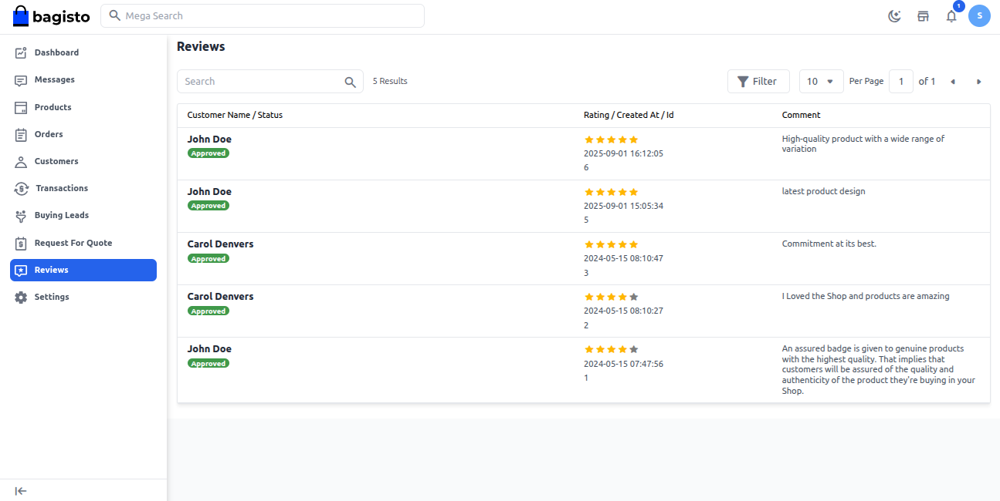
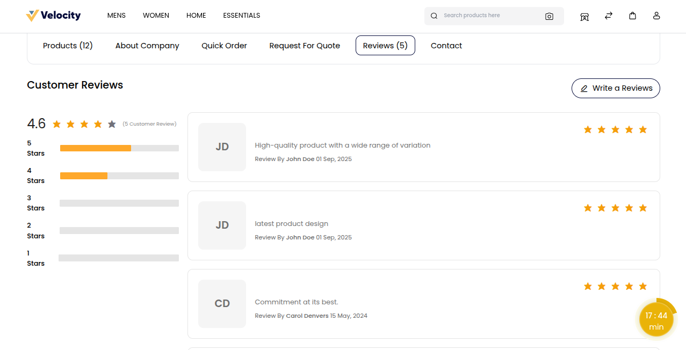

# B2B Marketplace Review

The Review feature allows buyers to share their experience with sellers in the marketplace. It is designed to build trust and make buying decisions easier.

1) Buyers can rate sellers based on service quality, communication, and reliability.

2) Reviews help other buyers choose the right seller with confidence.

3) Sellers can use reviews to gain credibility and improve their services.

This feature creates a transparent B2B marketplace where genuine feedback supports better business relationships.

**Note: Reviews can only be given by logged in customers after their product has been successfully delivered.**

### How to Submit a Review

The customer opens the **Supplier Page** to view details about the seller. From this page, they can click on the **“Review”**.

 

Once the **Review Page** is open, click on the **“Write a Review”** button to start adding your feedback about the seller.

 

A pop up box will open on your screen.

**1) Rating:** Select the rating the customer wants to give the seller.

**2) Title:** Enter a clear title for review.

**3) Comment:** Write detailed comments about the seller’s service.

Finally, click on the **“Submit”** button to post the review.

 

**Note: Reviews show on the page only after the admin approves.**

### Admin Panel: Approve Reviews

Go to **B2B Marketplace >> Supplier Reviews** to handle and approve supplier reviews.

The seller's review page will open, where the admin can see all customer ratings and feedback in one place.

 

To approve or disapprove a review, the admin selects it using the checkbox and chooses the desired action from the **“Select Action”** dropdown. 

 

The admin can then either approve or disapprove the review.

### Admin Supplier Reviews Page

Below is a detailed view of admin supplier reviews.

 

### Seller Reviews Page

Here’s a detailed view of seller reviews for easy monitoring.

 

### Frontend view

The display below shows how reviews appear to customers.

 
