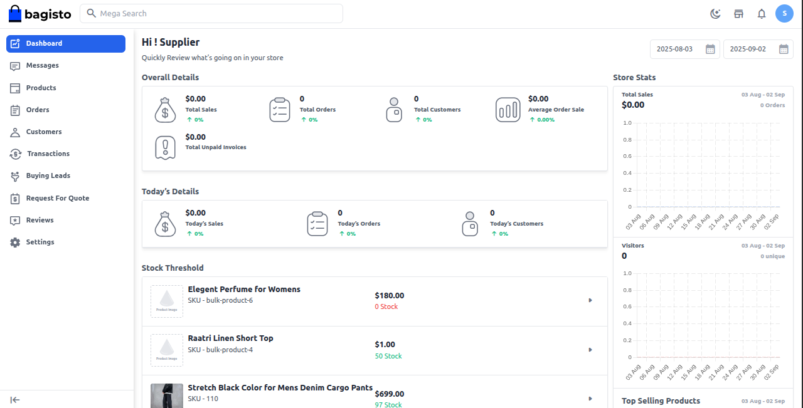
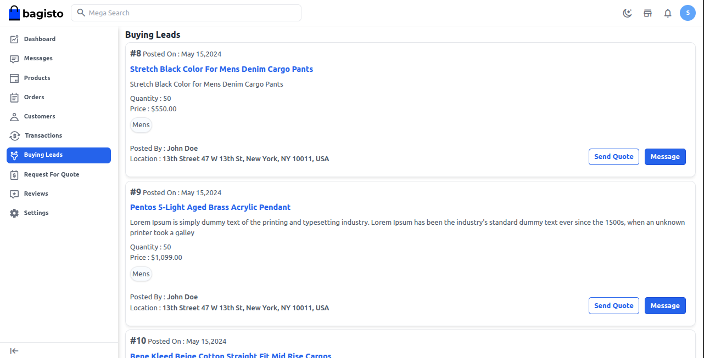
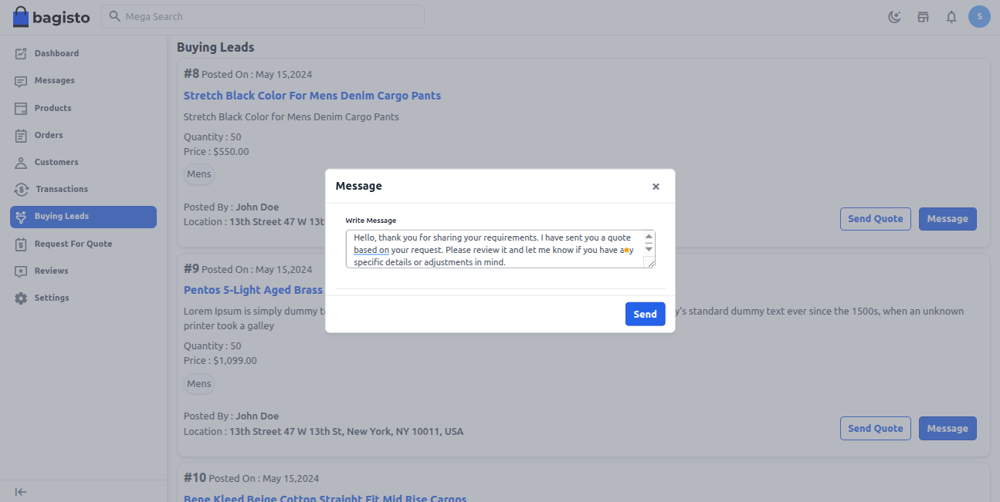
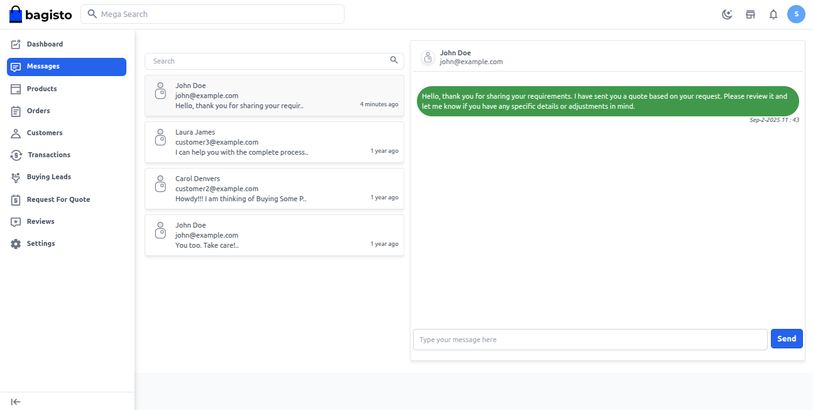
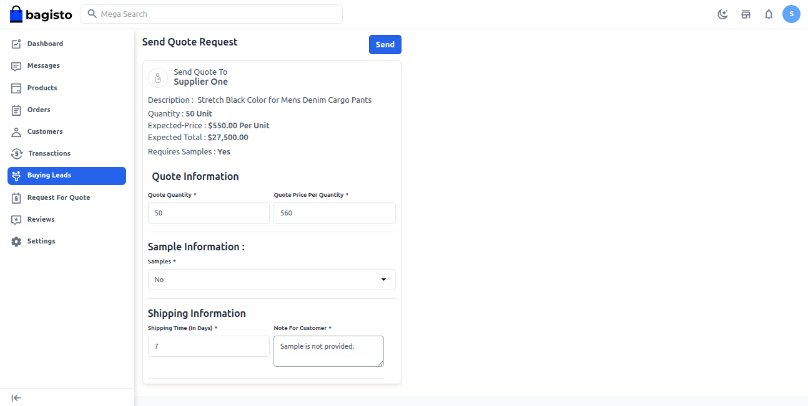
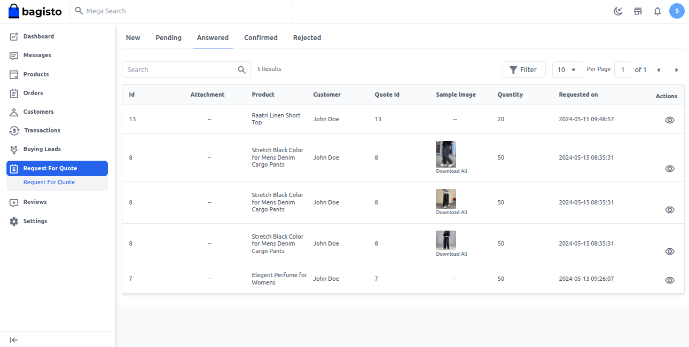
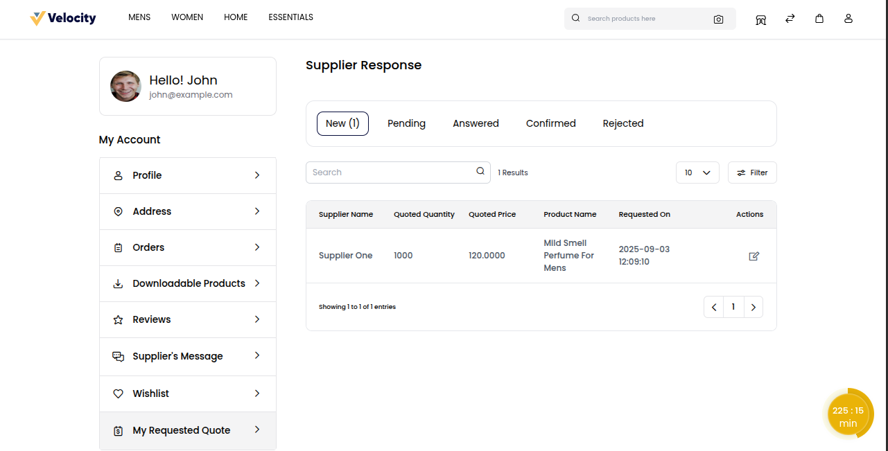

# Buying leads

In a B2B marketplace, buying leads is a smart way for businesses to connect with genuine buyers. Instead of waiting for customers to find you, leads bring ready to buy opportunities straight to your business. 

This saves time, increases sales chances, and helps sellers grow faster in a competitive market.

**Note:** Buying Leads are generated when customers submit an RFQ.

### Seller: Buying Leads

To start the buying leads process, the seller needs to log in to their Seller Dashboard.

 

Go to the **“Buying Leads”** section in the Seller Dashboard. This section displays all customer RFQs (Request for Quotes).

### Each RFQ shows below details.

**1) Product Name:** Shows the item the buyer is requesting.

**2) Quantity:** Displays how many units the buyer needs.

**3) Price:** Indicates the buyer’s expected or offered price.

**4) Category:** Defines the product’s category.

**5) Posted By (buyer):** Shows which buyer raised the RFQ.

**6) Location:** Tells where the buyer is located.

 

The seller can select an RFQ, send a quote with pricing, and message the customer to discuss or negotiate details.

Click the **“Message”** button to open a message box, then write your message and click “Send” to share it with the customer and discuss their requirements.

 

Once the message is sent, it will appear in the **“Messages”** section.

To view it, go to “Messages” and select the customer you recently messaged.

 

Click the **“Send Quote”** button to share your quote with the customer. 

### The quote contains details like:

**1) Quote Information:** Quote Quantity and Quote Price Per Quantity.

**2) Sample Information:** Details of product samples (if offered).

**3) Shipping Information:** Shipping time and customer notes.

Click the **“Send”** button to submit your quote to the customer.

 

After the lead is sent to the customer, it automatically shifts to the RFQ section for easy tracking and management.

 

### Store Frontend

Customers can easily track and manage the responses they receive from sellers.

Go to **Profile >> My Account >> My Requested Quote**

 

