# Request for Quotes

Request for Quotes (RFQ) in a B2B marketplace helps buyers ask sellers for prices before placing an order. Instead of placing an order directly, buyers can send a detailed quote request with their requirements, and sellers respond with tailored offers. 

This makes it easier to compare prices, negotiate, and choose the right deal. 

**Note:** RFQ feature can only be used by signed in customers.

### Create Request for Quotes 

To begin using the RFQ feature, customers need to sign in to their account. Just click on the profile icon at the top right corner of the page. 

 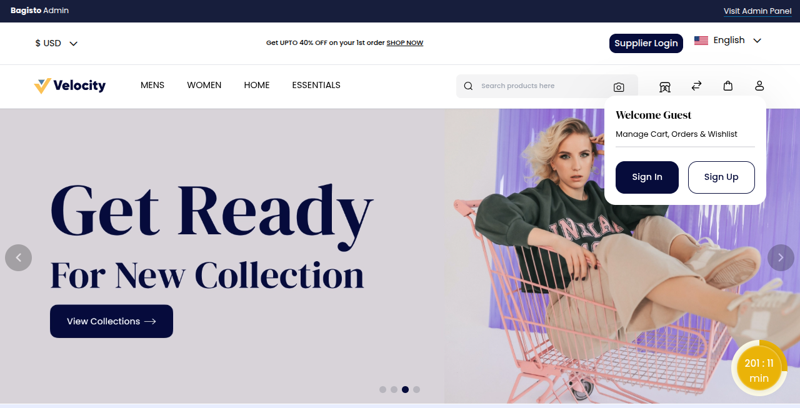

Enter email and password details, then click on the **Sign In** button.

 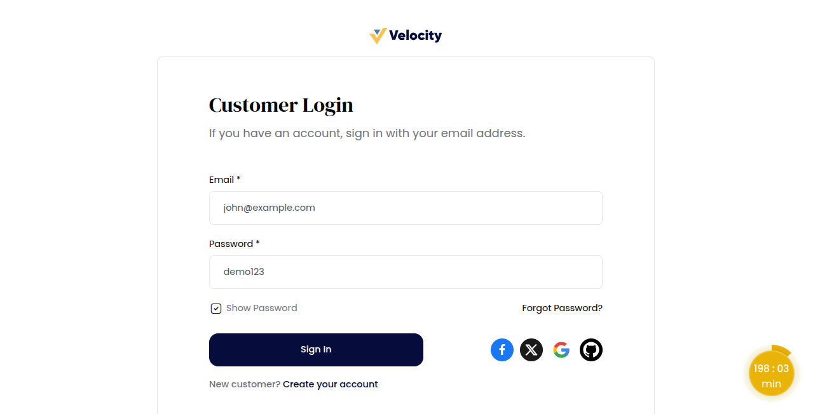

Customers can find the **‘Request for Quote’** option in the website header. 

Click on **‘Request for Quote’** to open the Request for Quote page

 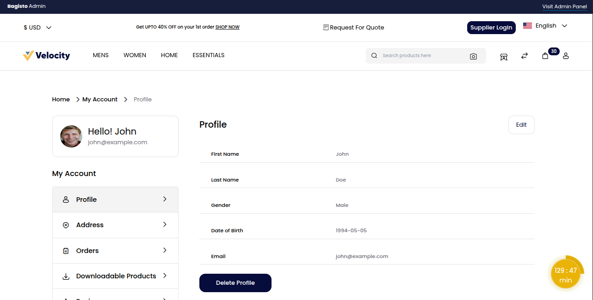

This feature enables customers to submit their requirements and request a personalized price offer. 

Required details must be filled out before sending the quote.

**Quote Information**

**1) Quote Title:** A short name for your request.

**2) Quote Description:** A clear explanation of what you need.

 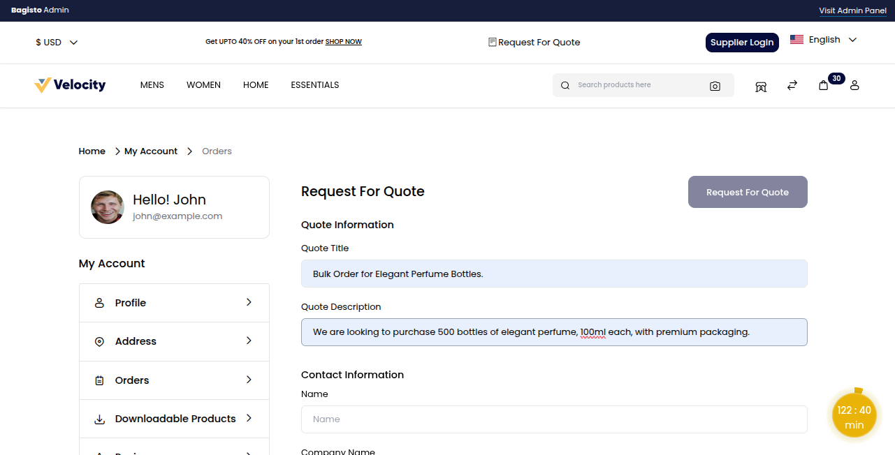

**Contact Information**

**1) Name:** Enter full name for identification.

**2) Company Name:** Provide the name of the organization.

**3) Address:** Mention the complete organization address.

**4) Contact Number:** Add a valid phone number for communication.

**5) Add Attachment:** Upload files like product specs or design references.

**6) Action Category:** Select at least one Action Category.

 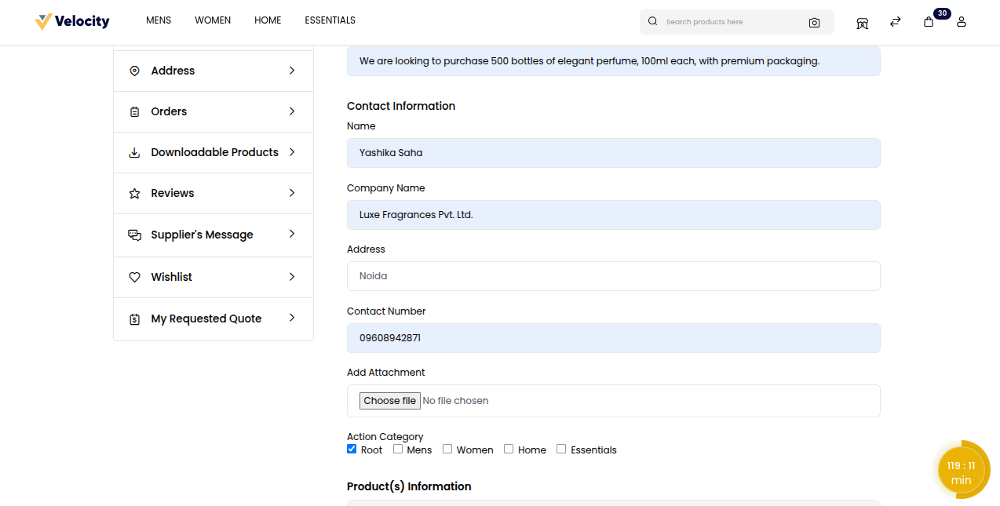

**Product Information**

To include product details in a quote, click on the **Add Product** button and fill in the required information.

 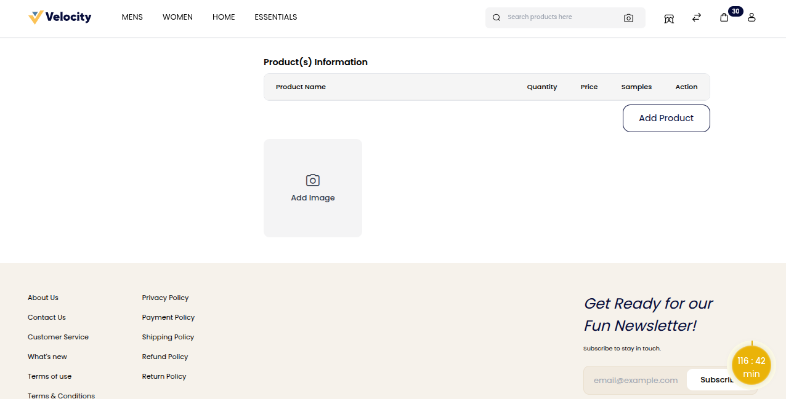

A pop-up window will appear where the customer can enter product details such as.

**1) Product Name:** Specify the product you want to request.

**2) Product Description:** Add important details for the product.

**3) Product Quantity:** Enter the total number of units needed.

**4) Expected Price Per Quantity:** Mention the price you expect per unit.

**5) Is Required:** Choose if the product needs a sample or not.

**6) Image:** Enter Image for reference.

After entering all the details, click the **Submit** button to confirm and add your product information.

 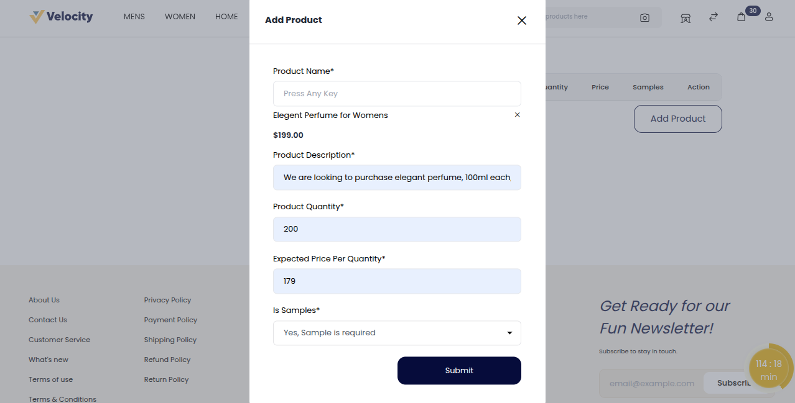

When all requirements are filled, go to the top right corner and click the **‘Request for Quotes’** Button.

Customers are redirected to **‘My Requested Quotes’** after raising a request, where all their earlier requests are listed.

 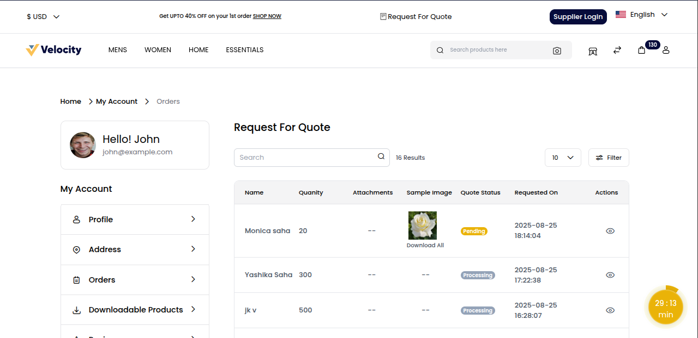

The customer can now select a specific request they raised and view the supplier’s response.

Click the **Action** icon to open the **Quote Request** page.

 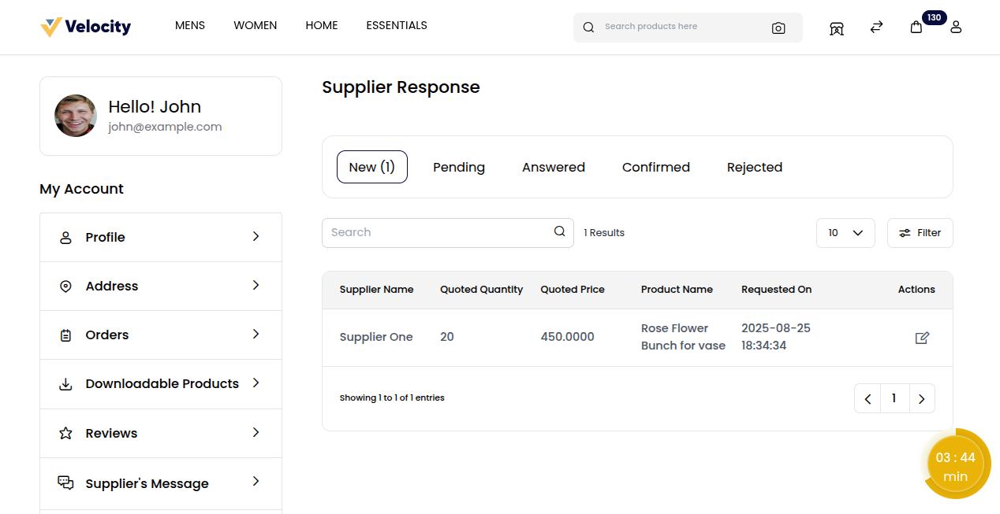

Customers can view details such as the Quote Request and the Quote Summary for quick reference. 

Customers have the option to either accept or reject a quotation after reviewing the seller’s response.

 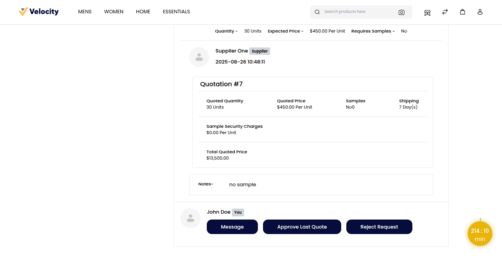

Click on **“Approve Last Quote”** to confirm the quotation. Once approved, the quotation status changes to **Confirmed**. 

This ensures the agreed terms are locked, preventing further changes. 

 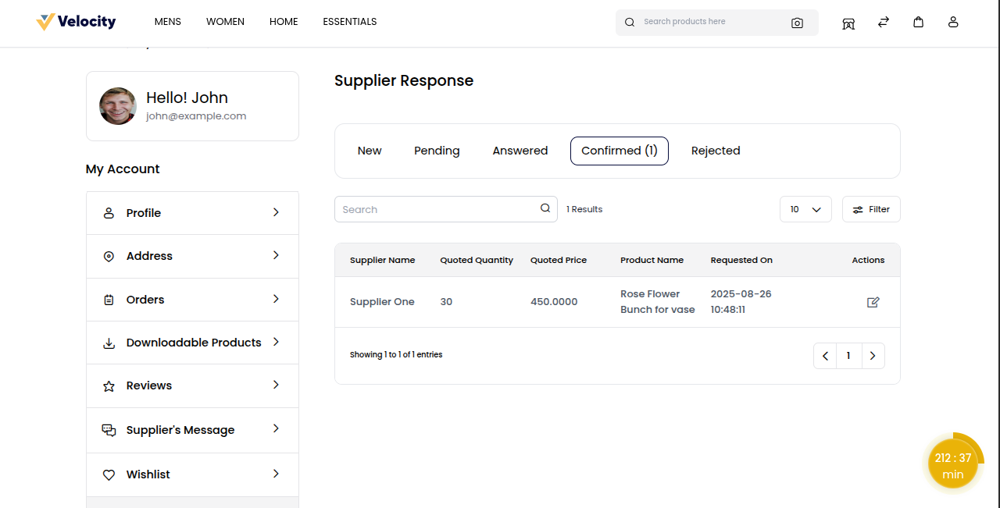

### Seller Dashboard

In the Seller Dashboard, click on **Buying Leads**. The seller will find the details of the RFQs here.

Click the **‘Send Quotes’** button to send a quote to the customer.

 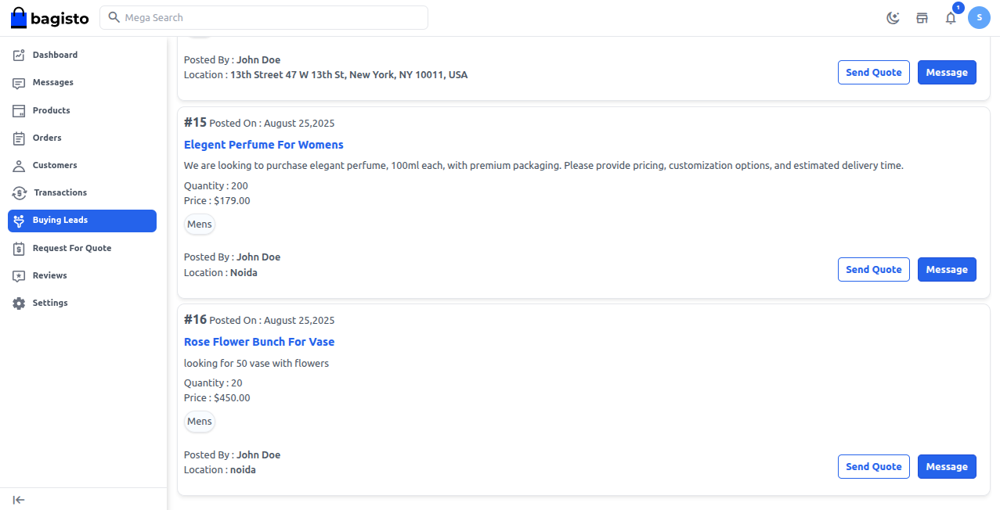

The **‘Send Quote Request’** page will open.

Enter the required details, including **Quote Quantity, Price per Quantity, Sample Information, and Shipping Information,** then click the **‘Send’** button.

 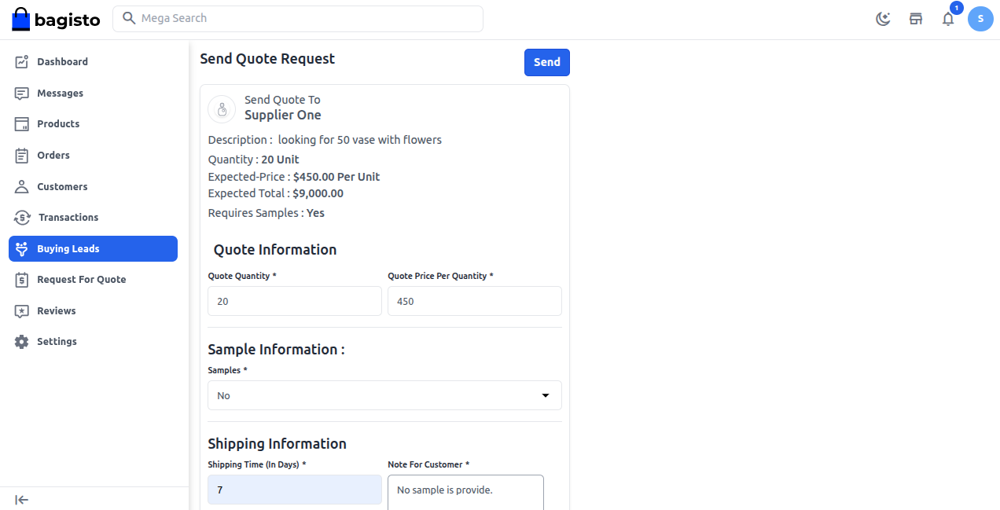

After sending a quote, sellers are redirected to the **‘Request For Quote’** page, where sellers can view all details, including new, pending, answered, confirmed, and rejected.

 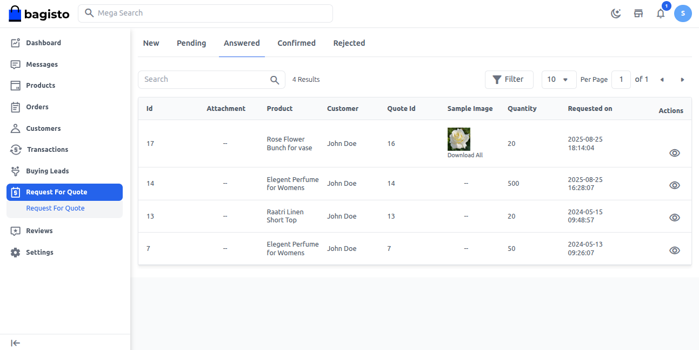
