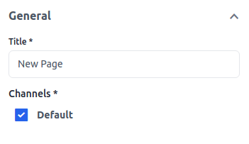
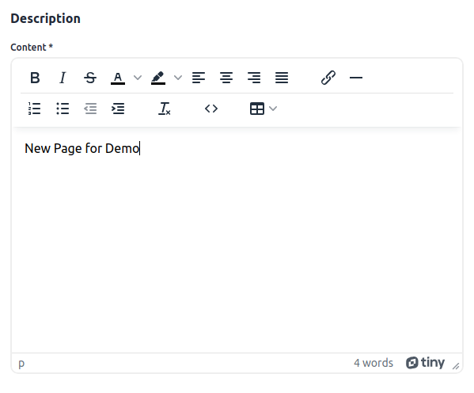
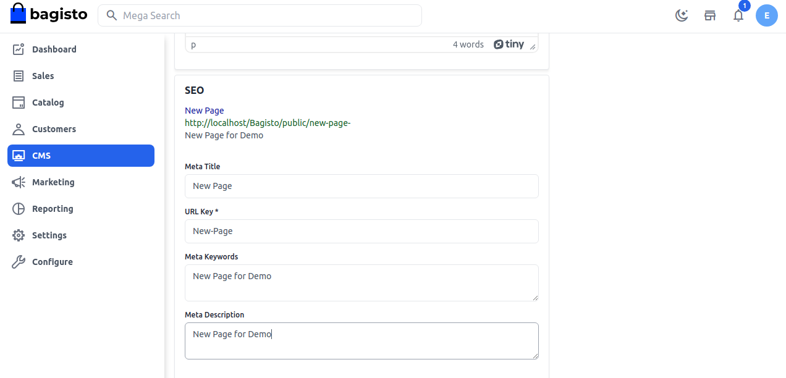

# CMS Pages

With the help of CMS(content management system), you can create a new page, and edit the page for your Bagisto store. CMS is also helpful for the customer while purchasing the product to check the refund and return policy and many more.

### To create a CMS page from the Admin Panel follow the below steps:

**Add a New Page**

**Step 1:** On the Admin Sidebar, click on  **CMS >> Page** By default there are already CMS pages located here to create a new CMS page click on the **Create Page** button as shown below.

 

**Step 2:** Add the page **Title** and add channels under general as shown in below image 

 

**Step 3:** Add the **Content** of the CMS page under **Description**.

 

**Step 4:** Add the below fields under **SEO**

1. **Meta Description**
Enter the description so that **CMS Page** can easily appear in search engine listings.

2. **Meta Title**
So Provide the main title of the **CMS Page** by which your page will be known.

3. **Meta Keyword**
The meta keyword for the page needs to be provided to improve its searchability on the search engine for specific keywords.

4. **URL Key** The URL key is the part of a static URL that describes the Page, product, or category. 

 

So a new CMS page is been created successfully by the name of **New Page** as shown below image.

 

By this, you can easily create CMS pages in Bagisto.

