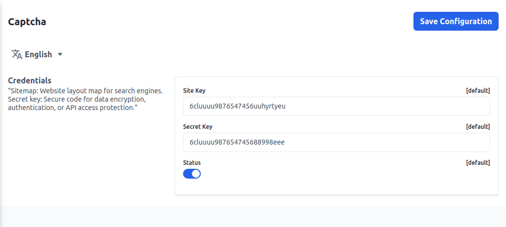

# Captcha

"Sitemap: Website layout map for search engines. Secret key: Secure code for data encryption, authentication, or API access protection."

On the Admin Panel go to **Configure >> Captcha** add the **Site Key & Secret Key** and enable/disable the **Status** according to your requirement.

After then click on the **Save Configuration** button.
