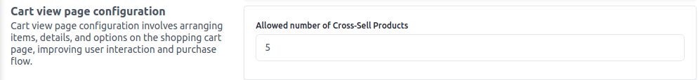

# Cart View Page

Cart view page configuration involves arranging items, details, and options on the shopping cart page, improving user interaction and purchase flow.

To add go to Admin Panel and click on **Configure >> Products**

Here you can able to manage several cross-selling products that will be visible on the front end.

After then click on the **Save Configuration** button.
