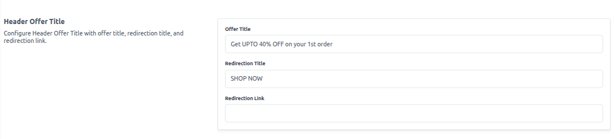
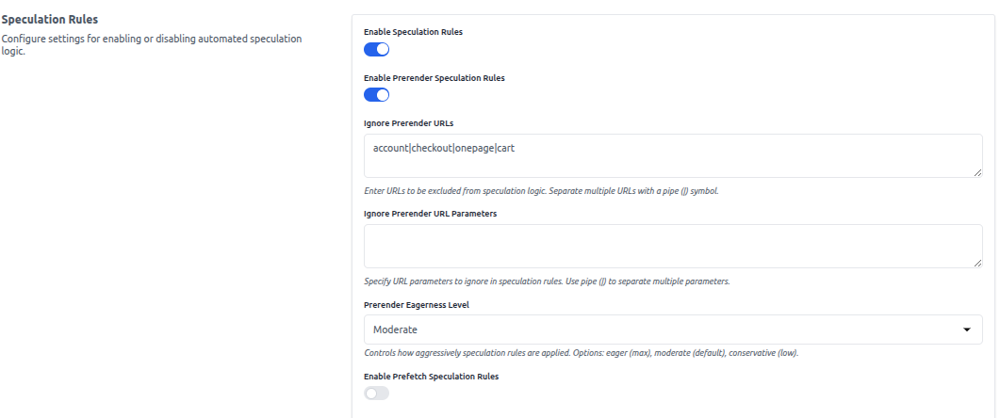
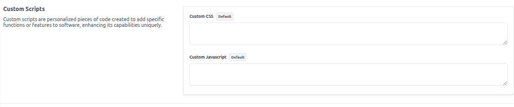

## Content Configuration

The **Content** section allows you to customize frontend behavior, promotional banners, and control advanced features like speculation rules and custom scripts. These settings help optimize user experience and tailor the storefront according to specific business needs.

**Steps to Configure Content Settings**

To update the **Content** configuration in Bagisto:

1. Log in to the **Admin Panel**.
2. Navigate to **Configure → Content**.
3. You will find the following options to configure:

---

**Header Offer Title**

Display a promotional banner on the storefront header.

- **Offer Title**  
  Example: `Get UPTO 40% OFF on your 1st order`

- **Redirection Title**  
  Example: `SHOP NOW`

- **Redirection Link**  
  Enter a valid URL (e.g., `/products/sale`)

  

---

**Speculation Rules**

These rules improve perceived performance by prefetching or prerendering pages intelligently.

- **Enable Speculation Rules**  
  Toggle to enable the overall speculation logic.

- **Enable Prerender Speculation Rules**  
  Enables prerendering based on user behavior predictions.

- **Ignore Prerender URLs**  
  Exclude specific routes from prerendering using pipe `|` as a separator.  
  Example: `account|checkout|onepage|cart`

- **Ignore Prerender URL Parameters**  
  Exclude certain URL parameters from prerender logic.  
  Example: `ref|token`

- **Prerender Eagerness Level**  
  Choose the intensity of prerendering:
  - `eager`: Max prerendering (more resources)
  - `moderate`: Default balance
  - `conservative`: Minimal prerendering

- **Enable Prefetch Speculation Rules**  
  Enables link prefetching to accelerate navigation.

---

**Custom Scripts**

Add your own scripts to enhance or integrate custom features.

- **Custom CSS**  
  Add global CSS to style your storefront.

- **Custom JavaScript**  
  Insert scripts for chat widgets, analytics, or any custom interaction.

---