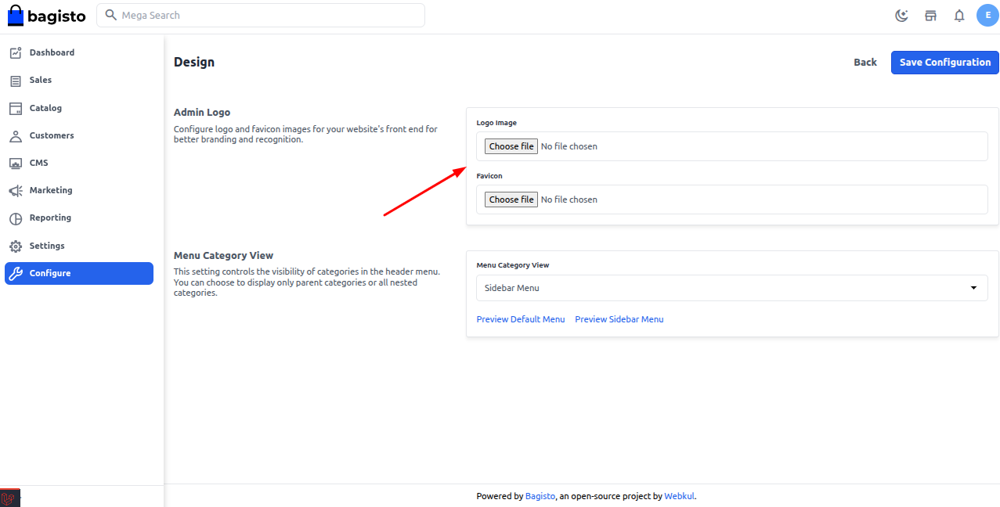
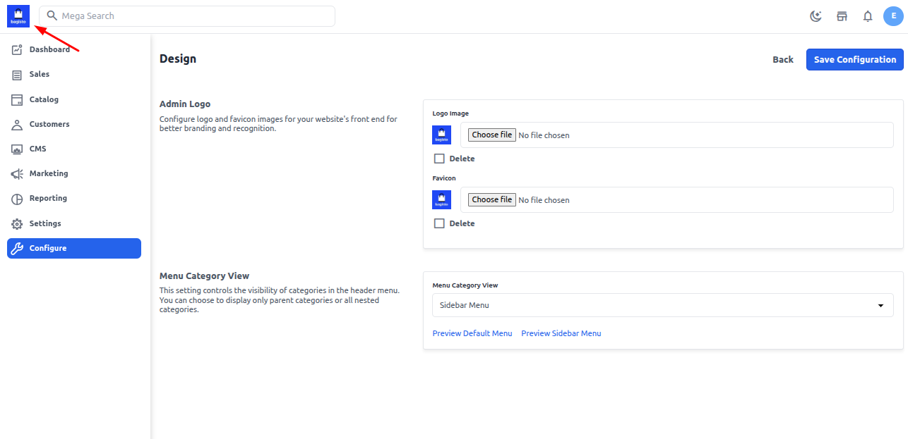
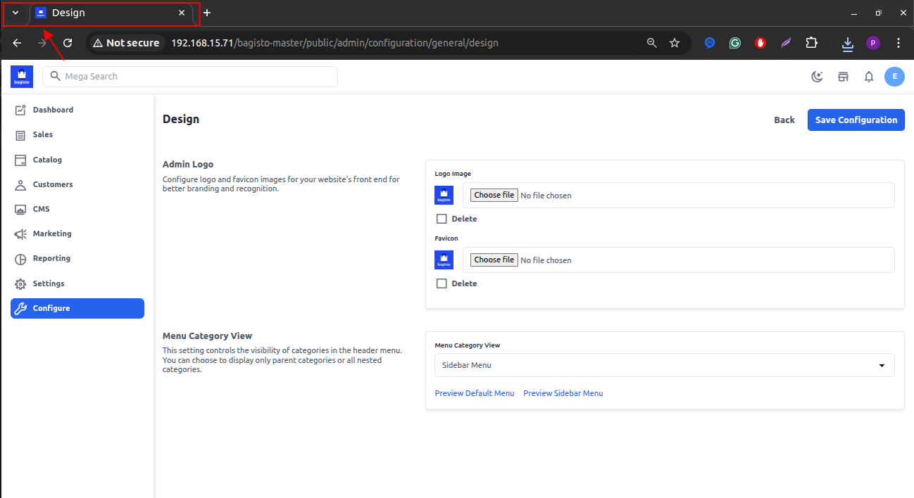
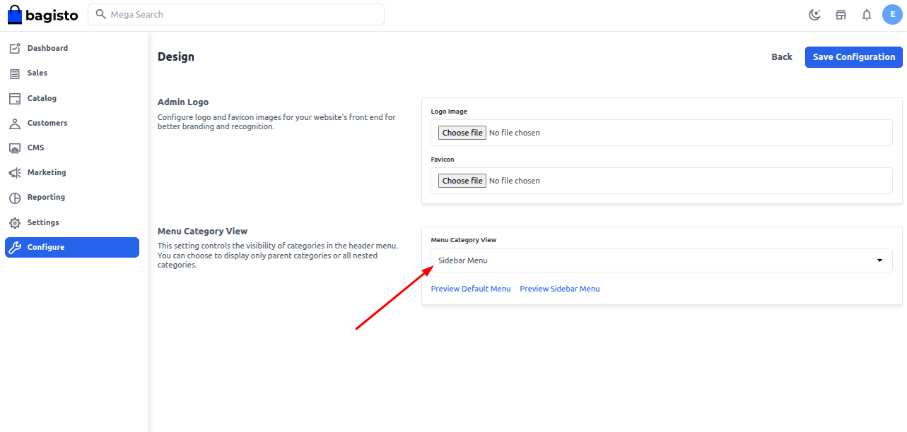
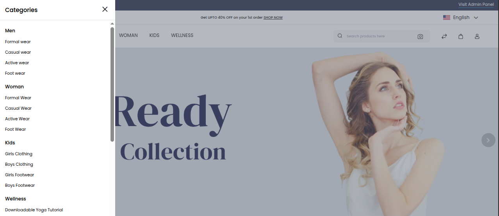

## Design

**Admin Logo & Favicon Configuration**

The **Admin Logo** is a distinctive image or emblem representing the administration interface of a system or website. It is often customizable to match your brand identity. Similarly, the **Favicon** is the small icon displayed in browser tabs, helping users visually identify your site.

**Steps to Update Admin Logo & Favicon**

To update the **Admin Logo** and **Favicon** in Bagisto:

1. Go to the **Admin Panel**.
2. Navigate to **Configure → Design**.
3. Under the **Design** section, you will find options to upload a new **Admin Logo** and **Favicon**.
4. Click on the **Choose Files** button to select the desired image files from your system.
5. Once selected, click the **Save Configuration** button to apply the changes.

**Design Configuration Interface**

**Updated Logo & Favicon Output**

After saving the configuration, the new **Admin Logo** and **Favicon** will be visible in the admin panel interface.

**Logo**

**Favicon**

**Menu Category View**, Bagisto v2.3.x introduced a new option to configure how product categories are displayed in the storefront menu.

You can now choose between:

- **Default Menu**: Displays categories in the top navigation bar.
- **Sidebar Menu**: Displays categories in a vertical side panel, ideal for stores with many categories or subcategories.

### To update the Menu Category View:

1. Navigate to **Admin Panel** → **Configure** → **Design**.
2. Scroll down to the **Header Settings** section.
3. Under **Category Menu View**, select:
   - `Default Menu` or
   - `Sidebar Menu` from the dropdown.
4. Click **Save Configuration**.

**Shop front view**

