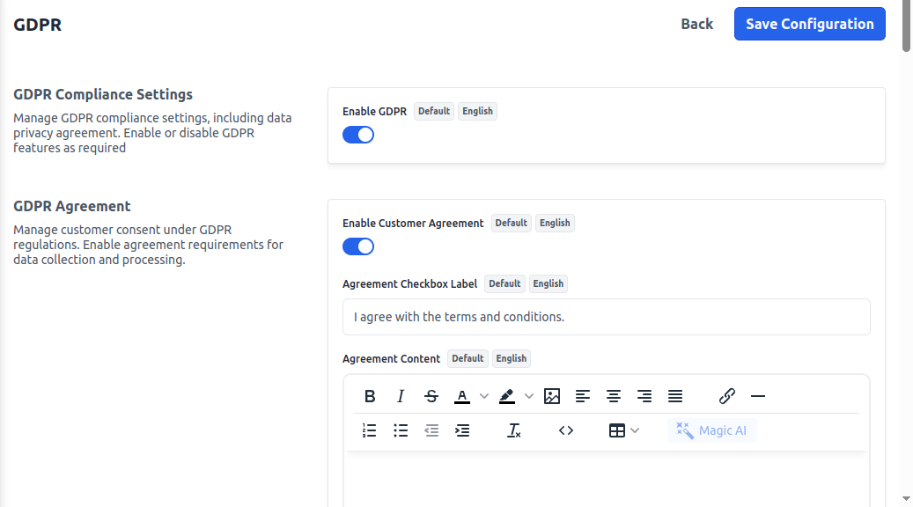
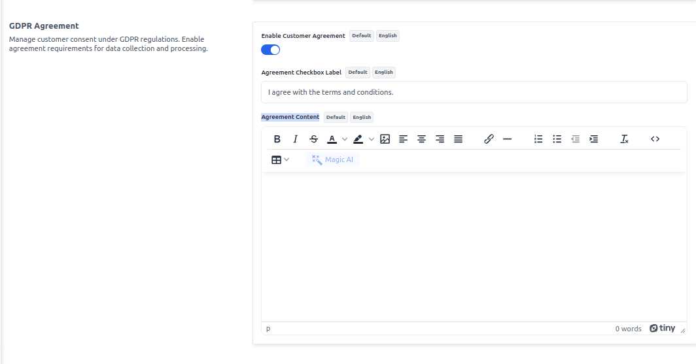
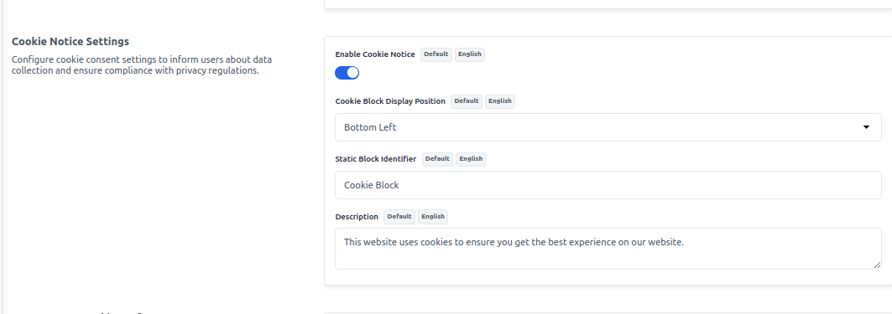
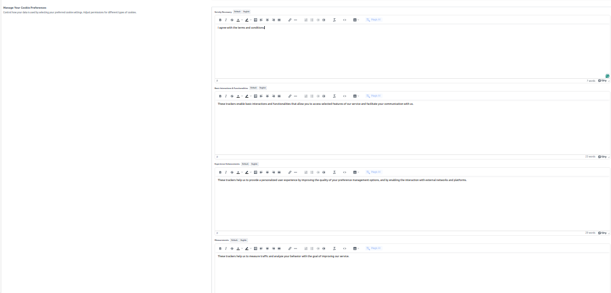

# GDPR
Bagisto provides essential GDPR (General Data Protection Regulation) compliance features to help businesses ensure data privacy and transparency for their customers. Below are the key sections where GDPR-related settings and options are available:

## Enable GDPR Compliance Settings

To add go to Admin Panel and click on **Configure >> GDPR >> Enable GDPR** 
This section empowers store owners to configure GDPR-related policies and efficiently manage customer data requests. Key features include:

- **GDPR Request** button appears on the customer's profile page in the store frontend.
- Handling customer requests for data deletion or updation.

After then click on the **Save Configuration** button.

## GDPR Agreement

To add go to Admin Panel and click on **Configure >> GDPR >> Enable Customer Agreement** 
The GDPR Agreement button is used to obtain explicit consent from customers before they proceed with account registration, checkout, or other data-related actions. It ensures:
- Users acknowledge and accept the store's privacy policy.
- Consent is recorded for legal compliance.

There is the list of fields you need to provide under the GDPR Agreement section:
- **Agreement Checkbox Label** – I agree to the terms and conditions and the privacy policy.
- **Agreement Content** – By checking this box, you consent to the processing of your personal data in accordance with our GDPR-compliant privacy policy.

After then click on the **Save Configuration** button.

## Cookie Notice Settings

To add go to Admin Panel and click on **Configure >> GDPR >> Enable Cookie Notice** 
This section allows store owners to configure how the cookie notice appears to users. Key settings include:

- **Cookie Block Display Position** – Determines where the cookie notice will appear on the page. Available options:
  - Bottom Left
  - Bottom Right
  - Top Left
  - Top Right
  - Center

- **Static Block Identifier** – Specifies a custom static block to display within the cookie notice, allowing store owners to provide additional details or links.

- **Description** – A customizable text field where the store owner can describe the purpose of cookies, privacy details, and how users can manage their preferences.

After then click on the **Save Configuration** button.

## Manage Your Cookie Preferences

This section enables users to personalize their cookie settings based on their preferences. The available categories include:

- **Strictly Necessary** – Essential cookies required for the website to function properly, such as session management and security features. These cannot be disabled.

- **Basic Interactions & Functionalities** – Cookies that support user interactions, such as chat features, form submissions, and navigation improvements.

- **Experience Enhancements** – Cookies that help improve user experience by remembering preferences, such as language selection or customized layouts.

- **Measurements** – Analytics cookies used to track website performance, user behavior, and traffic insights for optimization purposes.

- **Targeting & Advertising** – Cookies used for personalized marketing, ad targeting, and retargeting based on user behavior and preferences.

After then click on the **Save Configuration** button.