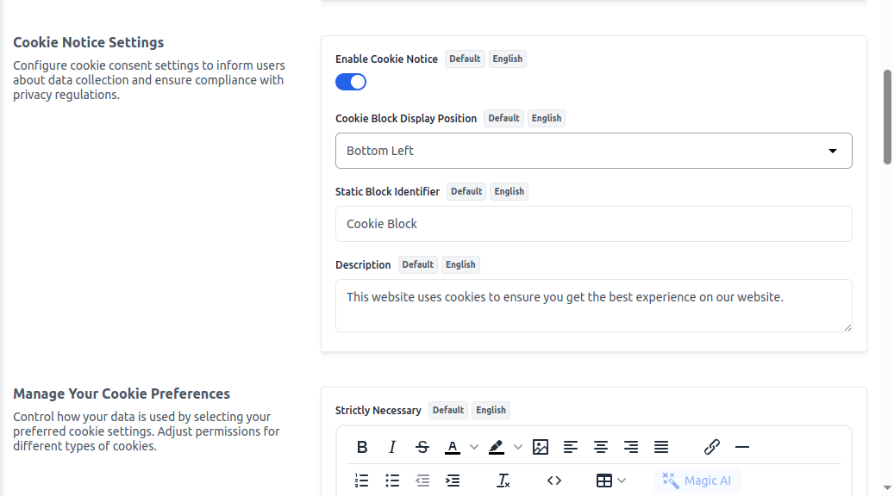

# GDPR
The GDPR Configuration section in Bagisto allows admins to **GDPR Request** button appears on the customer's profile page in the store frontend, allowing users to request data updation or deletion and setting lets admins define the position of the cookie consent banner on the storefront, ensuring clear visibility for users.

**Enable GDPR Compliance Settings & GDPR Agreement**

To add go to Admin Panel and click on **Configure >> GDPR >> Enable GDPR** 
**GDPR Request** button appears on the customer's profile page in the store frontend, allowing users to request data updation or deletion 

After then click on the **Save Configuration** button.

**Manage content and position of Cookies Box**

Enable Cookie Notice button & set a position of Cokkies box and add description of cookie.
To add go to Admin Panel and click on **Configure >> GDPR >> Enable Cookie Notice** 

After then click on the **Save Configuration** button.
