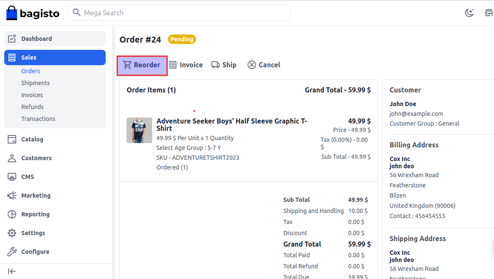
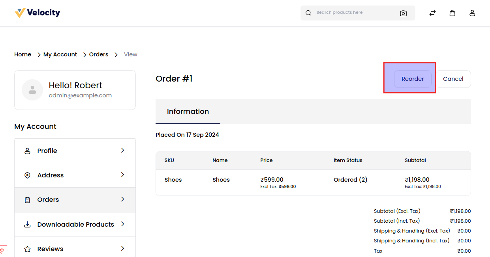

# Order Settings

To add go to the Admin Panel and click on **Configure >> Order Settings**

**Order Number Settings:-** Order Number Settings refer to the configuration parameters that determine how order numbers are generated, formatted, and managed within a system.
These settings are crucial for organizing and tracking orders efficiently.

**Minimum Order Settings:-** Configured criteria specifying the lowest required quantity or value for an order to be processed or qualify for benefits.

In the Order section add a new configuration setting so that the order has Included Discount Amount, Include Tax to Amount, and the Description in the cart page.

**Allow Reorder:-** Enable or disable the reordering feature for admin users.

After then click on the **Save Configuration** button.
**Admin Reorder**

To check Admin Reorder go to **Sales >> Orders** and go inside the order which is showing the pending status. Here you will able to see the option of Reorder on the admin side.

**Frontend Reorder**

After completing your order go inside **My Accounts >> Orders** here you will able to see the Reorder button at the top right corner as shown in the below image.

