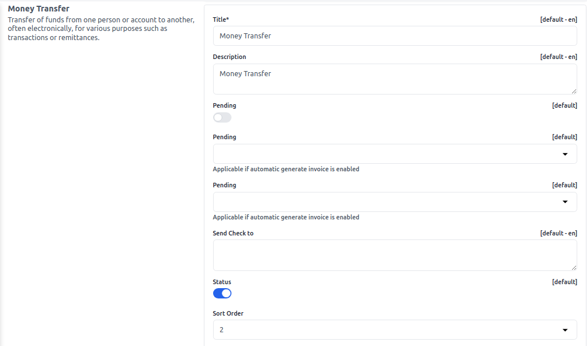
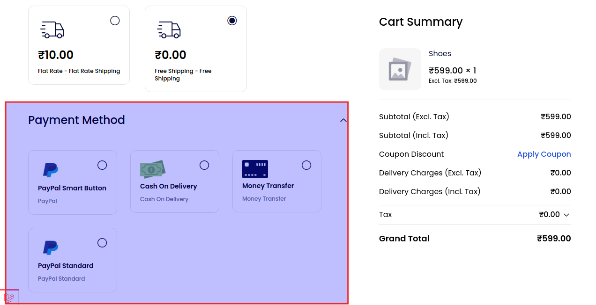

# Payment Methods

A payment method refers to the various options available for customers to make payments when purchasing a product or service. Whether in a physical or online store, payment methods cover a range of choices. Commonly accepted payment methods include cash, credit cards, debit cards, gift cards, and mobile payments.

To add go to the Admin Panel and click on **Configure >> Payment Method**

### Paypal

PayPal Smart Button: Simplifies online payments with customizable buttons for secure, multi-method transactions on websites and apps.

### Cash On Delivery

Payment method where customers pay in cash upon receiving goods or services at their doorstep.

### Money Transfer

Transfer of funds from one person or account to another, often electronically, for various purposes such as transactions or remittances.

### PayPal Standard

PayPal Standard is a basic PayPal payment option for online businesses, enabling customers to pay using their PayPal accounts or credit/debit cards.

After clicking on the **Save Configuration** button.

### Payment Methods Forntend

