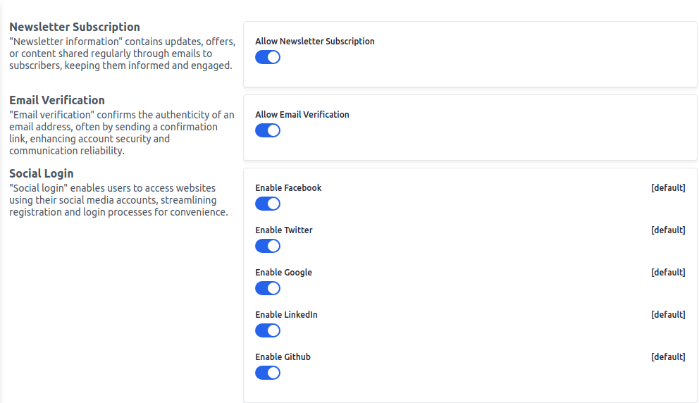

# Settings

Set newsletter subscriptions, email verifications, and social login.
To add go to the Admin Panel and click on **Configure >> Settings**

### Newsletter Subscription

"Newsletter information" contains updates, offers, or content shared regularly through emails to subscribers, keeping them informed and engaged.

### Email Verification

"Email verification" confirms the authenticity of an email address, often by sending a confirmation link, enhancing account security and communication reliability.

### Social Login

"Social login" enables users to access websites using their social media accounts, streamlining registration and login processes for convenience.

After clicking on the **Save Configuration** button.

