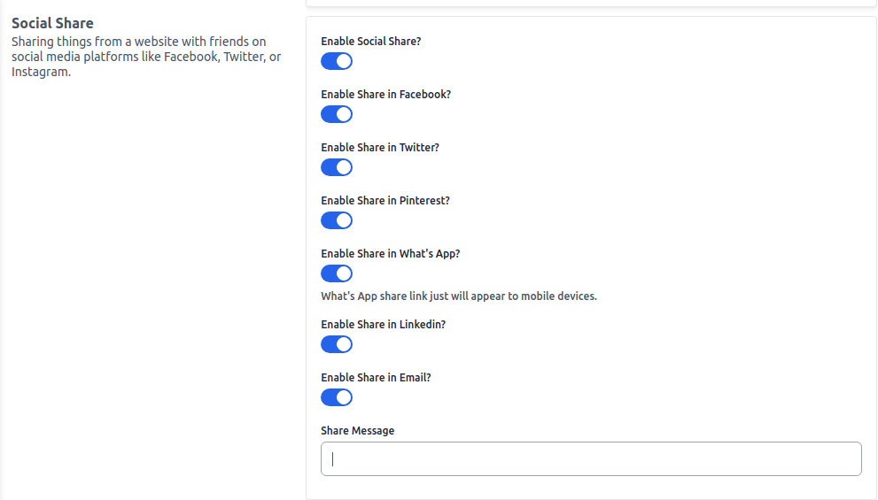
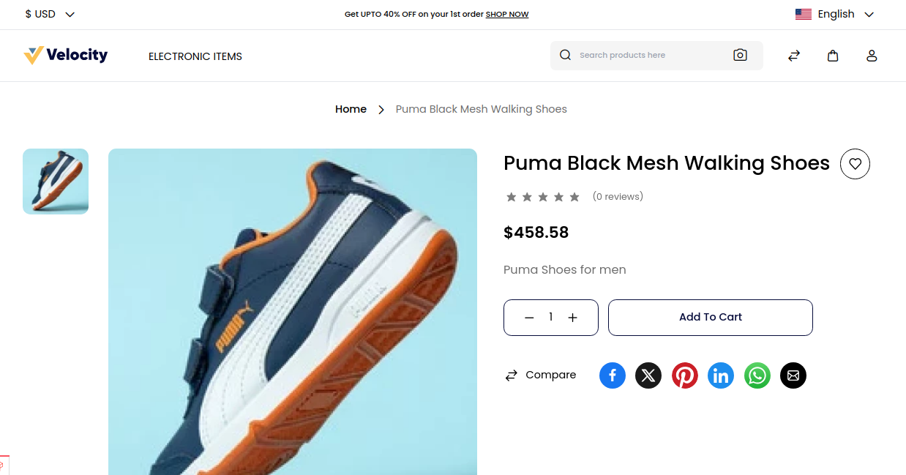

# Social Share

Sharing things from a website with friends on social media platforms like Facebook, Twitter, or Instagram.

To add go to Admin Panel and click on **Configure >> Products >> Social Share**

After then click on the **Save Configuration** button.

### Frontend:-

All the icons that you just enabled from the Admin Panel are created as shown in the below image.

