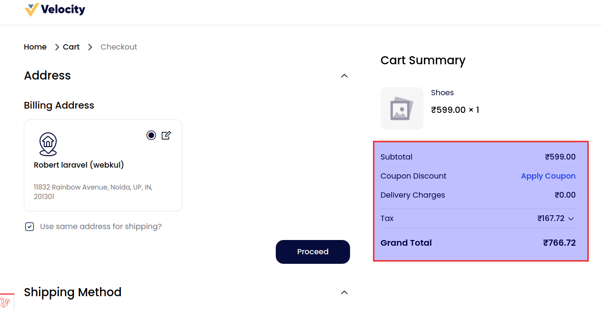
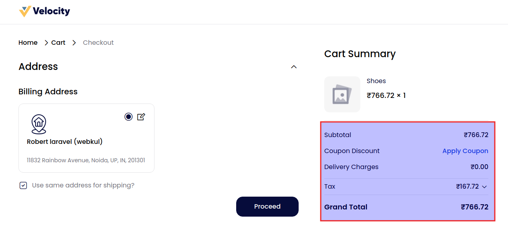
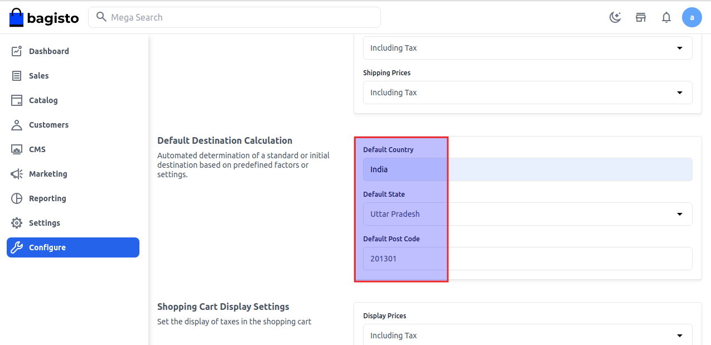
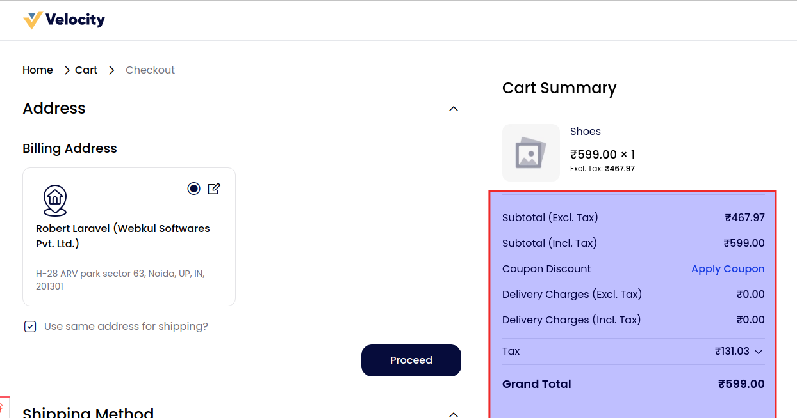

# Taxes

**A) Tax Categories -** Tax categories are classifications for different types of taxes, such as sales tax, value-added tax, or excise tax, used to categorize and apply tax rates to products or services that will be visible over here.

**B) Calculation Settings -** Information about how much things cost, including the starting price, any discounts, taxes, and extra fees.

**1) Calculation Based On-** By default, there are 3 options for calculations i.e. Shipping Address, Billing Address, Shipping Origin.

**A) Shipping Address-** A shipping address is the location where goods or products are sent for delivery. It includes details like the recipient’s name, street address, city, state or province, postal or ZIP code, and sometimes additional information like a company name or suite number.

**B) Billing Address-** A billing address is the address associated with a payment method, such as a credit or debit card. It’s used to verify the identity of the cardholder and to process transactions.

**C) Shipping Origin-** Shipping origin refers to the location from which goods or products are dispatched or sent out. It is the starting point of the shipment journey before it is transported to the destination address.
The shipping origin typically includes details such as the address of the warehouse, store, or supplier where the shipment begins.
This information is important for tracking the shipment, calculating shipping costs, and estimating delivery times.

**2) Product Pricing-** There are two options available. Include Tax and Exclude Tax

**A) Excluding Tax-** It simply means that no taxes have been included in the product pricing. For example in the below image product price is 599 and the tax amount is 167.72 and it is separately calculated.

**B) Including Tax-** It means tax are already factored into the price you have received for a good or service. For example in the below image product price is 599 and the tax amount is 167.72 and the calculation is showing all the amount altogether.

**C) Default Destination Calculation -** Select **Country, State & Pin Code** it typically refers to the automatic determination of a shipping or delivery address based on preset criteria or system.

**D) Shopping Cart Display Settings -** Set the display of taxes in the shopping cart by Display Prices, Display Subtotal, and Display Shipping Amount.

By default, we provide Three options:

**A) Excluding Tax-** It simply means that no taxes have been included in the product pricing. For example in the below image product price is 599 and the tax amount is 167.72 and it is separately calculated.

**B) Including Tax-** It means tax are already factored into the price you have received for a good or service. For example in the below image product price is 599 and the tax amount is 167.72 and the calculation shows the amount is altogether.

**C) Excluding and Including Both-** Excluding tax simply means that no taxes have been included in the product pricing and Include Tax are already factored into the price you have received for a good or service.

