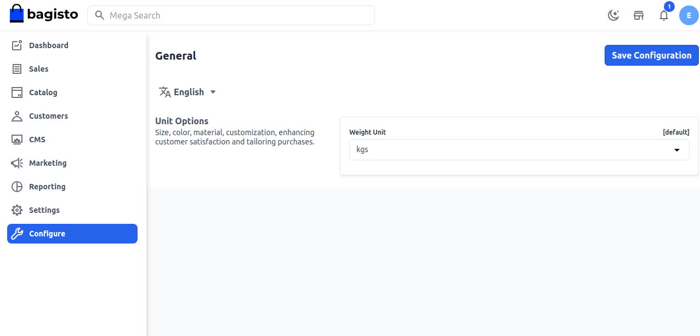

# Weight Unit

**1)** To add Weight Unit go to the Admin panel and go to **Configure >> General**.Next, select the **Weight Unit** from dropdown **lbs or kgs** according to your requirement and click on the **Save Configuration** button as shown in the image below

