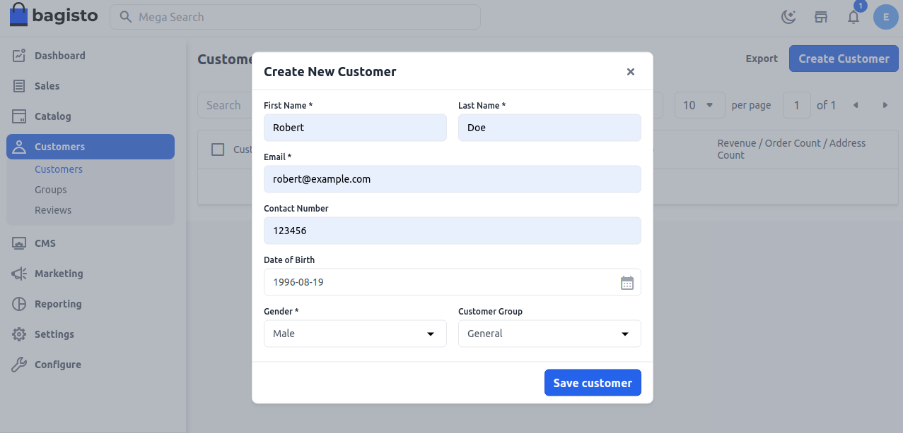

# Create Customer 

Visitors to your website can open an account to manage their purchases and activities. Customers generally create their own accounts in their shop. However, you can also create customer accounts directly from the administrator, which is useful for helping customers on the phone.

### To create a Customer from the Admin Panel follow the below steps:

**Step 1**: Login to admin panel of Bagisto and go to **Customers** >> **Customers** click on **Create Customer** button.

 

**Step 2**: Next you will get a form to create a customer fill in the necessary fields to create a customer as shown in the below image.

 

**Step 3**: Now you will able to see the new customer is registered successfully
   
 

 So by the above steps, you can easily create a customer from the admin panel in Bagisto.
 