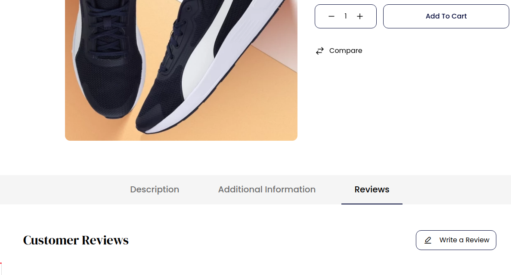
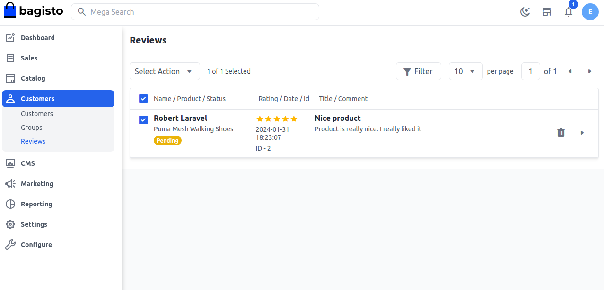
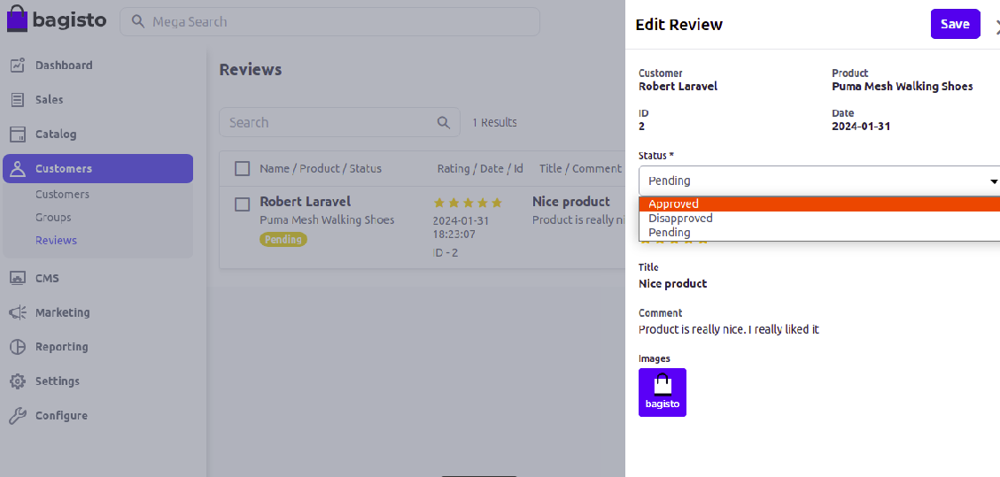
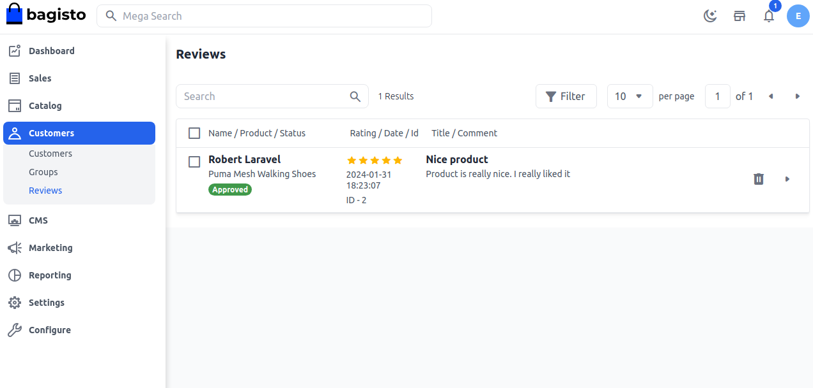

# Customer Reviews

Customer reviews are an important aspect of an eCommerce business. And as an eCommerce business owner, it should be an integral part of your online marketing strategy. Reviews create credibility for your products, and increased credibility means increased sales.

It helps other customers with the selection of the product. A customer review is an evaluation of a product or service made by someone who has purchased and used or had experience with, a product or service. Customer reviews are a form of customer feedback on electronic commerce and online shopping sites. 

### To add Reviews in Bagisto follow the below steps:

**Step 1**: After get logged in as a customer go to the product detail page of the store front and you will able to see the **Review** section as shown in the below image

 

**Step 2**: Next click on the **Write Review** button and fill the **Star Rating** add the **Title** and leave the comment with a attachment and **Submit Review**as shown in below image.

 

 **Step 3**: Now after adding the review open the **Admin Panel** of Bagisto and open the **Customers** >> **Reviews** and the review by the customer is shown in the below image.

  

**Step 3**: Next you can also change the **Status** of the Review as **Pending** to **Approved** and **Disapproved** and click on **Save** button as shown below.

**Step 4**: It will get redirected to the Review Grid and you will able to see a new record is registered successfully.

So by this, you can easily add the **Reviews** in Bagisto.