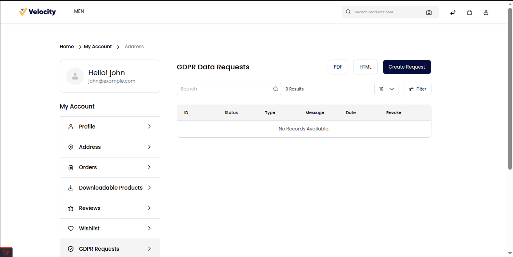
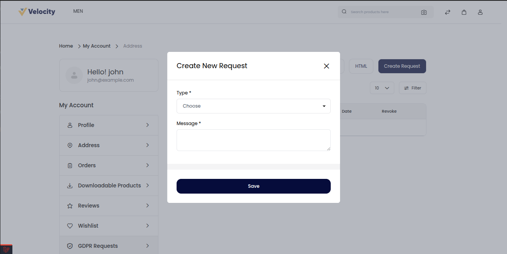
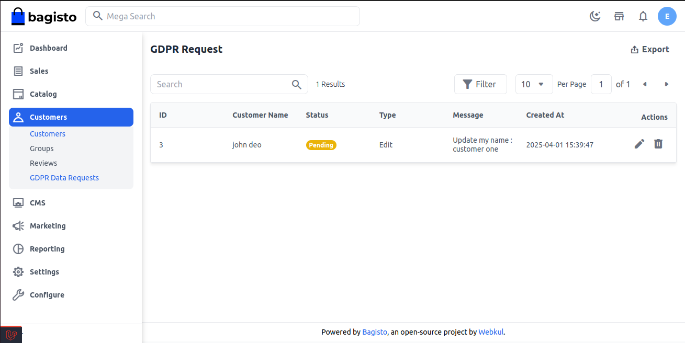
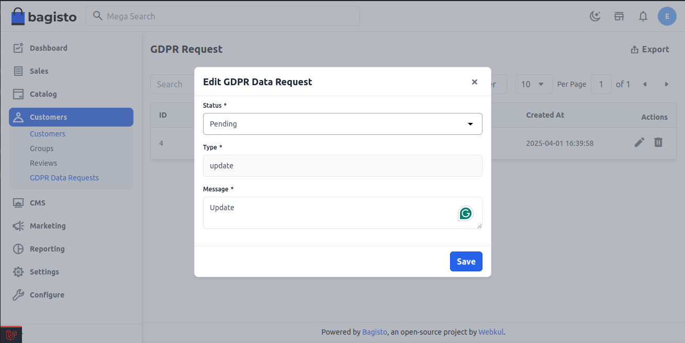

 # GDPR Data Request
 
 The General Data Protection Regulation (GDPR) is a comprehensive European law designed to protect users' personal data by enforcing strict guidelines on data collection, processing, and storage. For eCommerce businesses, GDPR compliance is not just a legal requirement but a fundamental step toward building customer trust and ensuring data security.

 Under GDPR, customers are granted specific rights over their personal information. The Right to Access empowers users to request a complete record of the data stored about them, ensuring transparency in how businesses handle personal information. Additionally, the Right to be Forgotten allows customers to request the permanent deletion of their data, reinforcing their control over personal information. 

 For eCommerce platforms, compliance involves implementing robust data protection measures, such as encrypted data storage, explicit consent mechanisms, and transparent privacy policies. 

 ### How to Manage GDPR Request in Bagisto2.3.0

 **Step 1**: After get logged in as a customer go to the GDPR Request section of the customer profile and you will able to see the **Create Request** section as shown in the below image

  

 **Step 2**: Next click on the **Create Request** button and select the type of request either **update or delete** add the **Message** and **Save** as shown in below image.

 

 **Step 3**: Now after creating the **GDPR Request** open the **Admin Panel** of Bagisto and open the **Customers** >> **GDPR Data Requests** and the Request by the customer is shown in the below image.

  

 **Step 4**: Next you can also change the **Status** of the GDPR Request as **Pending** to **Processing** or **Declined** or **Completed** and **Revoked** and click on **Save** button as shown below.

