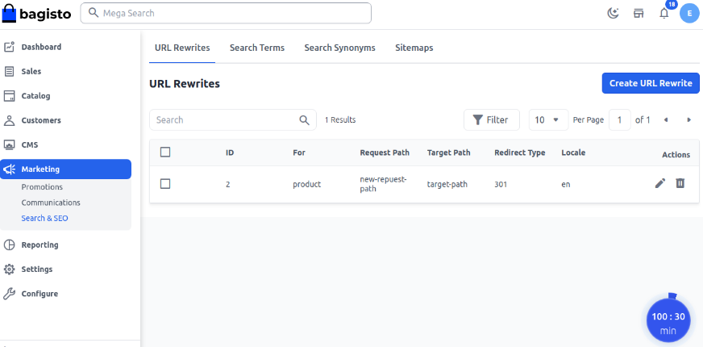
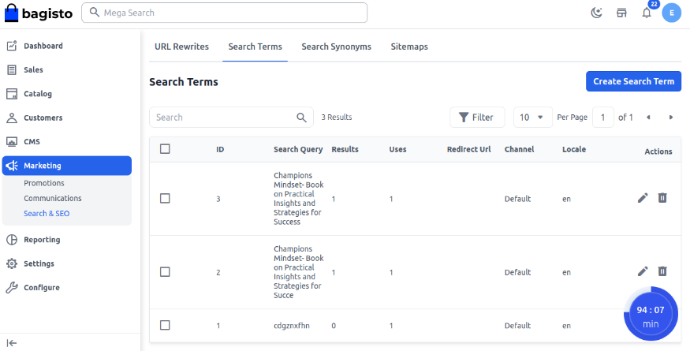
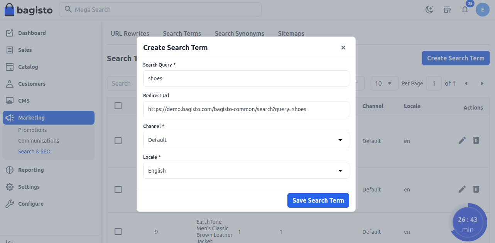
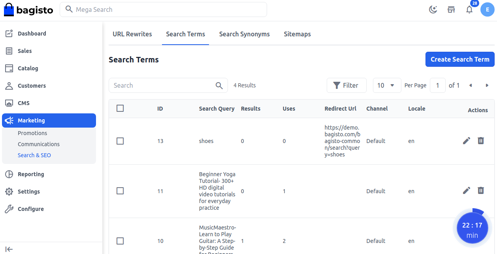
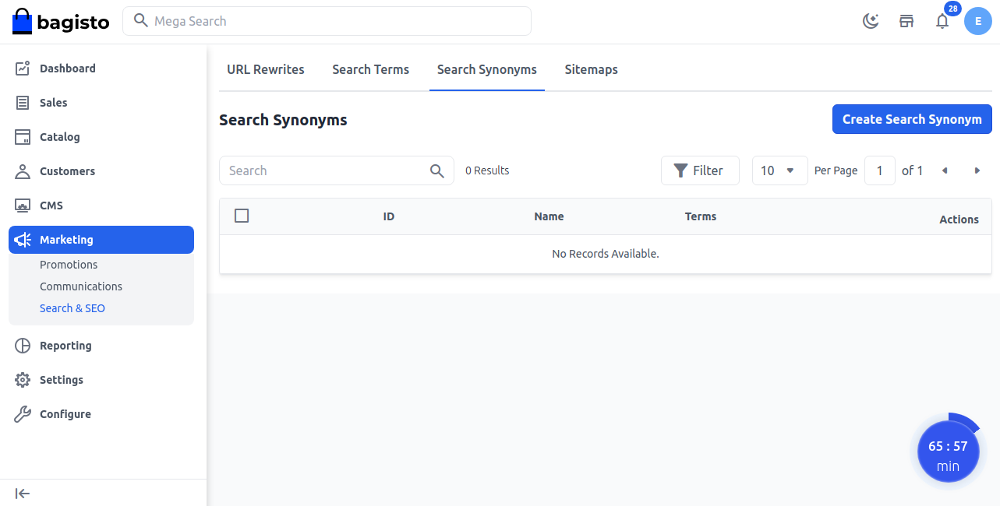
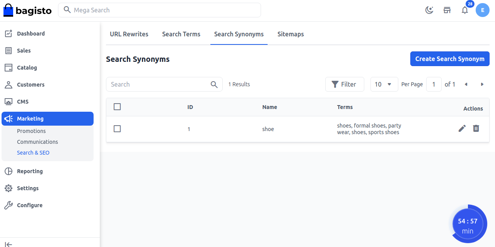
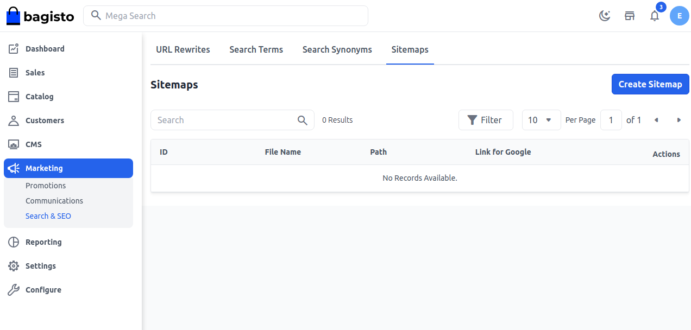
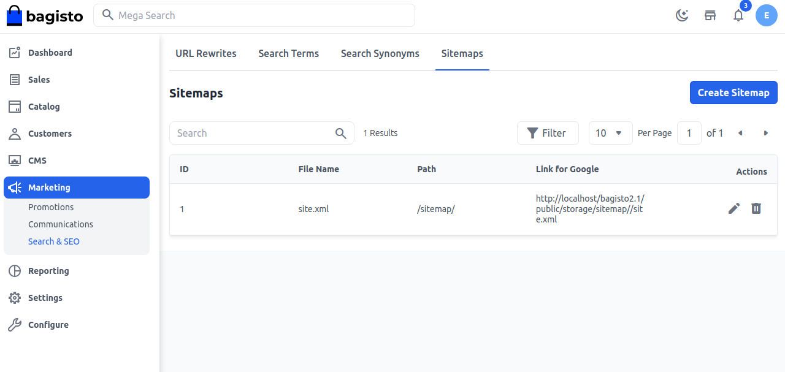

# Search & SEO

Bagisto 2.3.0 introduces new marketing tools to elevate your store’s visibility and improve customer experience.

## URL Rewrite

This feature allows the admin to manage errors related to product, category, and CMS URLs.

If an admin modifies their URL for any reason, this functionality ensures seamless redirection to the new path URL.

**Step 1:** To check this feature the admin needs to click **Marketing >> Search & SEO >> URL Rewrites** now click on **Create URL Rewrite** button as shown in the below image.

 

**Step 2:** Add the below fields:

**1) For** - Select the FOR for which you are applying the URL Rewrite (Product, Category, CMS Page).

**2) Request Path** - For Request Path, replace the default by entering the URL key and suffix (if applicable) of the original product request. This is the redirect from a product that you identified in the planning step. 

**3) Target Path** - The Target Path field displays the system version of the path, which cannot be changed. Initially, the Redirect Path field also displays the target path.

**4) Redirect Type** - Set Redirect Type to one of the following:

A) Temporary (302) - Use this for temporary changes, keeping SEO value with the old URL.

B) Permanent (301) - Use this for permanent changes with SEO value transfer to the new URL

**5) Locale** - Select the language in which you want the URL to be rewritten.

Now click on the **Save URL Rewrite** button.

 

**Step 3:** Now the New URL is redirected as per the Target path permanently.

 

## Search Terms

These are the Keywords that have been used by your customers on the storefront to search for their products.

**Step 1:** For creating a new search term go to the admin panel needs to click **Marketing >> Search & SEO >> Search Terms** now click on the **Create Search Term** button as shown in the below image.

 

**Step 2:** Add the Below fields of the Search Terms:

**1) Search Query** - Type the query of a product name that a customer will search from the storefront

**2) Redirect URL** - Add the URL that the search term will get redirected.

**3) Channel** - Add the channel at which the Search terms will be visible.

**4) Locale** - Select the language in which you want the Search Terms.

Now click on the **Save Search Term** button.

 

**Step 3:** A new search field by the name of **Adorable** is created successfully as shown in the below image.

 

**Step 4:** Frontend

Now check the result by searching your search term.

 

## Search Synonyms

Search Synonyms are those terms that the customer is searching in place of a particular product. For eg. if the customer wants footwear for that they can search shoe to formal shoes, sports shoes, party wear shoes, etc it will search for those with ease. 

**Step 1:** For creating a new search term go to admin panel needs to click **Marketing >> Search & SEO >> Search Synonyms** now click on the **Create Search Synonyms** button as shown in the below image.

 

**Step 2:** Enter the below fields:

**1) Name** - Enter the name of the synonym.

**2) Terms** Enter the related terms which belong to the name.

 

Now click on the **Save Search Synonym** button.

**Step 3:** A new synonym field by the name of **shoe** is created successfully as shown in the below image.

 

**Step 4:** Frontend 

Now check the result by searching your search synonym this contains all the categories of the shoes as shown in the below image.

 

## Sitemaps

Sitemaps inform search engines which pages on a website should be crawled, and may help search engines discover and index those pages. While sitemaps can be a simple text file listing the URLs of all of the pages you'd like to have indexed, they can also be an XML document carrying more information.

### Step 1: Add New Sitemap

1. On Admin panel, go to **Marketing >> Search & SEO >> Sitemaps** click on **Create Sitemap** as shown in below image

 

### Step 2: Add New Sitemap

Add **File Name** and **File Path** and click the **Save Sitemap** button.

Kindle make sure you created a **XML file** and mention its desired path as shown below.

 

### Step 3: 

Now you will able to see the new **Sitemap** as shown below.

 

By this, you can easily create a **Sitemap** in Bagisto 2.3.0