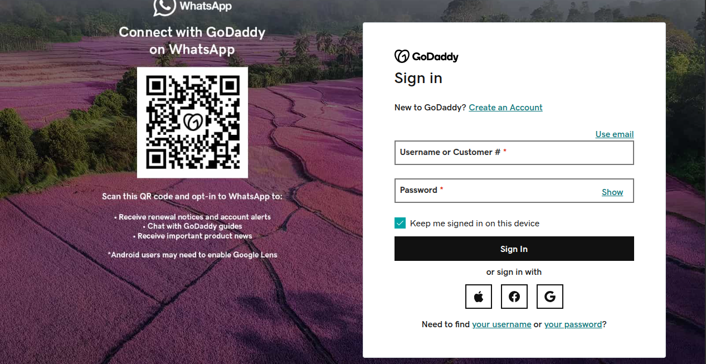
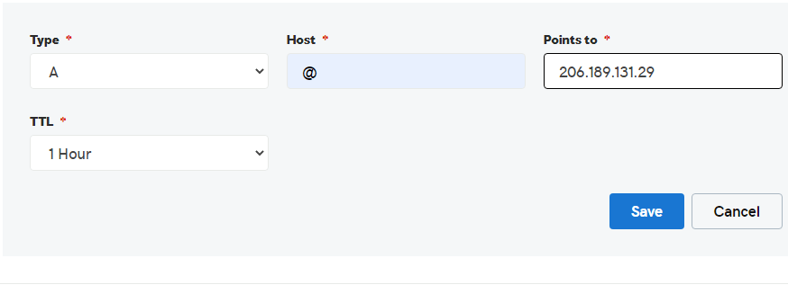
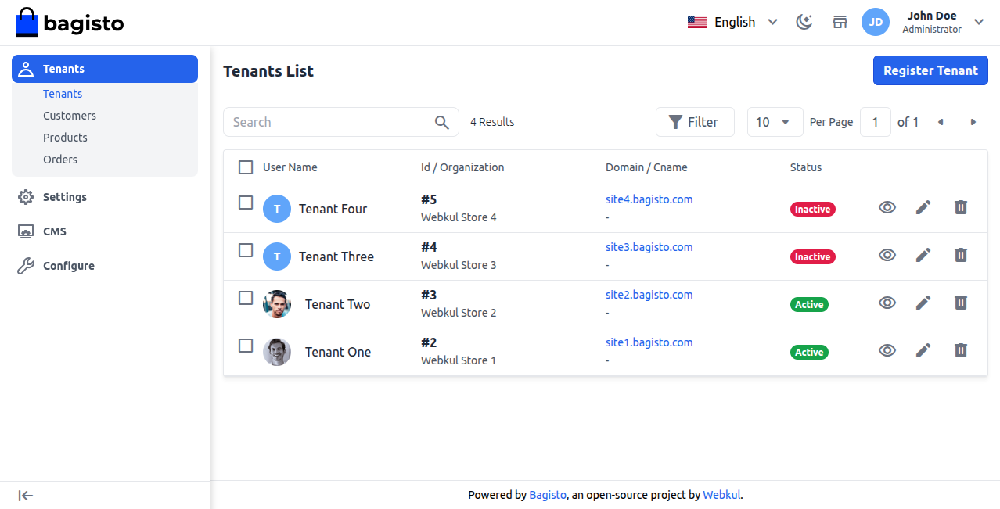
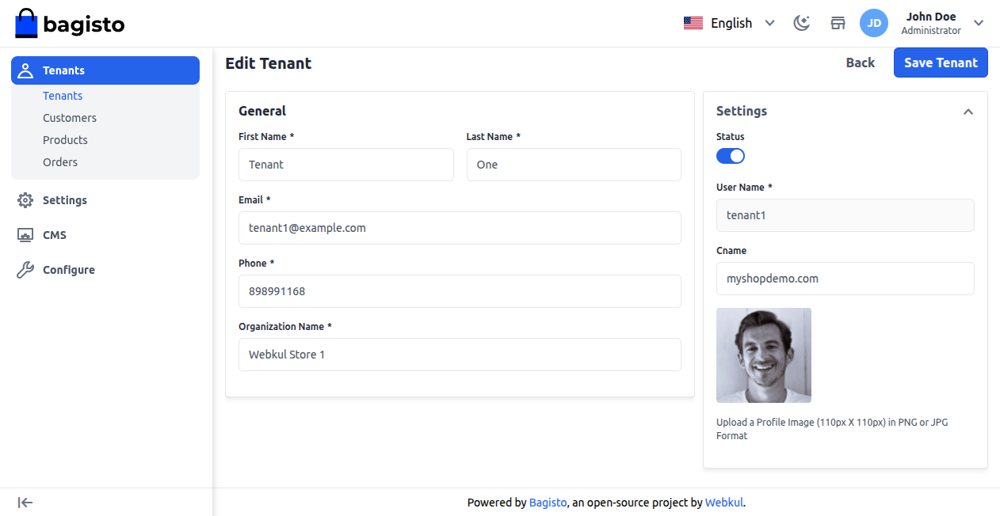
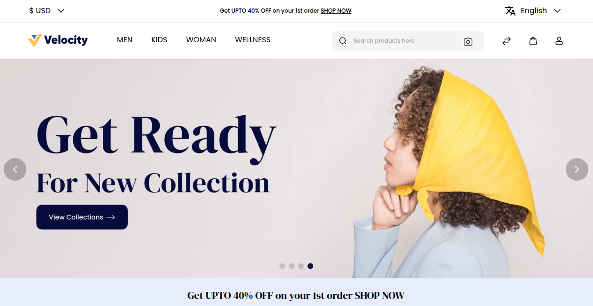

# CName Mapping

CName Mapping lets tenants connect their own domain to the subdomain made by the SaaS module, which helps with professional branding.

When a tenant signs up, a default subdomain like **username.rootdomain.com** is created. With CNAME, their actual domain can be directed to this subdomain.

This makes it easy for customers to find the store and keeps a reliable, consistent online image.

The mapping is set up through the tenant's DNS provider and the SaaS module by the Super Admin, and it doesn't need any extra plugins.

### Flow to Map Tenant Domain with CNAME

**Step 1: Login to DNS Console**

Log in to your DNS provider (like GoDaddy) and go to the settings for the domain you want to map.

**Step 2: Add DNS Record**

Once you log in, set up an A record for your domain that directs to the IP of the SaaS module server.

For example, to map the domain **myshopdemo.com** with the SaaS server **IP: 206.189.131.29**, add an A record in your DNS settings as shown in the image below.

**Step 3: Configure CNAME in SaaS Module**

After mapping the domain with the server IP, login as **Super Admin** in the SaaS module. You will see the tenant’s subdomain already created (e.g., **site1.bagisto.com**).

To map the tenant’s real domain (e.g., myshopdemo.com), click the edit (pencil) icon, enter the domain in the CNAME field, and then click Save Tenant to save. 

**Step 4: Test the Domain**

Open the tenant's website in a browser and see if it loads properly.

If the website loads on the tenant's original domain (like myshopdemo.com), it means the connection with the SaaS subdomain worked well.

