# Product Management

In Multi Vendor Marketplace, Product management is designed to give sellers complete control over their online store. It allows sellers to easily add new products, set prices, upload images, and update stock.

With easy to use tools, sellers can quickly edit or update products whenever needed, making sure their listings stay accurate and attractive. 

Whether it’s managing a single item or hundreds of products,  Multi Vendor Marketplace makes the process smooth and stress free, so sellers can focus more on growing sales and keeping customers happy.

### Seller Dashboard: Product Management

Product management is simple; sellers can add products, set details like price and stock, upload images, and quickly make them available in the marketplace.

From the seller dashboard, go to Products and click on it to open the product page.

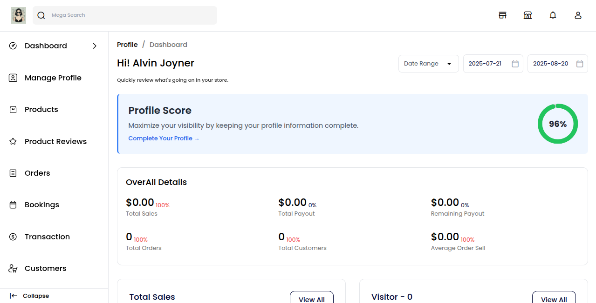

### Seller Products

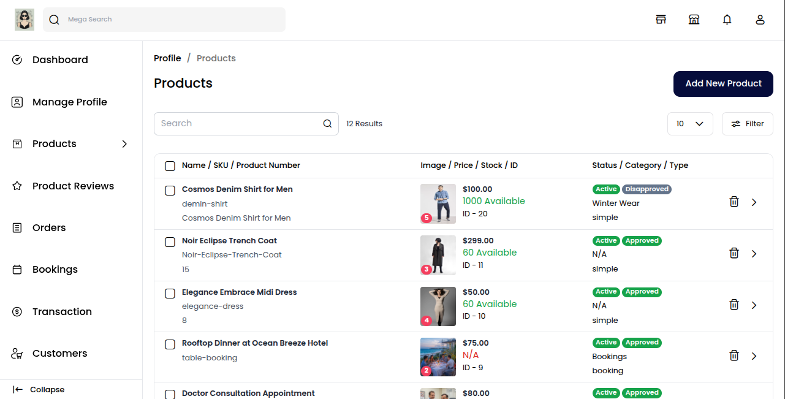

Click on the Add New Product button at the top right corner to begin adding a new product to your store.

You can add a product in two ways:

**1) Add New Product:** Add a completely new product with your own details.

**2) Add Existing Product:** Choose from existing products added by the admin.

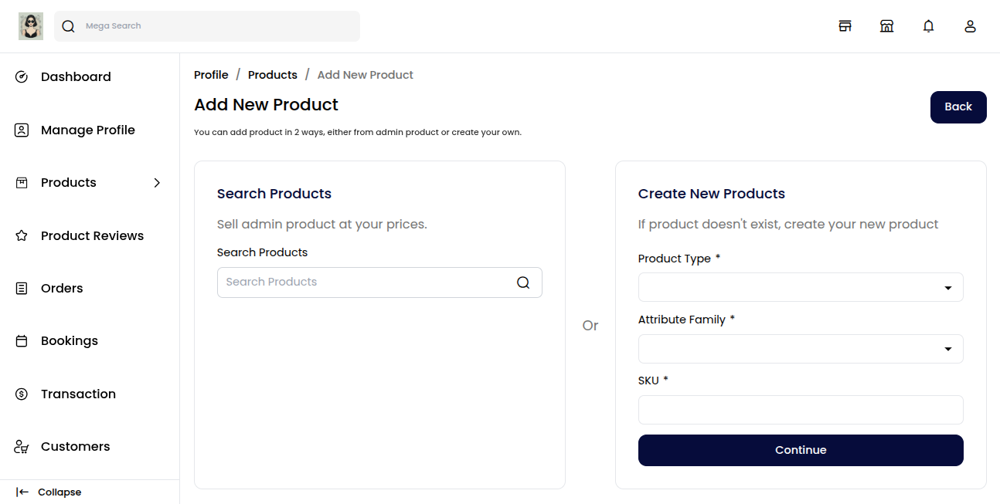

**1. Add New Product**

To create a new product, fill in the basic details:

**Product Type:** Select the type of product you want to add.

**Attribute Family:** Choose the attribute set that defines product features.

**SKU:** Enter a unique product code for easy identification.

Click on the **Continue** button to proceed further.

These fields help define the structure and unique identity of your product in the store.

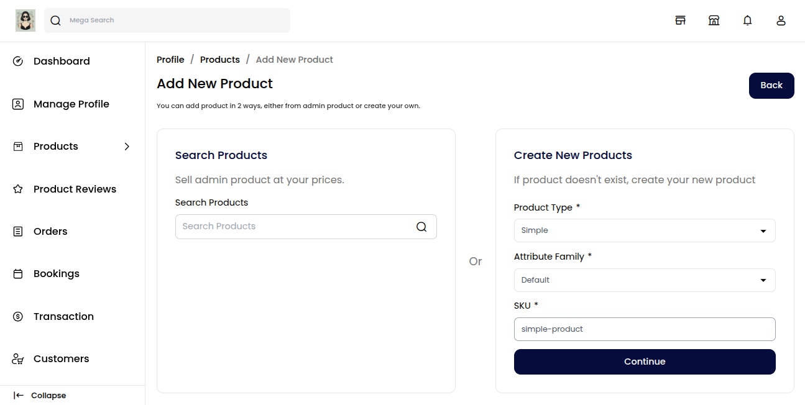

**General Attribute**

In the General Attributes section, you need to enter the following details.

**1) SKU:** A unique code to identify the product.

**2) Product Number:** Internal reference or product ID.

**3) Name:** The product’s display name shown to customers.

**4) URL Key:** SEOfriendly URL for the product page.

**5) Tax Category:** Select the tax rules that apply to the product.

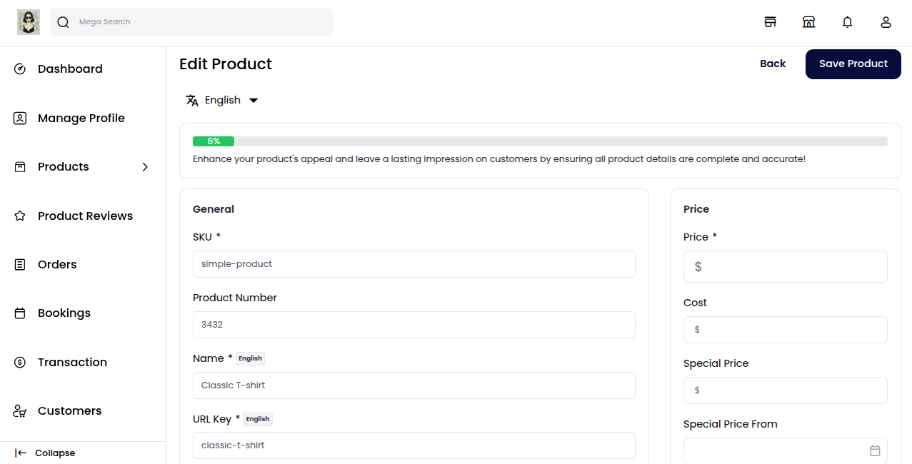

**Description**

Below is the list of fields you need to fill under the **Description** section.

**1) Short Description:** Enter a brief summary highlighting the key features of the product.

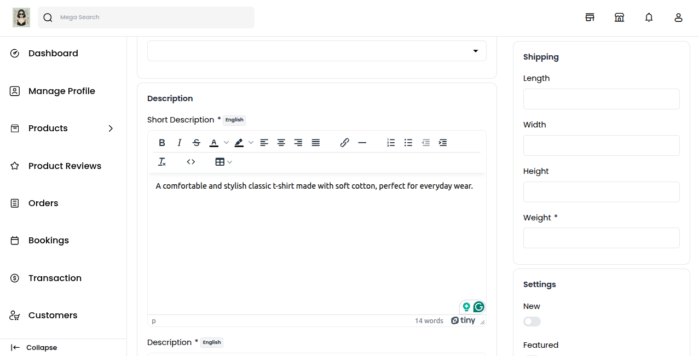

**2) Description:** Provide a detailed explanation of the product, covering all important details to help customers understand it better.

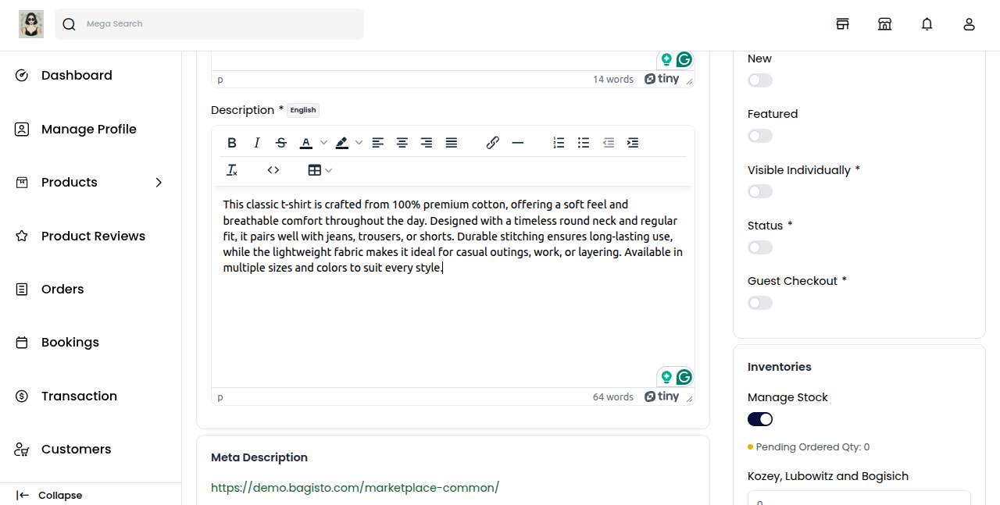

**Meta Description**

Below is the list of fields you need to fill under the **Meta Description** section.

**1) Meta Title:** Provide the main title of the product by which your product will be known.

**2) Meta Keyword:** Add specific keywords to improve the product’s visibility on search engines.

**3) Meta Description:** Enter a short description so the product can easily appear in search engine listings.

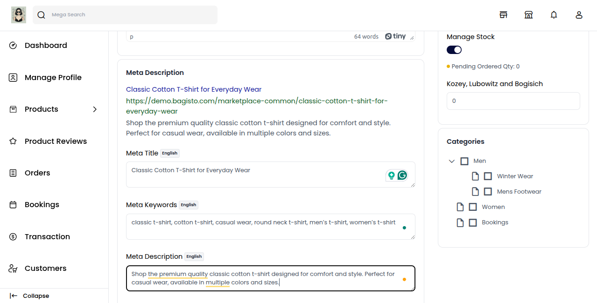

**Images**

To add product images, click on **Add Images**. You can upload multiple images to showcase your product from different angles, helping customers get a better view before making a purchase.

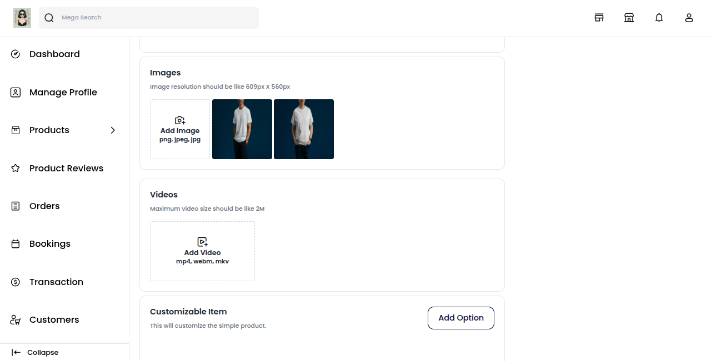

**Customizable Item**

A customizable item is a feature, component, or service that can be tailored to meet specific user needs, ensuring a personalized experience.

Below is the list of fields you need to provide under the Customizable Item section to allow product personalization.

**1) Title:** Provide the title of the customization by which it will be known in the product.

**2) Type:** Select the type of customization input you want to offer customers.

**Customization Data Types:**

**1) Text:** Allows users to enter a short text, such as a name or message.

**2) Textarea:** Provides a larger box for longer messages or instructions.

**3) Checkbox:** Customers can select multiple options from a list.

**4) Radio:** Customers can select only one option from multiple choices.

**5) Select:** A dropdown list with multiple choices but only one selection.

**6) Multi Select:** A dropdown list where multiple options can be selected.

**7) Date:** Customers can choose a specific date.

**8) DateTime:** Customers can choose both date and time together.

**9) Time:** Customers can select only a time value.

**10) File:** Allows users to upload an image, logo, or other files for personalization.

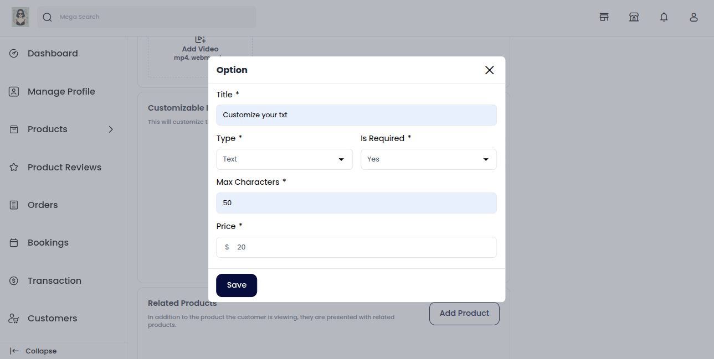

**Price**

In this section, you need to set the pricing details of your product:

**1) Price:** Enter the regular selling price of the product.

**2) Cost:** Add the actual cost of the product (used for profit tracking).

**3) Special Price:** Provide a discounted price for the product.

**4) Special Price Date:** Set the start and end date during which the special price will be visible on the website.

 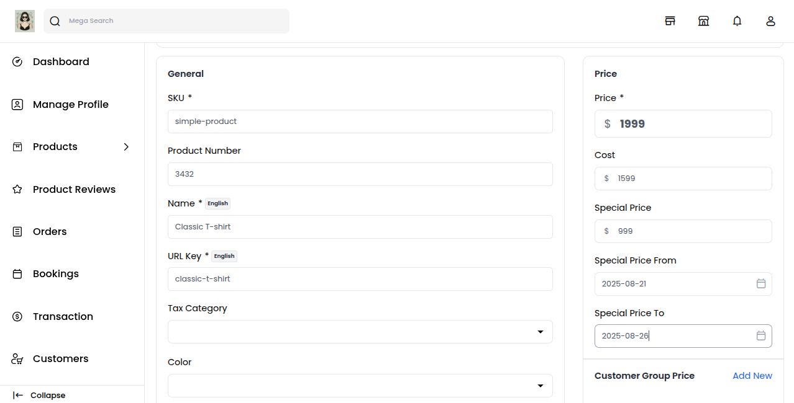

**Shipping**

In this section, you need to provide the product’s physical details for accurate shipping calculations:

**1) Width:** Enter the width of the product.

**2) Height:** Enter the height of the product.

**3) Length:** Enter the Length of the product.

**4) Weight:** Enter the weight of the product for shipping cost calculation.

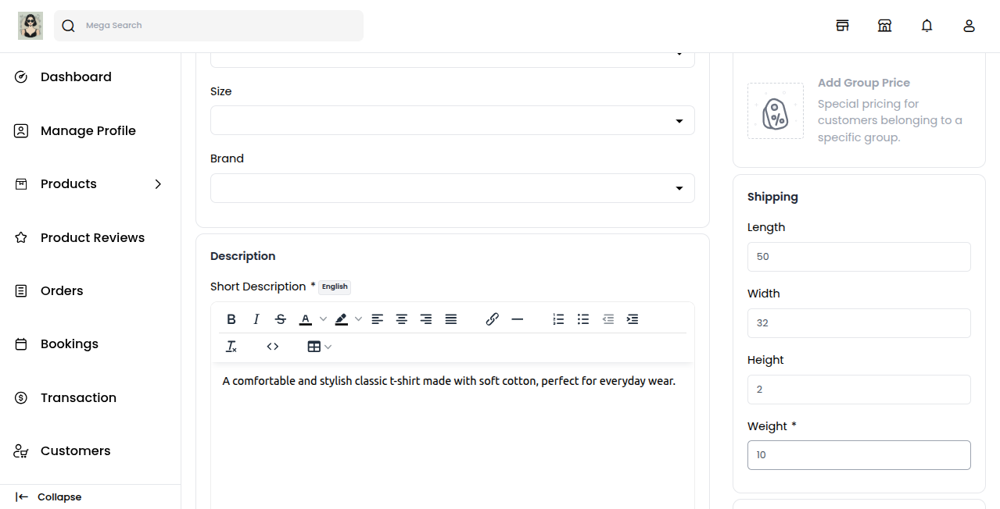

**Settings**

**1) New:** Enable the toggle button to feature the product as a New Product. It will then appear under the New Products section.

**2) Featured:** Enable the toggle button to display the product in the Featured Products section.

**3) Visible Individually:** Enable the toggle button so the product will be visible individually on the storefront.

**4) Status:** Enable the toggle button to activate the product and make it available in your eCommerce store.

**5)Guest Checkout:** Enable the toggle button to allow guest customers (without login) to purchase the product.

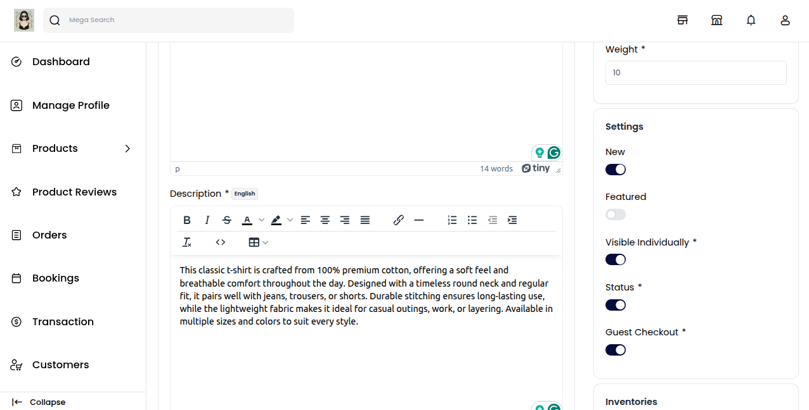

**Inventories**
In this section, enter the quantity of the product available in your inventory. By default, the quantity is set to 0, which means the product will appear as Out of Stock on the storefront.

**Category**

In this section, assign the product to one or more categories available in your store. Categories help organize products and make it easier for customers to browse and find them on the storefront. 

You can select multiple categories to ensure better visibility of your product.

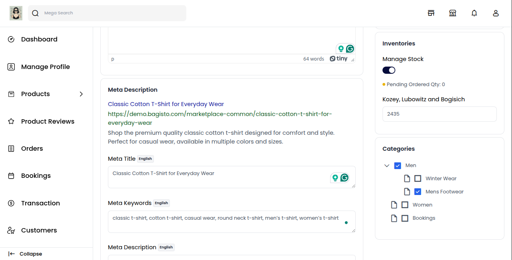

**Save Product**

Click on the **Save Product** button. This will add the product to your store, but initially, it will be in a Disapproved state. 

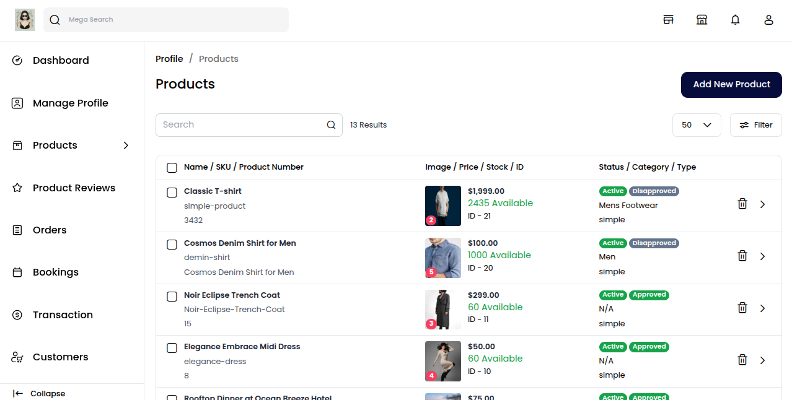

**Note:** Once the admin reviews and approves it, the status will change to **Approved**, and only then will the product be visible on the store frontend.

### Admin Dashboard

From the Admin Dashboard, the admin has the authority to approve or disapprove products created by sellers. Only approved products will appear on the storefront.

Go to **Marketplace >> Products** to view and manage all your products from the seller dashboard.

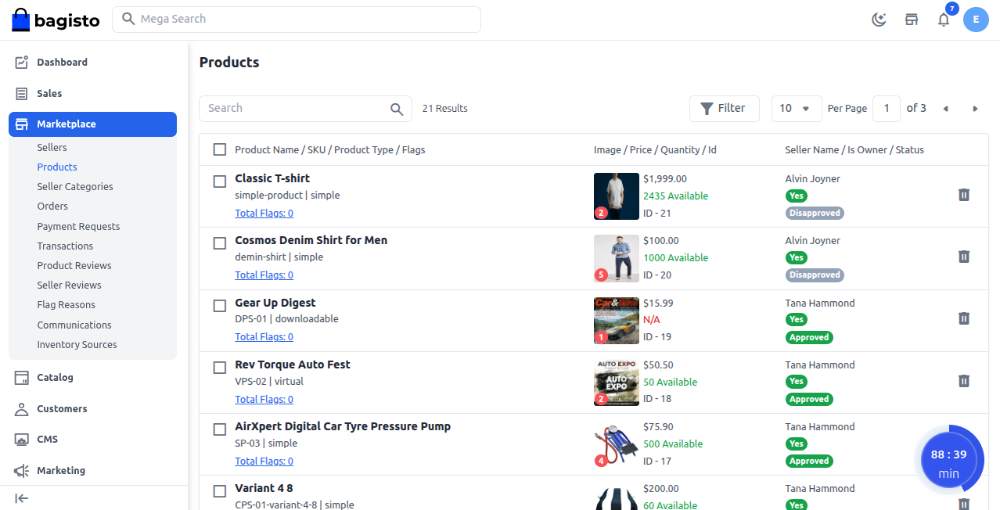

To approve a product, follow these steps:

1) Check the **product checkbox** for the item you want to approve.

2) Go to the **Select Action** dropdown.

3) Click on **Update Status**.

4) Select **Approved** to approve the product.

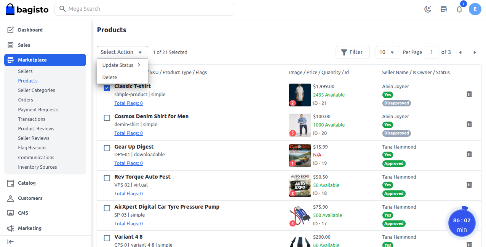

**Product Preview – Admin**

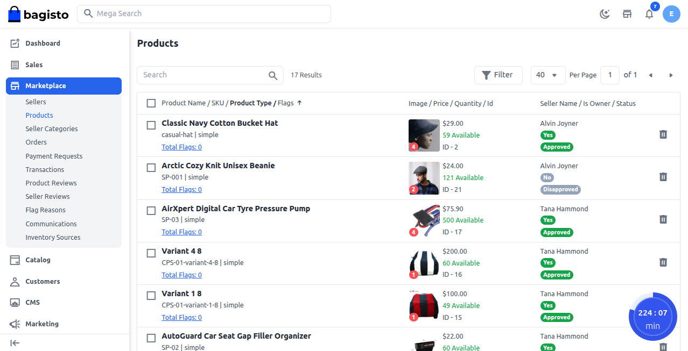

**Note:** Once the product is approved, it will show as **Approved** on the seller’s dashboard and will also become visible on the storefront for customers.

### Store Frontend

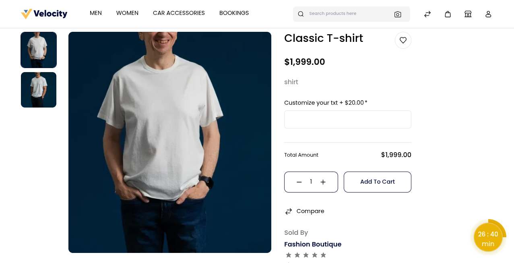

### Add Existing Product

This feature allows sellers to quickly sell items that are already listed in the marketplace. Instead of creating a new product, sellers can add their own version with different pricing, stock, and details.

Go to the Search Bar and enter the product name to find the existing product in the marketplace.

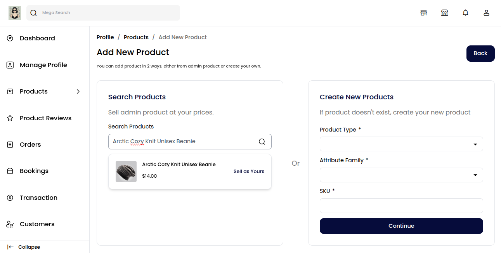

The matching product will appear in the results, allowing you to select it and list it under your store with different prices and stock.

Click on **Sell As Yours** to create your own version of the existing product. 

**Product Details**

In this section, set all the necessary information for your version of the existing product.

**1) Condition:** Specify the condition of the product (New, Old).

**2) Price:** Enter the selling price you want to offer for this product.

**3) Stock:** Add the available quantity of the product in inventory.

**4) Description:** Provide a brief description of the product.

**5) Images:** Upload product images to showcase the item.

**6) Video:** Optionally, add a video to give customers a better view of the product.

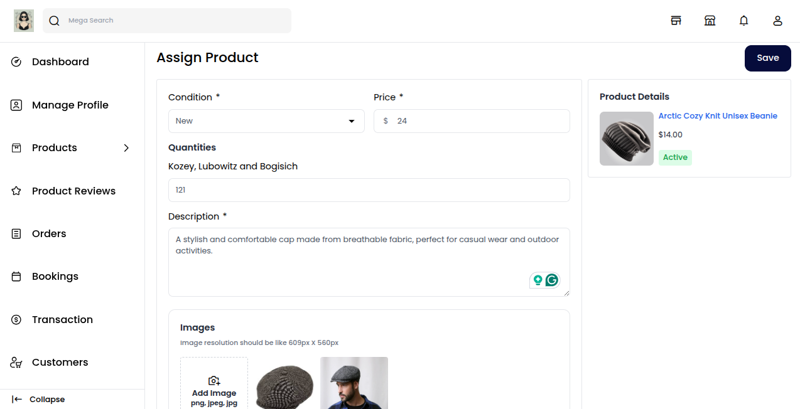

Click on the **Save button** at the top right corner to add the product to your store, but initially, it will be in a disapproved state. 

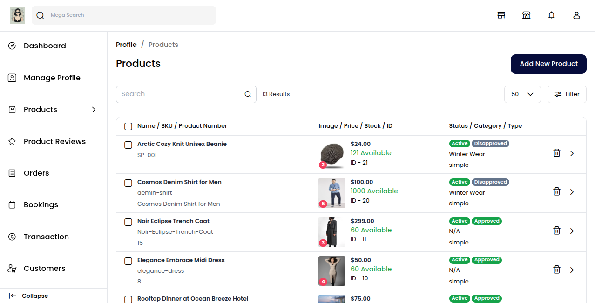

**Note:** Once the admin reviews and approves it, the status will change to **Approved**, and only then will the product be visible on the store frontend.

### Store Frontend

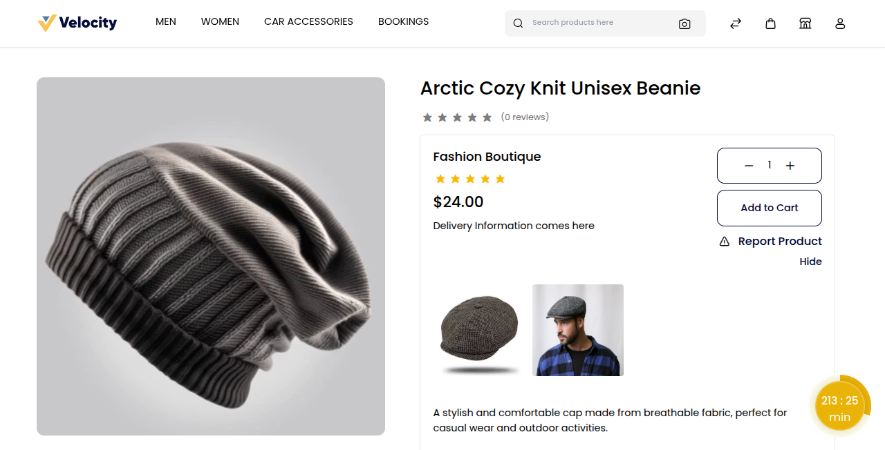

