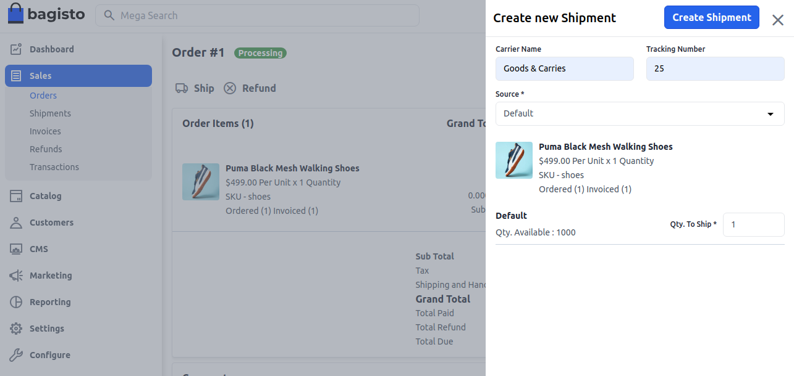
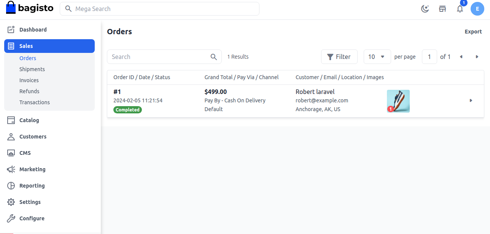

# Create Shipment

Shipment is a process whereby goods are shipped using the Internet as the primary means of communication. It is a convenient way of shipping for both consumers and businesses alike, as it offers a quick and easy way to send items from one location to another.

“Shipping” denotes the processing, packaging, and dispatching of small items that can be sent quickly and easily, typically through a local courier service. 

To create a shipment for that order, click on the **Ship** button. Enter the **Carrier Name, Tracking Number** and choose your **Inventory Source** from the drop-down list. Enter the quantity to ship then click on **Create Shipment**

 

 Now the order is **Completed** which you can check in the order list as shown in the below image.

  

By following the above steps, you can easily create a **Shipment** in Bagisto.