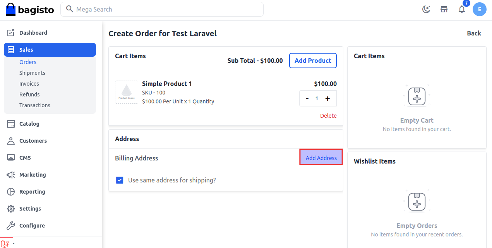
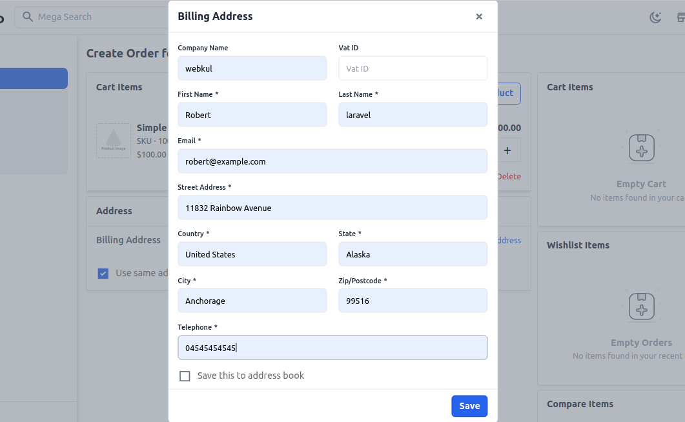
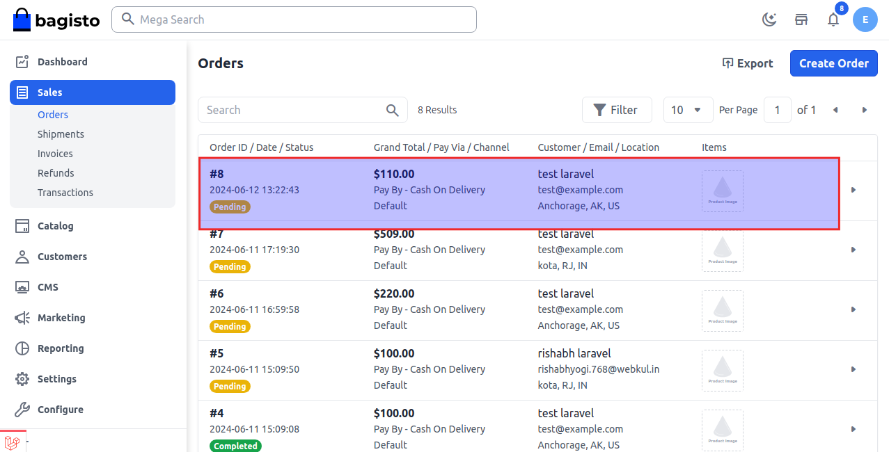

# Reorder

Reordering is the processing of placing an order for the same item that you have previously purchased. Some customers may not want to be locked into a long-term subscription commitment and may opt to reorder the same product from you since a reorder is more flexible than a standard subscription.

### How to Manage Reorder in Bagisto2.3.0

**Step-1** In the admin panel click on **Sales >> Orders >> Edit Order** and after then click **Reorder** as shown in the below image.

   

**Step-2** You can also increase the quantity of the product. Now click on add address as shown in below image.

  

**Step-3** Now add all the informtions in billing address form and then click on **Save button** as shown in the below image.

  

**Step-4** Now add the shipping and payment methods and click on **Place Order** as shown in the below image.

  

**Step-5** Reorder is successfully updated in the order datagrid as shown in the below image.

  

